# Sequence Diagram — Luồng API
## Module: Product (Sản phẩm)
### Dự án: Mobivexa E-Commerce Platform

> **Phiên bản:** 1.0  
> **Ngày:** 2026-06-19  
> **Ghi chú:** Sử dụng cú pháp Mermaid sequenceDiagram

---

## SD-01: Danh sách sản phẩm (Public)

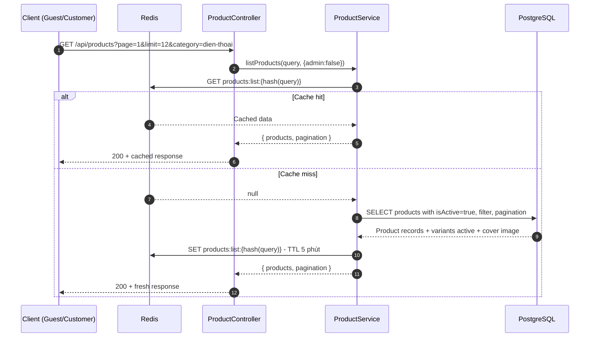
```mermaid
sequenceDiagram
    autonumber
    participant C as Client (Guest/Customer)
    participant R as Redis
    participant API as ProductController
    participant S as ProductService
    participant DB as PostgreSQL

    C->>API: GET /api/products?page=1&limit=12&category=dien-thoai
    API->>S: listProducts(query, {admin:false})
    S->>R: GET products:list:{hash(query)}
    alt Cache hit
        R-->>S: Cached data
        S-->>API: { products, pagination }
        API-->>C: 200 + cached response
    else Cache miss
        R-->>S: null
        S->>DB: SELECT products with isActive=true, filter, pagination
        DB-->>S: Product records + variants active + cover image
        S->>R: SET products:list:{hash(query)} - TTL 5 phút
        S-->>API: { products, pagination }
        API-->>C: 200 + fresh response
    end
```

---

## SD-02: Chi tiết sản phẩm (Public)

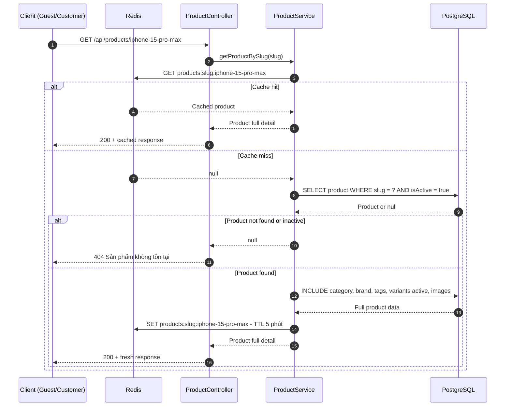
```mermaid
sequenceDiagram
    autonumber
    participant C as Client (Guest/Customer)
    participant R as Redis
    participant API as ProductController
    participant S as ProductService
    participant DB as PostgreSQL

    C->>API: GET /api/products/iphone-15-pro-max
    API->>S: getProductBySlug(slug)
    S->>R: GET products:slug:iphone-15-pro-max
    alt Cache hit
        R-->>S: Cached product
        S-->>API: Product full detail
        API-->>C: 200 + cached response
    else Cache miss
        R-->>S: null
        S->>DB: SELECT product WHERE slug = ? AND isActive = true
        DB-->>S: Product or null
        alt Product not found or inactive
            S-->>API: null
            API-->>C: 404 Sản phẩm không tồn tại
        else Product found
            S->>DB: INCLUDE category, brand, tags, variants active, images
            DB-->>S: Full product data
            S->>R: SET products:slug:iphone-15-pro-max - TTL 5 phút
            S-->>API: Product full detail
            API-->>C: 200 + fresh response
        end
    end
```

---

## SD-03: Tạo sản phẩm (Admin)

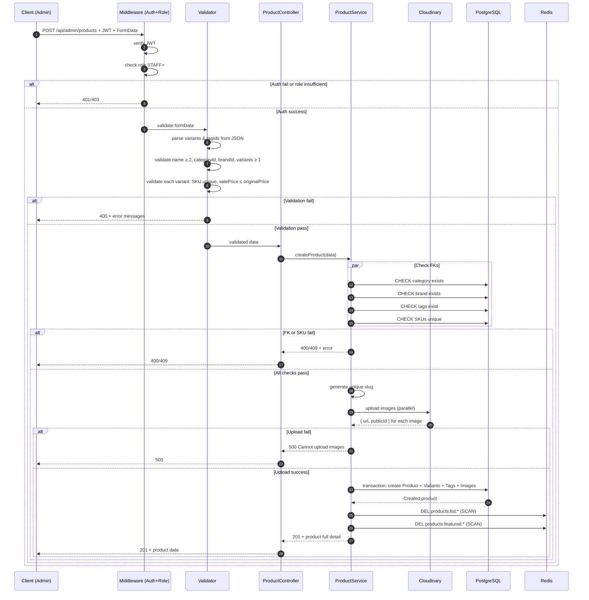
```mermaid
sequenceDiagram
    autonumber
    participant C as Client (Admin)
    participant M as Middleware (Auth+Role)
    participant V as Validator
    participant API as ProductController
    participant S as ProductService
    participant CL as Cloudinary
    participant DB as PostgreSQL
    participant R as Redis

    C->>M: POST /api/admin/products + JWT + FormData
    M->>M: verify JWT
    M->>M: check role STAFF+
    alt Auth fail or role insufficient
        M-->>C: 401/403
    else Auth success
        M->>V: validate formData
        V->>V: parse variants & tagIds from JSON
        V->>V: validate name ≥ 2, categoryId, brandId, variants ≥ 1
        V->>V: validate each variant: SKU unique, salePrice ≤ originalPrice
        alt Validation fail
            V-->>C: 400 + error messages
        else Validation pass
            V->>API: validated data
            API->>S: createProduct(data)
            par Check FKs
                S->>DB: CHECK category exists
                S->>DB: CHECK brand exists
                S->>DB: CHECK tags exist
                S->>DB: CHECK SKUs unique
            end
            alt FK or SKU fail
                S-->>API: 400/409 + error
                API-->>C: 400/409
            else All checks pass
                S->>S: generate unique slug
                S->>CL: upload images (parallel)
                CL-->>S: { url, publicId } for each image
                alt Upload fail
                    S-->>API: 500 Cannot upload images
                    API-->>C: 500
                else Upload success
                    S->>DB: transaction: create Product + Variants + Tags + Images
                    DB-->>S: Created product
                    S->>R: DEL products:list:* (SCAN)
                    S->>R: DEL products:featured:* (SCAN)
                    S-->>API: 201 + product full detail
                    API-->>C: 201 + product data
                end
            end
        end
    end
```

---

## SD-04: Cập nhật sản phẩm (Admin)

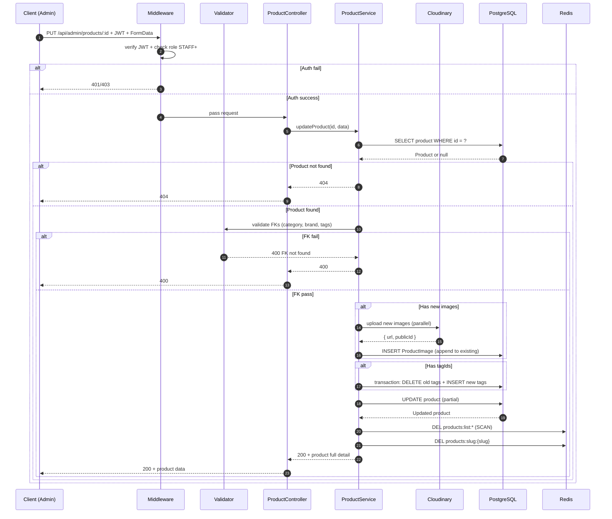
```mermaid
sequenceDiagram
    autonumber
    participant C as Client (Admin)
    participant M as Middleware
    participant V as Validator
    participant API as ProductController
    participant S as ProductService
    participant CL as Cloudinary
    participant DB as PostgreSQL
    participant R as Redis

    C->>M: PUT /api/admin/products/:id + JWT + FormData
    M->>M: verify JWT + check role STAFF+
    alt Auth fail
        M-->>C: 401/403
    else Auth success
        M->>API: pass request
        API->>S: updateProduct(id, data)
        S->>DB: SELECT product WHERE id = ?
        DB-->>S: Product or null
        alt Product not found
            S-->>API: 404
            API-->>C: 404
        else Product found
            S->>V: validate FKs (category, brand, tags)
            alt FK fail
                V-->>S: 400 FK not found
                S-->>API: 400
                API-->>C: 400
            else FK pass
                alt Has new images
                    S->>CL: upload new images (parallel)
                    CL-->>S: { url, publicId }
                    S->>DB: INSERT ProductImage (append to existing)
                end
                alt Has tagIds
                    S->>DB: transaction: DELETE old tags + INSERT new tags
                end
                S->>DB: UPDATE product (partial)
                DB-->>S: Updated product
                S->>R: DEL products:list:* (SCAN)
                S->>R: DEL products:slug:{slug}
                S-->>API: 200 + product full detail
                API-->>C: 200 + product data
            end
        end
    end
```

---

## SD-05: Xóa sản phẩm (Admin)

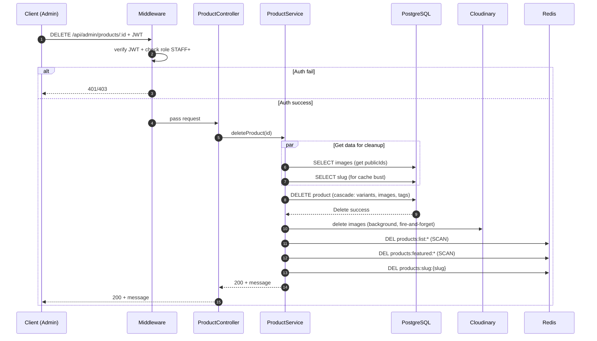
```mermaid
sequenceDiagram
    autonumber
    participant C as Client (Admin)
    participant M as Middleware
    participant API as ProductController
    participant S as ProductService
    participant DB as PostgreSQL
    participant CL as Cloudinary
    participant R as Redis

    C->>M: DELETE /api/admin/products/:id + JWT
    M->>M: verify JWT + check role STAFF+
    alt Auth fail
        M-->>C: 401/403
    else Auth success
        M->>API: pass request
        API->>S: deleteProduct(id)
        par Get data for cleanup
            S->>DB: SELECT images (get publicIds)
            S->>DB: SELECT slug (for cache bust)
        end
        S->>DB: DELETE product (cascade: variants, images, tags)
        DB-->>S: Delete success
        S->>CL: delete images (background, fire-and-forget)
        S->>R: DEL products:list:* (SCAN)
        S->>R: DEL products:featured:* (SCAN)
        S->>R: DEL products:slug:{slug}
        S-->>API: 200 + message
        API-->>C: 200 + message
    end
```

---

## SD-06: Thêm variant vào sản phẩm (Admin)

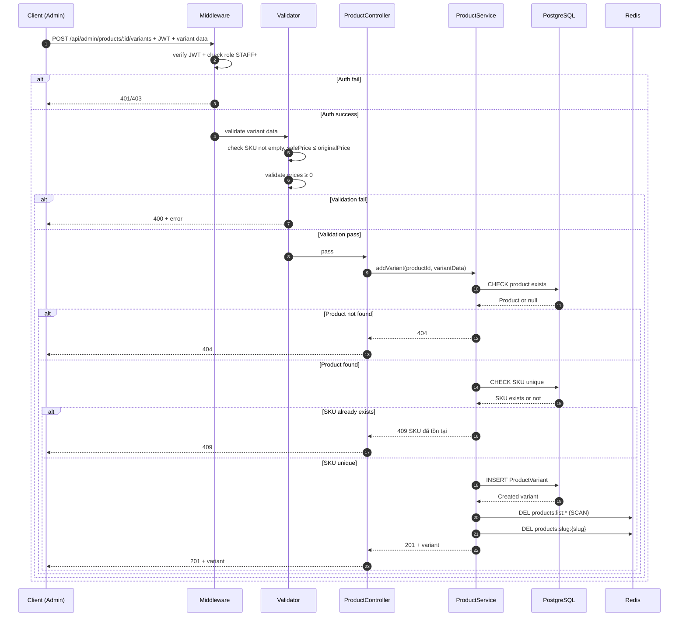
```mermaid
sequenceDiagram
    autonumber
    participant C as Client (Admin)
    participant M as Middleware
    participant V as Validator
    participant API as ProductController
    participant S as ProductService
    participant DB as PostgreSQL
    participant R as Redis

    C->>M: POST /api/admin/products/:id/variants + JWT + variant data
    M->>M: verify JWT + check role STAFF+
    alt Auth fail
        M-->>C: 401/403
    else Auth success
        M->>V: validate variant data
        V->>V: check SKU not empty, salePrice ≤ originalPrice
        V->>V: validate prices ≥ 0
        alt Validation fail
            V-->>C: 400 + error
        else Validation pass
            V->>API: pass
            API->>S: addVariant(productId, variantData)
            S->>DB: CHECK product exists
            DB-->>S: Product or null
            alt Product not found
                S-->>API: 404
                API-->>C: 404
            else Product found
                S->>DB: CHECK SKU unique
                DB-->>S: SKU exists or not
                alt SKU already exists
                    S-->>API: 409 SKU đã tồn tại
                    API-->>C: 409
                else SKU unique
                    S->>DB: INSERT ProductVariant
                    DB-->>S: Created variant
                    S->>R: DEL products:list:* (SCAN)
                    S->>R: DEL products:slug:{slug}
                    S-->>API: 201 + variant
                    API-->>C: 201 + variant
                end
            end
        end
    end
```

---

## SD-07: Xóa variant (Admin)

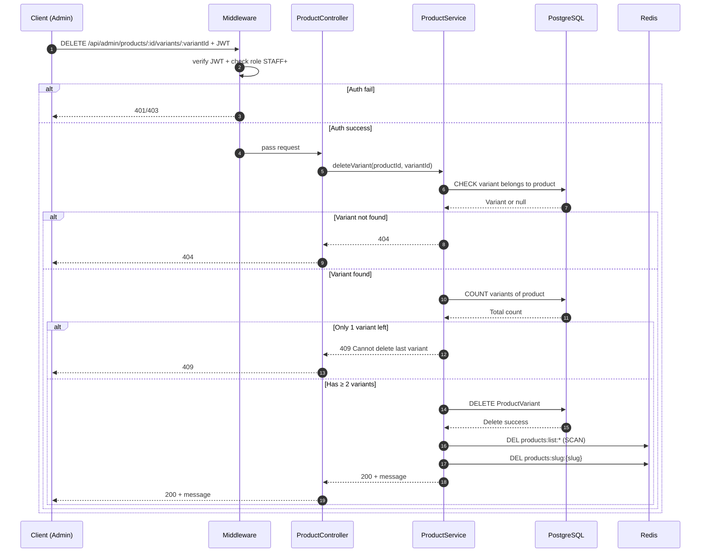
```mermaid
sequenceDiagram
    autonumber
    participant C as Client (Admin)
    participant M as Middleware
    participant API as ProductController
    participant S as ProductService
    participant DB as PostgreSQL
    participant R as Redis

    C->>M: DELETE /api/admin/products/:id/variants/:variantId + JWT
    M->>M: verify JWT + check role STAFF+
    alt Auth fail
        M-->>C: 401/403
    else Auth success
        M->>API: pass request
        API->>S: deleteVariant(productId, variantId)
        S->>DB: CHECK variant belongs to product
        DB-->>S: Variant or null
        alt Variant not found
            S-->>API: 404
            API-->>C: 404
        else Variant found
            S->>DB: COUNT variants of product
            DB-->>S: Total count
            alt Only 1 variant left
                S-->>API: 409 Cannot delete last variant
                API-->>C: 409
            else Has ≥ 2 variants
                S->>DB: DELETE ProductVariant
                DB-->>S: Delete success
                S->>R: DEL products:list:* (SCAN)
                S->>R: DEL products:slug:{slug}
                S-->>API: 200 + message
                API-->>C: 200 + message
            end
        end
    end
```

---

## SD-08: Cập nhật tồn kho nhanh (Admin)

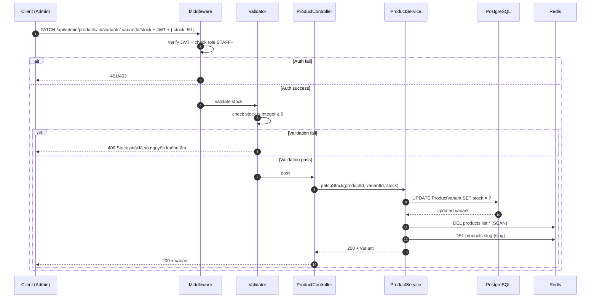
```mermaid
sequenceDiagram
    autonumber
    participant C as Client (Admin)
    participant M as Middleware
    participant V as Validator
    participant API as ProductController
    participant S as ProductService
    participant DB as PostgreSQL
    participant R as Redis

    C->>M: PATCH /api/admin/products/:id/variants/:variantId/stock + JWT + { stock: 50 }
    M->>M: verify JWT + check role STAFF+
    alt Auth fail
        M-->>C: 401/403
    else Auth success
        M->>V: validate stock
        V->>V: check stock is integer ≥ 0
        alt Validation fail
            V-->>C: 400 Stock phải là số nguyên không âm
        else Validation pass
            V->>API: pass
            API->>S: patchStock(productId, variantId, stock)
            S->>DB: UPDATE ProductVariant SET stock = ?
            DB-->>S: Updated variant
            S->>R: DEL products:list:* (SCAN)
            S->>R: DEL products:slug:{slug}
            S-->>API: 200 + variant
            API-->>C: 200 + variant
        end
    end
```

---

## SD-09: Thêm ảnh vào sản phẩm (Admin)

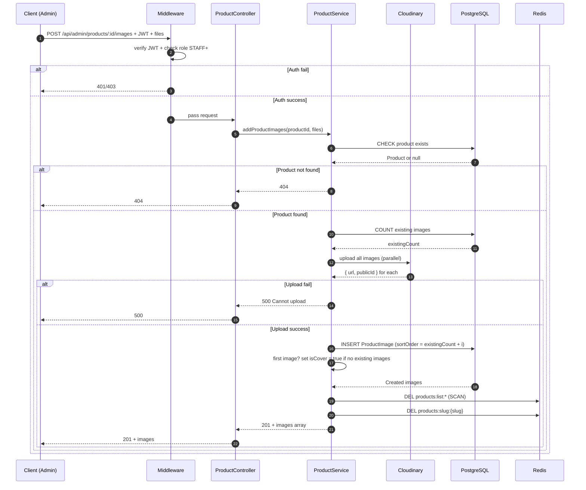
```mermaid
sequenceDiagram
    autonumber
    participant C as Client (Admin)
    participant M as Middleware
    participant API as ProductController
    participant S as ProductService
    participant CL as Cloudinary
    participant DB as PostgreSQL
    participant R as Redis

    C->>M: POST /api/admin/products/:id/images + JWT + files
    M->>M: verify JWT + check role STAFF+
    alt Auth fail
        M-->>C: 401/403
    else Auth success
        M->>API: pass request
        API->>S: addProductImages(productId, files)
        S->>DB: CHECK product exists
        DB-->>S: Product or null
        alt Product not found
            S-->>API: 404
            API-->>C: 404
        else Product found
            S->>DB: COUNT existing images
            DB-->>S: existingCount
            S->>CL: upload all images (parallel)
            CL-->>S: { url, publicId } for each
            alt Upload fail
                S-->>API: 500 Cannot upload
                API-->>C: 500
            else Upload success
                S->>DB: INSERT ProductImage (sortOrder = existingCount + i)
                S->>S: first image? set isCover = true if no existing images
                DB-->>S: Created images
                S->>R: DEL products:list:* (SCAN)
                S->>R: DEL products:slug:{slug}
                S-->>API: 201 + images array
                API-->>C: 201 + images
            end
        end
    end
```

---

## SD-10: Xóa ảnh khỏi sản phẩm (Admin)

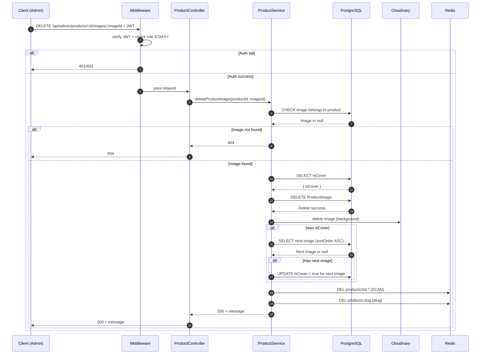
```mermaid
sequenceDiagram
    autonumber
    participant C as Client (Admin)
    participant M as Middleware
    participant API as ProductController
    participant S as ProductService
    participant DB as PostgreSQL
    participant CL as Cloudinary
    participant R as Redis

    C->>M: DELETE /api/admin/products/:id/images/:imageId + JWT
    M->>M: verify JWT + check role STAFF+
    alt Auth fail
        M-->>C: 401/403
    else Auth success
        M->>API: pass request
        API->>S: deleteProductImage(productId, imageId)
        S->>DB: CHECK image belongs to product
        DB-->>S: Image or null
        alt Image not found
            S-->>API: 404
            API-->>C: 404
        else Image found
            S->>DB: SELECT isCover
            DB-->>S: { isCover }
            S->>DB: DELETE ProductImage
            DB-->>S: Delete success
            S->>CL: delete image (background)
            alt was isCover
                S->>DB: SELECT next image (sortOrder ASC)
                DB-->>S: Next image or null
                alt Has next image
                    S->>DB: UPDATE isCover = true for next image
                end
            end
            S->>R: DEL products:list:* (SCAN)
            S->>R: DEL products:slug:{slug}
            S-->>API: 200 + message
            API-->>C: 200 + message
        end
    end
```

---

## SD-11: Đặt ảnh bìa (Admin)

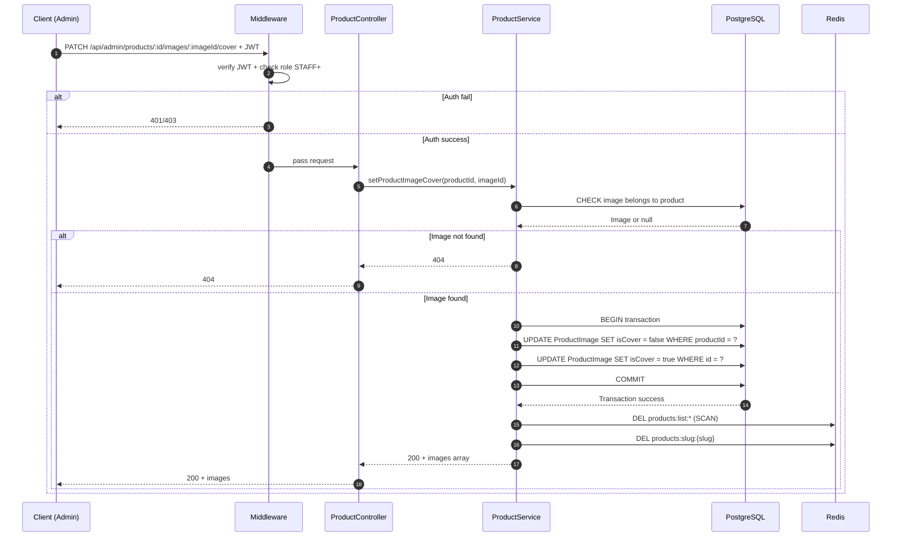
```mermaid
sequenceDiagram
    autonumber
    participant C as Client (Admin)
    participant M as Middleware
    participant API as ProductController
    participant S as ProductService
    participant DB as PostgreSQL
    participant R as Redis

    C->>M: PATCH /api/admin/products/:id/images/:imageId/cover + JWT
    M->>M: verify JWT + check role STAFF+
    alt Auth fail
        M-->>C: 401/403
    else Auth success
        M->>API: pass request
        API->>S: setProductImageCover(productId, imageId)
        S->>DB: CHECK image belongs to product
        DB-->>S: Image or null
        alt Image not found
            S-->>API: 404
            API-->>C: 404
        else Image found
            S->>DB: BEGIN transaction
            S->>DB: UPDATE ProductImage SET isCover = false WHERE productId = ?
            S->>DB: UPDATE ProductImage SET isCover = true WHERE id = ?
            S->>DB: COMMIT
            DB-->>S: Transaction success
            S->>R: DEL products:list:* (SCAN)
            S->>R: DEL products:slug:{slug}
            S-->>API: 200 + images array
            API-->>C: 200 + images
        end
    end
```

---

## SD-12: Báo cáo tồn kho (Admin)

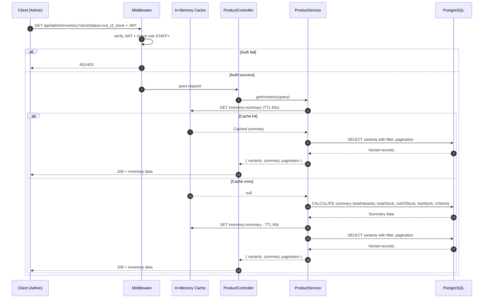
```mermaid
sequenceDiagram
    autonumber
    participant C as Client (Admin)
    participant M as Middleware
    participant Cache as In-Memory Cache
    participant API as ProductController
    participant S as ProductService
    participant DB as PostgreSQL

    C->>M: GET /api/admin/inventory?stockStatus=out_of_stock + JWT
    M->>M: verify JWT + check role STAFF+
    alt Auth fail
        M-->>C: 401/403
    else Auth success
        M->>API: pass request
        API->>S: getInventory(query)
        S->>Cache: GET inventory:summary (TTL 60s)
        alt Cache hit
            Cache-->>S: Cached summary
            S->>DB: SELECT variants with filter, pagination
            DB-->>S: Variant records
            S-->>API: { variants, summary, pagination }
            API-->>C: 200 + inventory data
        else Cache miss
            Cache-->>S: null
            S->>DB: CALCULATE summary (totalVariants, totalStock, outOfStock, lowStock, inStock)
            DB-->>S: Summary data
            S->>Cache: SET inventory:summary - TTL 60s
            S->>DB: SELECT variants with filter, pagination
            DB-->>S: Variant records
            S-->>API: { variants, summary, pagination }
            API-->>C: 200 + inventory data
        end
    end
```

---

## SD-13: Full-text Search (Public)

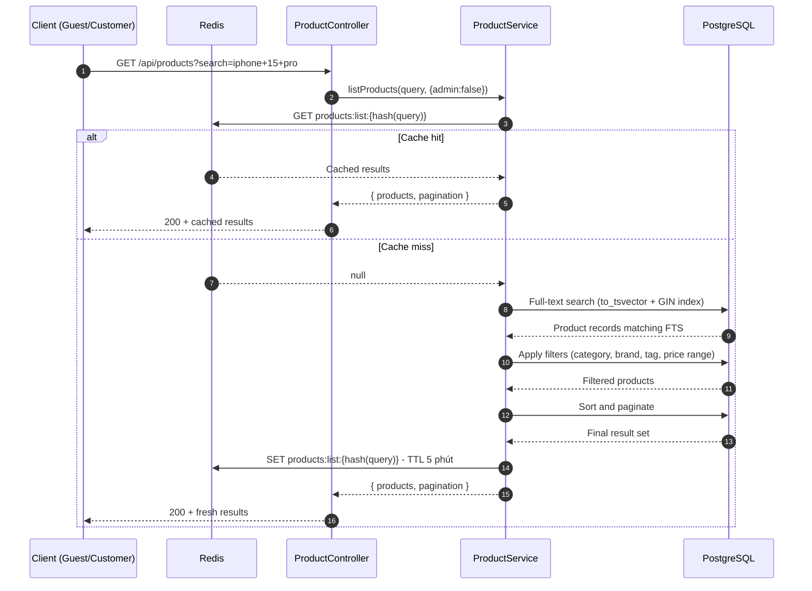
```mermaid
sequenceDiagram
    autonumber
    participant C as Client (Guest/Customer)
    participant R as Redis
    participant API as ProductController
    participant S as ProductService
    participant DB as PostgreSQL

    C->>API: GET /api/products?search=iphone+15+pro
    API->>S: listProducts(query, {admin:false})
    S->>R: GET products:list:{hash(query)}
    alt Cache hit
        R-->>S: Cached results
        S-->>API: { products, pagination }
        API-->>C: 200 + cached results
    else Cache miss
        R-->>S: null
        S->>DB: Full-text search (to_tsvector + GIN index)
        DB-->>S: Product records matching FTS
        S->>DB: Apply filters (category, brand, tag, price range)
        DB-->>S: Filtered products
        S->>DB: Sort and paginate
        DB-->>S: Final result set
        S->>R: SET products:list:{hash(query)} - TTL 5 phút
        S-->>API: { products, pagination }
        API-->>C: 200 + fresh results
    end
```

---

## SD-14: Cache Bust Flow

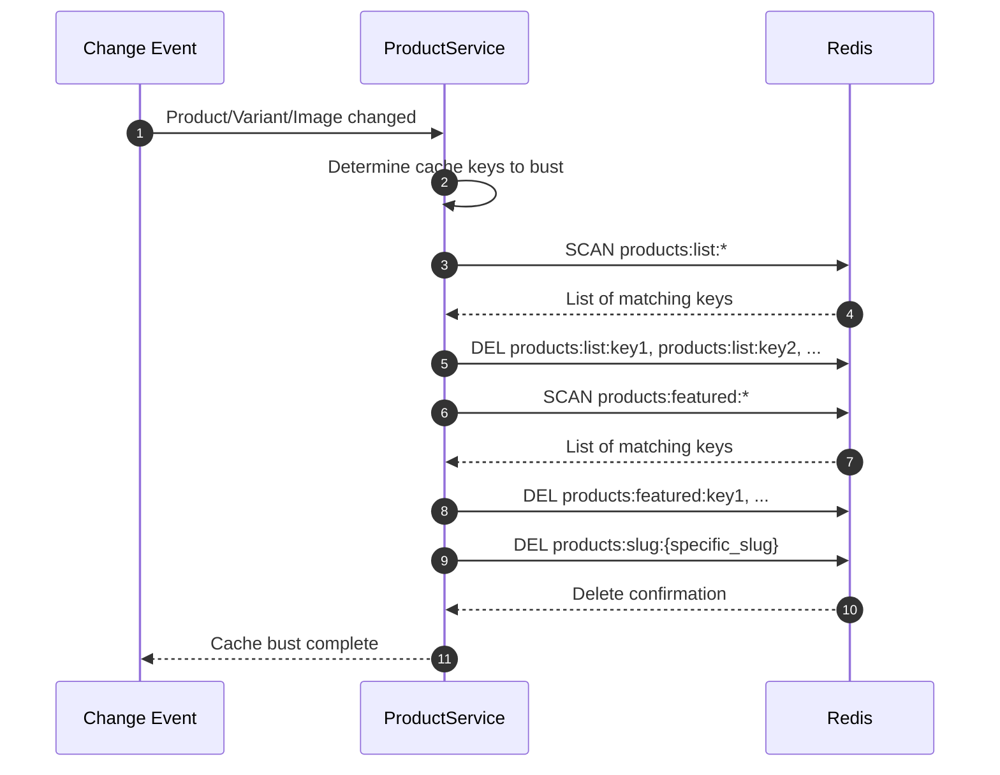
```mermaid
sequenceDiagram
    autonumber
    participant Trigger as Change Event
    participant S as ProductService
    participant R as Redis

    Trigger->>S: Product/Variant/Image changed
    S->>S: Determine cache keys to bust
    S->>R: SCAN products:list:*
    R-->>S: List of matching keys
    S->>R: DEL products:list:key1, products:list:key2, ...
    S->>R: SCAN products:featured:*
    R-->>S: List of matching keys
    S->>R: DEL products:featured:key1, ...
    S->>R: DEL products:slug:{specific_slug}
    R-->>S: Delete confirmation
    S-->>Trigger: Cache bust complete
```

---

## SD-15: Bật/tắt hiển thị sản phẩm (Admin)

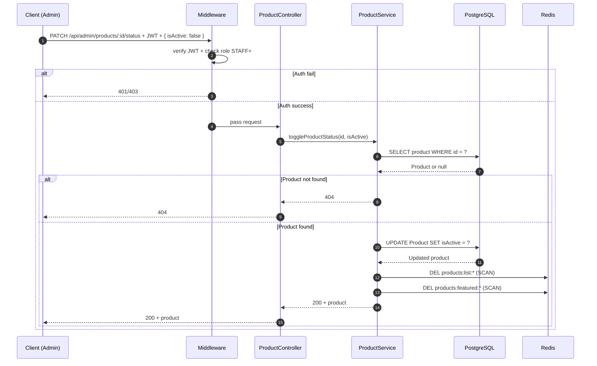
```mermaid
sequenceDiagram
    autonumber
    participant C as Client (Admin)
    participant M as Middleware
    participant API as ProductController
    participant S as ProductService
    participant DB as PostgreSQL
    participant R as Redis

    C->>M: PATCH /api/admin/products/:id/status + JWT + { isActive: false }
    M->>M: verify JWT + check role STAFF+
    alt Auth fail
        M-->>C: 401/403
    else Auth success
        M->>API: pass request
        API->>S: toggleProductStatus(id, isActive)
        S->>DB: SELECT product WHERE id = ?
        DB-->>S: Product or null
        alt Product not found
            S-->>API: 404
            API-->>C: 404
        else Product found
            S->>DB: UPDATE Product SET isActive = ?
            DB-->>S: Updated product
            S->>R: DEL products:list:* (SCAN)
            S->>R: DEL products:featured:* (SCAN)
            S-->>API: 200 + product
            API-->>C: 200 + product
        end
    end
```

---

## SD-16: Bật/tắt nổi bật sản phẩm (Admin)

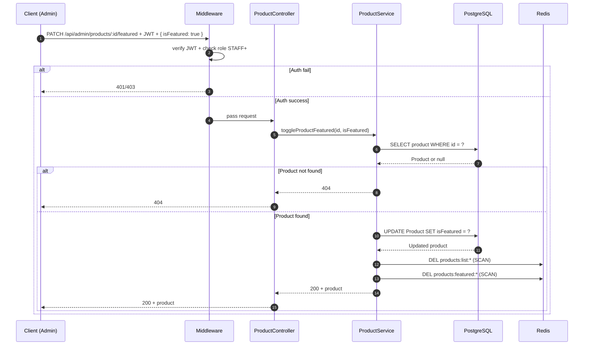
```mermaid
sequenceDiagram
    autonumber
    participant C as Client (Admin)
    participant M as Middleware
    participant API as ProductController
    participant S as ProductService
    participant DB as PostgreSQL
    participant R as Redis

    C->>M: PATCH /api/admin/products/:id/featured + JWT + { isFeatured: true }
    M->>M: verify JWT + check role STAFF+
    alt Auth fail
        M-->>C: 401/403
    else Auth success
        M->>API: pass request
        API->>S: toggleProductFeatured(id, isFeatured)
        S->>DB: SELECT product WHERE id = ?
        DB-->>S: Product or null
        alt Product not found
            S-->>API: 404
            API-->>C: 404
        else Product found
            S->>DB: UPDATE Product SET isFeatured = ?
            DB-->>S: Updated product
            S->>R: DEL products:list:* (SCAN)
            S->>R: DEL products:featured:* (SCAN)
            S-->>API: 200 + product
            API-->>C: 200 + product
        end
    end
```

---

> **Document Status:** Draft  
> **Last Updated:** 2026-06-19  
> **Total Diagrams:** 16  
> **Next Review:** After implementation complete
