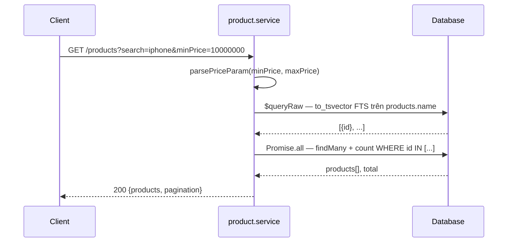
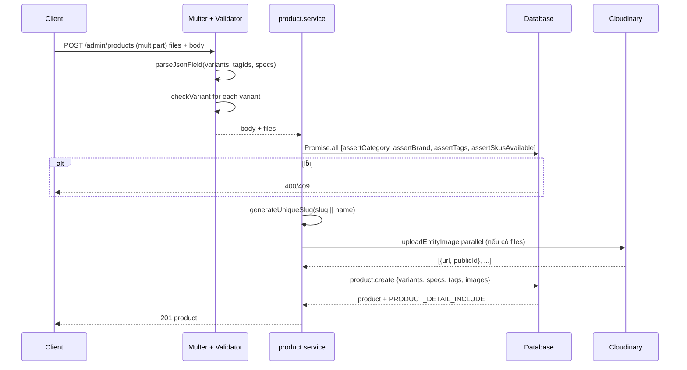
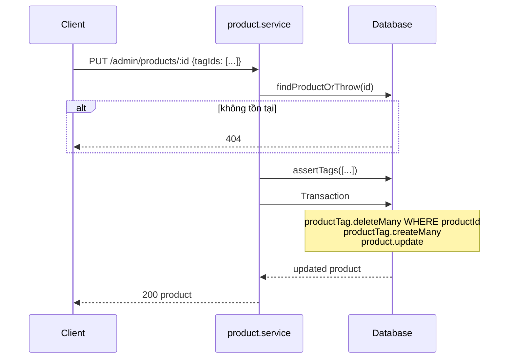
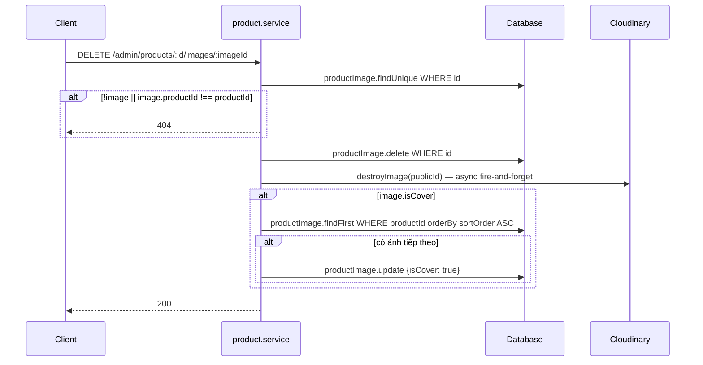
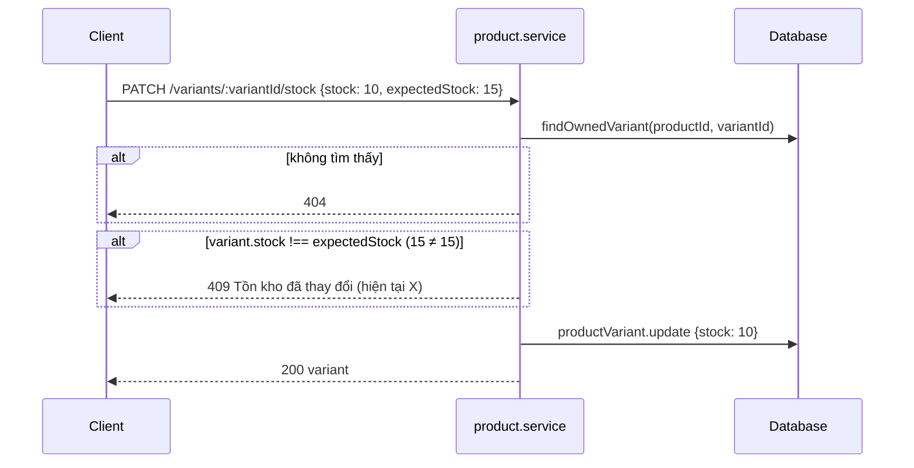
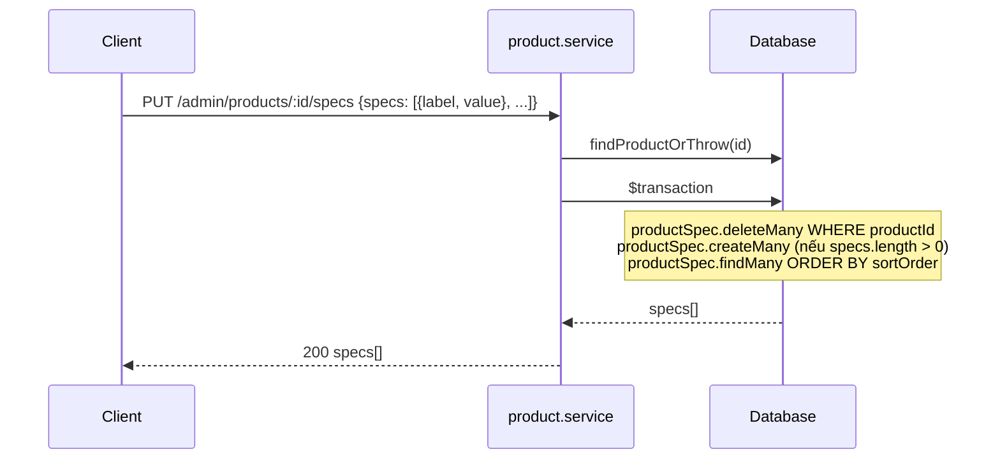
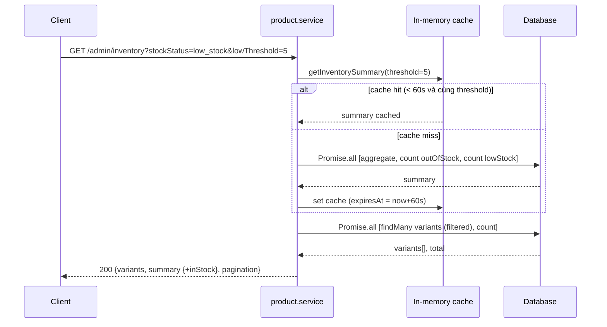

# Sequence Diagram — Luồng API
## Module: Product
### Dự án: Mobivexa E-Commerce Platform

> **Phiên bản:** 2.0 | **Ngày:** 2026-08-22

---

## 1. Listing sản phẩm public (với search)

---

## 2. Tạo sản phẩm (multipart/form-data)

---

## 3. Cập nhật sản phẩm với tags

---

## 4. Xóa ảnh cover → auto-set cover tiếp theo

---

## 5. Cập nhật tồn kho (optimistic lock)

---

## 6. Thay thế specs (replace-all transaction)

---

## 7. Inventory report (với cache)

