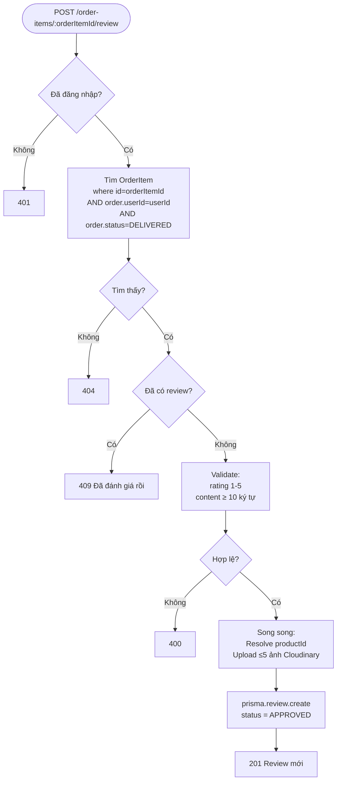
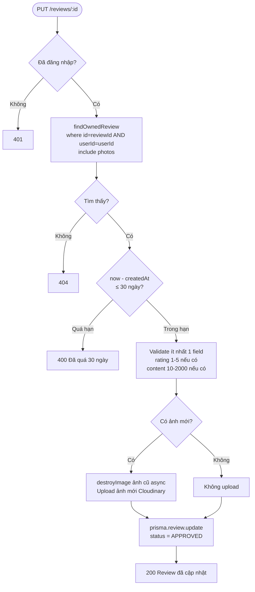
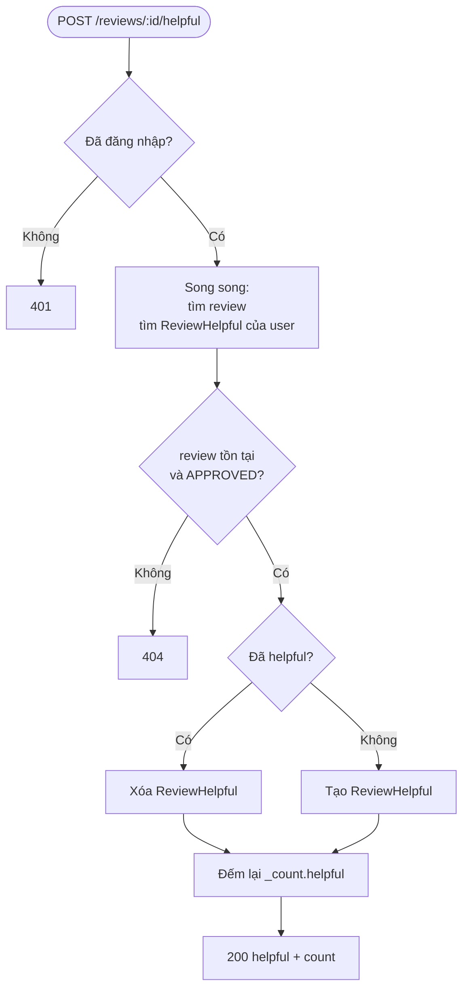
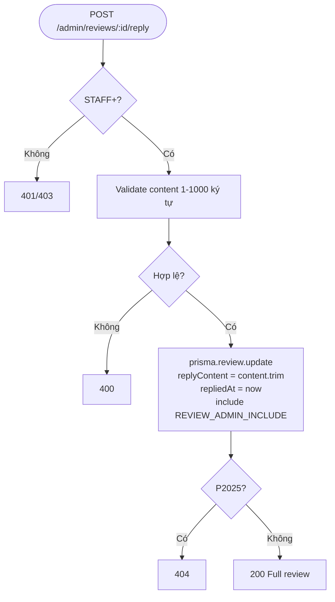

# Activity Diagram
## Module: Review
### Dự án: Mobivexa E-Commerce Platform

> **Phiên bản:** 2.0 | **Ngày:** 2026-08-22

---

## AD-01: Tạo đánh giá

---

## AD-02: Sửa đánh giá

---

## AD-03: Toggle Helpful

---

## AD-04: Admin Reply

