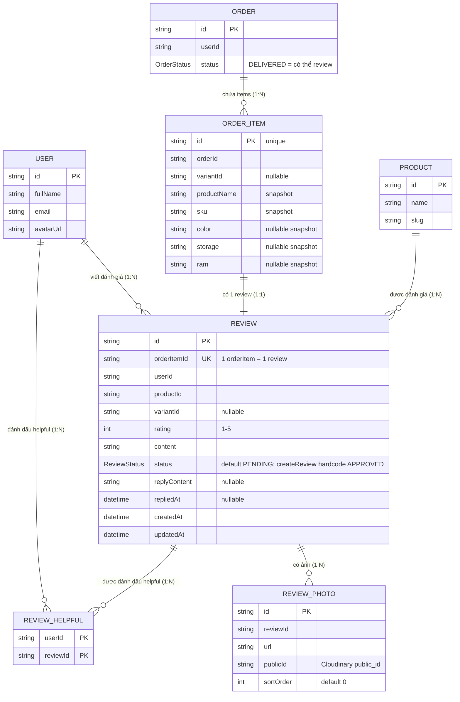

# ERD — Entity Relationship Diagram
## Module: Review
### Dự án: Mobivexa E-Commerce Platform

> **Phiên bản:** 2.0 | **Ngày:** 2026-08-22

---

## 1. Sơ đồ ERD



---

## 2. Mô tả các model chính

### Review

| Cột | Kiểu | Ghi chú |
|---|---|---|
| `orderItemId` | String | UNIQUE — 1 orderItem chỉ có 1 review |
| `status` | ReviewStatus | Default PENDING trong schema, nhưng service hardcode APPROVED khi tạo |
| `replyContent` | String? | Admin reply text |
| `repliedAt` | DateTime? | Null cho đến khi admin reply lần đầu |

**Index:** `@@index([productId, status])`, `@@index([userId])`

### ReviewPhoto

| Cột | Kiểu | Ghi chú |
|---|---|---|
| `publicId` | String | Cloudinary public_id; dùng để xóa khi review bị xóa |
| `sortOrder` | Int | Thứ tự hiển thị; tăng theo index của file upload |

`onDelete: Cascade` từ Review

### ReviewHelpful

| Cột | Kiểu | Ghi chú |
|---|---|---|
| `@@id([userId, reviewId])` | Composite PK | Mỗi user chỉ helpful 1 lần / review |

`onDelete: Cascade` từ cả User và Review

---

## 3. Select objects

### REVIEW_PUBLIC_SELECT (public endpoints)
```
id, rating, content, replyContent, repliedAt, createdAt
orderItem: { color, storage, ram, sku }
user: { id, fullName, avatarUrl }
photos: sorted by sortOrder ASC { id, url }
_count: { helpful }
```

### REVIEW_ADMIN_INCLUDE (admin endpoints)
```
user:    { id, fullName, email }
product: { id, name, slug }
photos:  sorted by sortOrder ASC { id, url }
_count:  { helpful }
```

> Admin include dùng **include** (không phải select) nên trả thêm tất cả scalar fields của Review.
