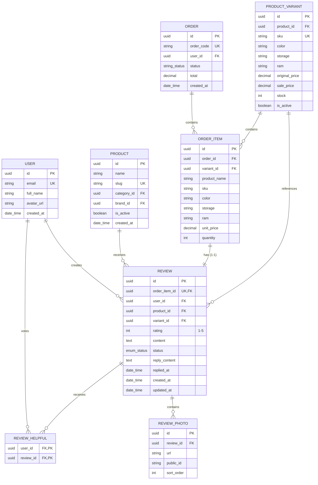

# Entity Relationship Diagram - Review System

## 📊 Mermaid ERD Diagram



## 📋 Chi tiết Schema

### 1. Users Table (`users`)

```sql
CREATE TABLE users (
    id UUID PRIMARY KEY DEFAULT gen_random_uuid(),
    email VARCHAR(255) UNIQUE NOT NULL,
    full_name VARCHAR(255) NOT NULL,
    avatar_url TEXT,
    role VARCHAR(20) DEFAULT 'CUSTOMER',
    is_active BOOLEAN DEFAULT true,
    created_at TIMESTAMPTZ DEFAULT NOW(),
    updated_at TIMESTAMPTZ
);

-- Indexes
CREATE INDEX idx_users_role ON users(role);
CREATE INDEX idx_users_is_active ON users(is_active);
CREATE INDEX idx_users_created_at ON users(created_at DESC);
```

**Mục đích:** Lưu thông tin người dùng, phân quyền và quản lý đánh giá

**Quan hệ với Review:** Một user có thể tạo nhiều review (1:N)

---

### 2. Products Table (`products`)

```sql
CREATE TABLE products (
    id UUID PRIMARY KEY DEFAULT gen_random_uuid(),
    name VARCHAR(500) NOT NULL,
    slug VARCHAR(255) UNIQUE NOT NULL,
    description TEXT,
    category_id UUID NOT NULL REFERENCES categories(id),
    brand_id UUID NOT NULL REFERENCES brands(id),
    is_active BOOLEAN DEFAULT true,
    is_featured BOOLEAN DEFAULT false,
    created_at TIMESTAMPTZ DEFAULT NOW(),
    updated_at TIMESTAMPTZ
);

-- Indexes
CREATE INDEX idx_products_category ON products(category_id);
CREATE INDEX idx_products_brand ON products(brand_id);
CREATE INDEX idx_products_active_featured ON products(is_active, is_featured);
CREATE INDEX idx_products_created_at ON products(created_at DESC);

-- Review aggregation (optional computed column)
ALTER TABLE products ADD COLUMN review_count INTEGER DEFAULT 0;
ALTER TABLE products ADD COLUMN average_rating DECIMAL(3,2) DEFAULT 0.00;

-- Trigger to update aggregation (simplified)
CREATE OR REPLACE FUNCTION update_product_review_stats()
RETURNS TRIGGER AS $$
BEGIN
    UPDATE products
    SET
        review_count = (SELECT COUNT(*) FROM reviews WHERE product_id = NEW.product_id AND status = 'APPROVED'),
        average_rating = (SELECT AVG(rating) FROM reviews WHERE product_id = NEW.product_id AND status = 'APPROVED')
    WHERE id = NEW.product_id;
    RETURN NEW;
END;
$$ LANGUAGE plpgsql;
```

**Mục đích:** Lưu thông tin sản phẩm được đánh giá

**Quan hệ với Review:** Một product có nhiều review (1:N)

---

### 3. ProductVariants Table (`product_variants`)

```sql
CREATE TABLE product_variants (
    id UUID PRIMARY KEY DEFAULT gen_random_uuid(),
    product_id UUID NOT NULL REFERENCES products(id) ON DELETE CASCADE,
    sku VARCHAR(100) UNIQUE NOT NULL,
    color VARCHAR(50),
    storage VARCHAR(50),
    ram VARCHAR(50),
    image_url TEXT,
    original_price DECIMAL(12,2) NOT NULL,
    sale_price DECIMAL(12,2) NOT NULL,
    stock INTEGER DEFAULT 0,
    is_active BOOLEAN DEFAULT true,
    created_at TIMESTAMPTZ DEFAULT NOW(),
    updated_at TIMESTAMPTZ
);

-- Indexes
CREATE INDEX idx_variants_product ON product_variants(product_id);
CREATE INDEX idx_variants_stock ON product_variants(stock);
CREATE INDEX idx_variants_active_price ON product_variants(is_active, sale_price);
```

**Mục đích:** Lưu thông tin biến thể sản phẩm (màu, dung lượng, RAM)

**Quan hệ với Review:** Nhiều review có thể tham chiếu đến một variant (N:1, optional)

---

### 4. Orders Table (`orders`)

```sql
CREATE TABLE orders (
    id UUID PRIMARY KEY DEFAULT gen_random_uuid(),
    order_code VARCHAR(50) UNIQUE NOT NULL,
    user_id UUID NOT NULL REFERENCES users(id),
    shipping_name VARCHAR(255) NOT NULL,
    shipping_phone VARCHAR(20) NOT NULL,
    shipping_province VARCHAR(100) NOT NULL,
    shipping_district VARCHAR(100) NOT NULL,
    shipping_ward VARCHAR(100) NOT NULL,
    shipping_detail TEXT NOT NULL,
    subtotal DECIMAL(12,2) NOT NULL,
    shipping_fee DECIMAL(12,2) DEFAULT 0,
    discount DECIMAL(12,2) DEFAULT 0,
    total DECIMAL(12,2) NOT NULL,
    status VARCHAR(20) DEFAULT 'PENDING',
    payment_method VARCHAR(20) DEFAULT 'COD',
    payment_status VARCHAR(20) DEFAULT 'UNPAID',
    note TEXT,
    cancel_reason TEXT,
    paid_at TIMESTAMPTZ,
    created_at TIMESTAMPTZ DEFAULT NOW(),
    updated_at TIMESTAMPTZ
);

-- Indexes
CREATE INDEX idx_orders_user ON orders(user_id);
CREATE INDEX idx_orders_status ON orders(status);
CREATE INDEX idx_orders_payment_status ON orders(payment_status);
CREATE INDEX idx_orders_created_at ON orders(created_at DESC);
```

**Mục đích:** Lưu thông tin đơn hàng

**Quan hệ với Review:** Gián tiếp thông qua OrderItem (đơn hàng đã giao mới có thể đánh giá)

---

### 5. OrderItems Table (`order_items`)

```sql
CREATE TABLE order_items (
    id UUID PRIMARY KEY DEFAULT gen_random_uuid(),
    order_id UUID NOT NULL REFERENCES orders(id) ON DELETE CASCADE,
    variant_id UUID REFERENCES product_variants(id) ON DELETE SET NULL,
    product_name VARCHAR(500) NOT NULL,
    sku VARCHAR(100) NOT NULL,
    color VARCHAR(50),
    storage VARCHAR(50),
    ram VARCHAR(50),
    unit_price DECIMAL(12,2) NOT NULL,
    quantity INTEGER NOT NULL,
    subtotal DECIMAL(12,2) NOT NULL
);

-- Indexes
CREATE INDEX idx_order_items_order ON order_items(order_id);
```

**Mục đích:** Lưu chi tiết từng sản phẩm trong đơn hàng

**Quan hệ với Review:** Một OrderItem có tối đa một Review (1:1, unique)

**Điều kiện:** Chỉ OrderItem của đơn hàng có status = `DELIVERED` mới có thể đánh giá

---

### 6. Reviews Table (`reviews`)

```sql
CREATE TYPE review_status AS ENUM ('PENDING', 'APPROVED', 'REJECTED');

CREATE TABLE reviews (
    id UUID PRIMARY KEY DEFAULT gen_random_uuid(),
    order_item_id UUID UNIQUE NOT NULL REFERENCES order_items(id) ON DELETE CASCADE,
    user_id UUID NOT NULL REFERENCES users(id) ON DELETE CASCADE,
    product_id UUID NOT NULL REFERENCES products(id) ON DELETE CASCADE,
    variant_id UUID REFERENCES product_variants(id) ON DELETE SET NULL,
    rating INTEGER NOT NULL CHECK (rating BETWEEN 1 AND 5),
    content TEXT NOT NULL CHECK (LENGTH(TRIM(content)) BETWEEN 10 AND 2000),
    status review_status DEFAULT 'PENDING',
    reply_content TEXT,
    replied_at TIMESTAMPTZ,
    created_at TIMESTAMPTZ DEFAULT NOW(),
    updated_at TIMESTAMPTZ
);

-- Indexes
CREATE INDEX idx_reviews_product_status ON reviews(product_id, status);
CREATE INDEX idx_reviews_user ON reviews(user_id);
CREATE INDEX idx_reviews_rating ON reviews(rating);
CREATE INDEX idx_reviews_created_at ON reviews(created_at DESC);

-- Unique constraint ensures one review per order item
CREATE UNIQUE INDEX idx_reviews_order_item ON reviews(order_item_id);

-- Composite index for admin filtering
CREATE INDEX idx_reviews_admin_filter ON reviews(status, product_id, created_at DESC);
```

**Mục đích:** Lưu đánh giá sản phẩm từ người dùng đã mua hàng

**Validation:**
- `rating`: Phải từ 1-5, integer
- `content`: Độ dài 10-2000 ký tự
- `order_item_id`: Unique (mỗi OrderItem chỉ có 1 review)
- `status`: Auto-approve khi tạo, có thể pending/reject cho admin review
- `createdAt`: Cửa sổ chỉnh sửa 30 ngày

**Quan hệ:**
- User → Review: 1:N
- Product → Review: 1:N
- ProductVariant → Review: N:1 (optional)
- OrderItem → Review: 1:1 (unique)

---

### 7. ReviewPhotos Table (`review_photos`)

```sql
CREATE TABLE review_photos (
    id UUID PRIMARY KEY DEFAULT gen_random_uuid(),
    review_id UUID NOT NULL REFERENCES reviews(id) ON DELETE CASCADE,
    url TEXT NOT NULL,
    public_id TEXT NOT NULL,
    sort_order INTEGER DEFAULT 0,
    created_at TIMESTAMPTZ DEFAULT NOW()
);

-- Indexes
CREATE INDEX idx_review_photos_review ON review_photos(review_id);
CREATE INDEX idx_review_photos_sort ON review_photos(review_id, sort_order);
```

**Mục đích:** Lưu hình ảnh đi kèm đánh giá

**Quan hệ với Review:** Một review có nhiều photo (1:N, max 5 enforced at app level)

**Giới hạn:** Tối đa 5 photos per review (enforced in application layer)

---

### 8. ReviewHelpfuls Table (`review_helpful`)

```sql
CREATE TABLE review_helpful (
    user_id UUID NOT NULL REFERENCES users(id) ON DELETE CASCADE,
    review_id UUID NOT NULL REFERENCES reviews(id) ON DELETE CASCADE,
    created_at TIMESTAMPTZ DEFAULT NOW(),
    PRIMARY KEY (user_id, review_id)
);

-- Indexes
CREATE INDEX idx_review_helpful_review ON review_helpful(review_id);
CREATE INDEX idx_review_helpful_user ON review_helpful(user_id);
```

**Mục đích:** Lưu投票 "hữu ích" cho đánh giá

**Quan hệ:**
- User ↔ ReviewHelpful: 1:N (một user có thể vote nhiều review)
- Review ↔ ReviewHelpful: 1:N (một review có nhiều vote)
- Unique constraint: Một user chỉ vote một review một lần

---

## 🔗 Quan hệ Giữa Các Entity

### 1. User ↔ Review (1:N)
- Một User có thể tạo nhiều Review
- Một Review thuộc về một User
- **Foreign Key:** `reviews.user_id`

### 2. Product ↔ Review (1:N)
- Một Product có nhiều Review
- Một Review thuộc về một Product
- **Foreign Key:** `reviews.product_id`
- **Aggregation:** `products.review_count`, `products.average_rating`

### 3. ProductVariant ↔ Review (N:1, Optional)
- Nhiều Review có thể tham chiếu đến một ProductVariant
- Review có thể không có variant (nếu sản phẩm không có variant)
- **Foreign Key:** `reviews.variant_id` (nullable)

### 4. OrderItem ↔ Review (1:1, Unique)
- Một OrderItem có tối đa một Review
- Một Review thuộc về một OrderItem
- **Unique Constraint:** `reviews.order_item_id`
- **Điều kiện:** Chỉ OrderItem của đơn hàng `DELIVERED` mới có thể đánh giá

### 5. Review ↔ ReviewPhoto (1:N)
- Một Review có nhiều ReviewPhoto
- Một ReviewPhoto thuộc về một Review
- **Foreign Key:** `review_photos.review_id`
- **Giới hạn:** Max 5 photos (enforced at app level)

### 6. Review ↔ ReviewHelpful (1:N)
- Một Review có nhiều ReviewHelpful votes
- Một ReviewHelpful vote thuộc về một Review
- **Foreign Key:** `review_helpful.review_id`

### 7. User ↔ ReviewHelpful (1:N)
- Một User có thể vote nhiều Review
- Một ReviewHelpful vote thuộc về một User
- **Foreign Key:** `review_helpful.user_id`
- **Unique Constraint:** `PRIMARY KEY (user_id, review_id)` - mỗi user chỉ vote một lần

---

## 📝 Query Patterns

### 1. Review Summary (3 Parallel Aggregations)

**Use case:** Hiển thị thống kê đánh giá trên trang product

```sql
-- Query 1: Aggregate rating & count
SELECT
    COALESCE(AVG(r.rating), 0) as average_rating,
    COUNT(r.id) as total_count
FROM reviews r
WHERE r.product_id = $1
  AND r.status = 'APPROVED';

-- Query 2: Breakdown by rating (1-5 stars)
SELECT
    r.rating,
    COUNT(r.id) as count
FROM reviews r
WHERE r.product_id = $1
  AND r.status = 'APPROVED'
GROUP BY r.rating
ORDER BY r.rating;

-- Query 3: Count reviews with photos
SELECT COUNT(DISTINCT rp.review_id) as with_photo_count
FROM review_photos rp
JOIN reviews r ON r.id = rp.review_id
WHERE r.product_id = $1
  AND r.status = 'APPROVED';

-- Execute all 3 in parallel using Promise.all()
```

**TypeScript Implementation:**
```typescript
const [aggregate, breakdown, withPhoto] = await Promise.all([
  prisma.review.aggregate({
    where: { productId, status: 'APPROVED' },
    _avg: { rating: true },
    _count: { id: true },
  }),
  prisma.review.groupBy({
    by: ['rating'],
    where: { productId, status: 'APPROVED' },
    _count: { id: true },
  }),
  prisma.reviewPhoto.count({
    where: { review: { productId, status: 'APPROVED' } },
  }),
]);
```

**Index Utilization:**
- `idx_reviews_product_status` trên `(product_id, status)` - covers tất cả 3 queries
- Parallel execution reduces total latency

---

### 2. List Reviews with Filters

**Use case:** Trang "Đánh giá" của sản phẩm với filter

```sql
-- Base query with filters
SELECT
    r.id,
    r.rating,
    r.content,
    r.reply_content,
    r.replied_at,
    r.created_at,
    u.id as user_id,
    u.full_name as user_name,
    u.avatar_url as user_avatar,
    json_agg(
        json_build_object('id', rp.id, 'url', rp.url)
        ORDER BY rp.sort_order
    ) as photos,
    COUNT(rh.user_id) as helpful_count
FROM reviews r
JOIN users u ON u.id = r.user_id
LEFT JOIN review_photos rp ON rp.review_id = r.id
LEFT JOIN review_helpful rh ON rh.review_id = r.id
WHERE r.product_id = $1
  AND r.status = 'APPROVED'
  -- Optional filters
  AND ($2::integer IS NULL OR r.rating = $2)  -- rating filter
  AND ($3::boolean IS FALSE OR EXISTS (      -- hasPhoto filter
      SELECT 1 FROM review_photos rp2
      WHERE rp2.review_id = r.id
  ))
GROUP BY r.id, u.id
ORDER BY
  CASE WHEN $4 = 'helpful' THEN COUNT(rh.user_id) END DESC,
  CASE WHEN $4 = 'newest' THEN r.created_at END DESC
LIMIT $5 OFFSET $6;
```

**Prisma Implementation:**
```typescript
const where: Prisma.ReviewWhereInput = {
  productId,
  status: 'APPROVED',
  rating: query.rating ? Number(query.rating) : undefined,
  photos: query.hasPhoto === 'true' ? { some: {} } : undefined,
};

const orderBy: Prisma.ReviewOrderByWithRelationInput =
  query.sort === 'helpful'
    ? { helpful: { _count: 'desc' } }
    : { createdAt: 'desc' };

const [reviews, total] = await Promise.all([
  prisma.review.findMany({
    where,
    orderBy,
    skip: (page - 1) * limit,
    take: limit,
    select: REVIEW_PUBLIC_SELECT,
  }),
  prisma.review.count({ where }),
]);
```

**Optimization Notes:**
- Use composite index `idx_reviews_product_status` for product filtering
- Use `idx_reviews_rating` if filtering by rating
- Pagination with `skip/take` - consider cursor-based for large datasets
- Sort by helpful count requires counting votes - may be slow for large datasets

---

### 3. Find Pending Reviews (DELIVERED Orders)

**Use case:** Trang "Đánh giá của tôi" - tìm đơn hàng có thể đánh giá

```sql
-- Find order items from delivered orders without reviews
SELECT
    oi.id,
    oi.product_name,
    oi.sku,
    oi.color,
    oi.storage,
    oi.ram,
    oi.unit_price,
    oi.quantity,
    o.id as order_id,
    o.order_code,
    o.updated_at as order_updated_at,
    p.slug as product_slug,
    pi.url as product_image_url
FROM order_items oi
JOIN orders o ON o.id = oi.order_id
LEFT JOIN product_variants pv ON pv.id = oi.variant_id
LEFT JOIN products p ON p.id = pv.product_id
LEFT JOIN product_images pi ON pi.product_id = p.id AND pi.is_cover = true
WHERE o.user_id = $1
  AND o.status = 'DELIVERED'
  AND NOT EXISTS (
      SELECT 1 FROM reviews r
      WHERE r.order_item_id = oi.id
  )
ORDER BY o.updated_at DESC;
```

**Prisma Implementation:**
```typescript
return prisma.orderItem.findMany({
  where: {
    order: { userId, status: 'DELIVERED' },
    review: { is: null },
  },
  select: {
    id: true,
    productName: true,
    sku: true,
    color: true,
    storage: true,
    ram: true,
    unitPrice: true,
    quantity: true,
    order: {
      select: {
        id: true,
        orderCode: true,
        updatedAt: true,
      },
    },
    variant: {
      select: {
        product: {
          select: {
            slug: true,
            images: {
              where: { isCover: true },
              take: 1,
              select: { url: true },
            },
          },
        },
      },
    },
  },
  orderBy: { order: { updatedAt: 'desc' } },
});
```

**Optimization Notes:**
- Index on `orders(user_id, status)` for filtering
- Index on `order_items(order_id)` for join
- Unique constraint on `reviews(order_item_id)` for NOT EXISTS check

---

### 4. Create Review (Resolve ProductId from OrderItem)

**Use case:** Tạo đánh giá mới từ OrderItem

```sql
-- Step 1: Verify order ownership and delivered status
SELECT
    oi.id,
    oi.variant_id,
    oi.product_name,
    oi.sku,
    o.id as order_id
FROM order_items oi
JOIN orders o ON o.id = oi.order_id
WHERE oi.id = $1
  AND o.user_id = $2
  AND o.status = 'DELIVERED';

-- Step 2: Check if review already exists
SELECT id FROM reviews WHERE order_item_id = $1;

-- Step 3: Resolve productId from variant or fallback
SELECT product_id
FROM product_variants
WHERE id = $variant_id;

-- Fallback if variant_id is null
SELECT id FROM products WHERE name = $product_name LIMIT 1;

-- Step 4: Create review with photos
INSERT INTO reviews (order_item_id, user_id, product_id, variant_id, rating, content, status)
VALUES ($1, $2, $3, $4, $5, $6, 'APPROVED')
RETURNING *;

-- Step 5: Create photos in batch
INSERT INTO review_photos (review_id, url, public_id, sort_order)
VALUES
    (review_id, url1, public_id1, 0),
    (review_id, url2, public_id2, 1),
    ...
;
```

**Prisma Implementation:**
```typescript
// Parallel resolve productId & upload photos
const [productId, uploadedPhotos] = await Promise.all([
  orderItem.variantId
    ? prisma.productVariant
        .findUnique({ where: { id: orderItem.variantId } })
        .then((r) => r!.productId)
    : resolveProductIdFromOrderItem(orderItem),
  Promise.all(
    files.slice(0, MAX_PHOTOS).map((f) =>
      uploadEntityImage(f.buffer, 'reviews')
    )
  ),
]);

return prisma.review.create({
  data: {
    orderItemId,
    userId,
    productId,
    variantId: orderItem.variantId,
    rating: body.rating,
    content: body.content.trim(),
    status: 'APPROVED',
    photos: uploadedPhotos.length
      ? { create: uploadedPhotos.map((p, i) => ({ ...p, sortOrder: i })) }
      : undefined,
  },
  include: { photos: { orderBy: { sortOrder: 'asc' } } },
});
```

**Optimization Notes:**
- Parallel operations: resolve productId + upload photos
- Batch insert photos instead of sequential
- Use transaction to ensure atomicity

---

### 5. Update Review (30-Day Window Check)

**Use case:** Chỉnh sửa đánh giá trong vòng 30 ngày

```sql
-- Step 1: Find owned review with photos
SELECT
    r.id,
    r.created_at,
    r.rating,
    r.content,
    rp.id as photo_id,
    rp.public_id
FROM reviews r
LEFT JOIN review_photos rp ON rp.review_id = r.id
WHERE r.id = $1
  AND r.user_id = $2;

-- Step 2: Check 30-day window (application logic)
-- if (Date.now() - review.createdAt.getTime() > EDIT_WINDOW_MS) throw error

-- Step 3: Update review
UPDATE reviews
SET
    rating = COALESCE($3, rating),
    content = COALESCE($4, content),
    status = 'APPROVED',
    updated_at = NOW()
WHERE id = $1;

-- Step 4: Replace photos (delete old + create new)
DELETE FROM review_photos WHERE review_id = $1;

INSERT INTO review_photos (review_id, url, public_id, sort_order)
VALUES (review_id, url1, public_id1, 0), ...;
```

**Prisma Implementation:**
```typescript
const review = await findOwnedReview(userId, reviewId);

if (Date.now() - review.createdAt.getTime() > EDIT_WINDOW_MS) {
  throw new AppError(400, 'Đã quá 30 ngày, không thể chỉnh sửa đánh giá');
}

const data: Prisma.ReviewUpdateInput = { status: 'APPROVED' };
if (body.rating !== undefined) data.rating = body.rating;
if (body.content !== undefined) data.content = body.content.trim();

if (files?.length) {
  // Parallel: upload new + delete old
  const uploadPromise = Promise.all(
    files.slice(0, MAX_PHOTOS).map((f) =>
      uploadEntityImage(f.buffer, 'reviews')
    )
  );
  review.photos.forEach((p) => void destroyImage(p.publicId));

  const uploaded = await uploadPromise;
  data.photos = {
    deleteMany: {},
    create: uploaded.map((p, i) => ({ ...p, sortOrder: i })),
  };
}

return prisma.review.update({
  where: { id: reviewId },
  data,
  include: { photos: { orderBy: { sortOrder: 'asc' } } },
});
```

**Optimization Notes:**
- Check createdAt in application layer (faster than SQL)
- Parallel photo deletion + upload
- Use `deleteMany` + `create` instead of individual operations

---

### 6. Toggle Helpful (Unique Constraint Lookup)

**Use case:** Vote/unvote "hữu ích" cho đánh giá

```sql
-- Step 1: Check if vote exists (using unique constraint)
SELECT user_id, review_id
FROM review_helpful
WHERE user_id = $1 AND review_id = $2;

-- Step 2: Verify review exists and is approved
SELECT id, status FROM reviews WHERE id = $2;

-- Step 3: Delete if exists, otherwise create
DELETE FROM review_helpful
WHERE user_id = $1 AND review_id = $2;

-- OR

INSERT INTO review_helpful (user_id, review_id)
VALUES ($1, $2);

-- Step 4: Return updated count
SELECT COUNT(*) as helpful_count
FROM review_helpful
WHERE review_id = $2;
```

**Prisma Implementation:**
```typescript
const [review, existing] = await Promise.all([
  prisma.review.findUnique({
    where: { id: reviewId },
    select: { id: true, status: true },
  }),
  prisma.reviewHelpful.findUnique({
    where: { userId_reviewId: { userId, reviewId } },
  }),
]);

if (!review || review.status !== 'APPROVED') {
  throw new AppError(404, 'Đánh giá không tồn tại');
}

if (existing) {
  await prisma.reviewHelpful.delete({
    where: { userId_reviewId: { userId, reviewId } },
  });
} else {
  await prisma.reviewHelpful.create({ data: { userId, reviewId } });
}

const updated = await prisma.review.findUnique({
  where: { id: reviewId },
  select: { _count: { select: { helpful: true } } },
});
return { helpful: !existing, count: updated?._count.helpful ?? 0 };
```

**Optimization Notes:**
- Unique constraint on `(user_id, review_id)` enables fast lookup
- Use compound unique key in Prisma: `userId_reviewId`
- Parallel: check review + check existing vote

---

### 7. Admin List (Filter by Status, Rating, Product)

**Use case:** Admin panel - quản lý tất cả đánh giá

```sql
-- With dynamic filters
SELECT
    r.id,
    r.rating,
    r.content,
    r.status,
    r.reply_content,
    r.replied_at,
    r.created_at,
    u.id as user_id,
    u.full_name as user_name,
    u.email as user_email,
    p.id as product_id,
    p.name as product_name,
    p.slug as product_slug,
    json_agg(
        json_build_object('id', rp.id, 'url', rp.url)
        ORDER BY rp.sort_order
    ) as photos,
    COUNT(rh.user_id) as helpful_count
FROM reviews r
JOIN users u ON u.id = r.user_id
JOIN products p ON p.id = r.product_id
LEFT JOIN review_photos rp ON rp.review_id = r.id
LEFT JOIN review_helpful rh ON rh.review_id = r.id
WHERE 1=1
  AND ($1::text IS NULL OR r.status = $1)
  AND ($2::uuid IS NULL OR r.product_id = $2)
  AND ($3::integer IS NULL OR r.rating = $3)
GROUP BY r.id, u.id, p.id
ORDER BY r.created_at DESC
LIMIT $4 OFFSET $5;
```

**Prisma Implementation:**
```typescript
const where: Prisma.ReviewWhereInput = {};
if (query.status) where.status = query.status;
if (query.productId) where.productId = query.productId;
if (query.rating) where.rating = Number(query.rating);

const [reviews, total] = await Promise.all([
  prisma.review.findMany({
    where,
    orderBy: { createdAt: 'desc' },
    skip: (page - 1) * limit,
    take: limit,
    include: REVIEW_ADMIN_INCLUDE,
  }),
  prisma.review.count({ where }),
]);
```

**Optimization Notes:**
- Composite index `idx_reviews_admin_filter` on `(status, product_id, created_at)`
- Avoid SELECT * - only fetch needed fields
- Use JOIN instead of separate queries for user/product info

---

## 🚀 Optimization Notes

### Indexes Strategy

```sql
-- Primary indexes
CREATE INDEX idx_reviews_product_status ON reviews(product_id, status);
CREATE INDEX idx_reviews_user ON reviews(user_id);
CREATE INDEX idx_reviews_rating ON reviews(rating);
CREATE INDEX idx_reviews_created_at ON reviews(created_at DESC);

-- Unique constraints
CREATE UNIQUE INDEX idx_reviews_order_item ON reviews(order_item_id);
ALTER TABLE review_helpful ADD CONSTRAINT pk_review_helpful PRIMARY KEY (user_id, review_id);

-- Composite indexes for common query patterns
CREATE INDEX idx_reviews_admin_filter ON reviews(status, product_id, created_at DESC);
CREATE INDEX idx_review_photos_review ON review_photos(review_id);
CREATE INDEX idx_review_photos_sort ON review_photos(review_id, sort_order);
CREATE INDEX idx_review_helpful_review ON review_helpful(review_id);
CREATE INDEX idx_review_helpful_user ON review_helpful(user_id);
```

**Index Usage Examples:**

1. **Product reviews list:**
   - Query: `WHERE product_id = ? AND status = 'APPROVED'`
   - Index used: `idx_reviews_product_status`

2. **User's reviews:**
   - Query: `WHERE user_id = ?`
   - Index used: `idx_reviews_user`

3. **Admin filter by status & product:**
   - Query: `WHERE status = ? AND product_id = ? ORDER BY created_at DESC`
   - Index used: `idx_reviews_admin_filter`

4. **Helpful votes check:**
   - Query: `WHERE user_id = ? AND review_id = ?`
   - Index used: `PRIMARY KEY (user_id, review_id)`

---

### N+1 Query Prevention

**Bad Example (N+1):**
```typescript
// ❌ Bad: N+1 query
const reviews = await prisma.review.findMany({
  where: { productId, status: 'APPROVED' },
});

for (const review of reviews) {
  review.user = await prisma.user.findUnique({
    where: { id: review.userId },
  });
  review.photos = await prisma.reviewPhoto.findMany({
    where: { reviewId: review.id },
  });
  review.helpfulCount = await prisma.reviewHelpful.count({
    where: { reviewId: review.id },
  });
}
```

**Good Example (Single Query):**
```typescript
// ✅ Good: Single query with include/select
const reviews = await prisma.review.findMany({
  where: { productId, status: 'APPROVED' },
  select: {
    id: true,
    rating: true,
    content: true,
    createdAt: true,
    user: {
      select: { id: true, fullName: true, avatarUrl: true },
    },
    photos: {
      orderBy: { sortOrder: 'asc' },
      select: { id: true, url: true },
    },
    _count: {
      select: { helpful: true },
    },
  },
});
```

**Best Practices:**
- Use `include` or `select` to fetch relations in single query
- Use `_count` for aggregation instead of separate queries
- Define reusable select/include constants (e.g., `REVIEW_PUBLIC_SELECT`)

---

### Aggregation Optimization

**Parallel Aggregations for Review Summary:**
```typescript
// Instead of 3 sequential queries (slow)
const aggregate = await prisma.review.aggregate({ ... });
const breakdown = await prisma.review.groupBy({ ... });
const withPhoto = await prisma.reviewPhoto.count({ ... });

// Use Promise.all for parallel execution (3x faster)
const [aggregate, breakdown, withPhoto] = await Promise.all([
  prisma.review.aggregate({ ... }),
  prisma.review.groupBy({ ... }),
  prisma.reviewPhoto.count({ ... }),
]);
```

**Computed Columns for Product Stats:**
```sql
-- Add computed columns to products table
ALTER TABLE products
ADD COLUMN review_count INTEGER DEFAULT 0,
ADD COLUMN average_rating DECIMAL(3,2) DEFAULT 0.00;

-- Create trigger to update stats
CREATE OR REPLACE FUNCTION update_product_review_stats()
RETURNS TRIGGER AS $$
BEGIN
  UPDATE products
  SET
    review_count = (
      SELECT COUNT(*) FROM reviews
      WHERE product_id = NEW.product_id AND status = 'APPROVED'
    ),
    average_rating = (
      SELECT COALESCE(AVG(rating), 0) FROM reviews
      WHERE product_id = NEW.product_id AND status = 'APPROVED'
    )
  WHERE id = NEW.product_id;
  RETURN NEW;
END;
$$ LANGUAGE plpgsql;

CREATE TRIGGER trigger_update_product_stats
AFTER INSERT OR UPDATE OR DELETE ON reviews
FOR EACH ROW EXECUTE FUNCTION update_product_review_stats();
```

---

### Pagination Patterns

**Offset-Based Pagination (simple, but slow for large datasets):**
```typescript
const page = Number(query.page) || 1;
const limit = Number(query.limit) || 10;
const skip = (page - 1) * limit;

const [reviews, total] = await Promise.all([
  prisma.review.findMany({
    where,
    skip,
    take: limit,
    orderBy: { createdAt: 'desc' },
  }),
  prisma.review.count({ where }),
]);

return {
  reviews,
  pagination: {
    page,
    limit,
    total,
    totalPages: Math.ceil(total / limit),
  },
};
```

**Cursor-Based Pagination (better for large datasets):**
```typescript
// Use id + createdAt as cursor
const cursor = query.cursor
  ? { id: query.cursor, createdAt: query.createdAt }
  : undefined;

const reviews = await prisma.review.findMany({
  where,
  cursor,
  take: limit,
  skip: cursor ? 1 : 0, // Skip cursor itself
  orderBy: [{ createdAt: 'desc' }, { id: 'desc' }],
});

return {
  reviews,
  nextCursor: reviews.length === limit
    ? { id: reviews[reviews.length - 1].id,
        createdAt: reviews[reviews.length - 1].createdAt }
    : null,
};
```

---

## 🛡️ Data Integrity Rules

### 1. Rating Validation
```typescript
// Application layer validation
if (rating < 1 || rating > 5 || !Number.isInteger(rating)) {
  throw new AppError(400, 'Rating phải từ 1-5');
}

// Database layer constraint
CHECK (rating BETWEEN 1 AND 5)
```

### 2. Content Length Validation
```typescript
// Application layer
const trimmed = content.trim();
if (trimmed.length < 10 || trimmed.length > 2000) {
  throw new AppError(400, 'Nội dung từ 10-2000 ký tự');
}

// Database layer
CHECK (LENGTH(TRIM(content)) BETWEEN 10 AND 2000)
```

### 3. Review Status Transitions
```typescript
// Auto-approve on creation
const review = await prisma.review.create({
  data: { ..., status: 'APPROVED' },
});

// Admin can manually change status
await prisma.review.update({
  where: { id },
  data: { status: 'REJECTED' }, // or 'APPROVED'
});
```

### 4. Photo Limits (Max 5)
```typescript
const MAX_PHOTOS = 5;

// Enforce at application layer
if (files.length > MAX_PHOTOS) {
  throw new AppError(400, `Tối đa ${MAX_PHOTOS} ảnh`);
}

// Slice to max
const validFiles = files.slice(0, MAX_PHOTOS);
```

### 5. Helpful Vote Uniqueness
```typescript
// Database constraint handles uniqueness
@@id([userId, reviewId]) // Composite primary key

// Application check for better UX
const existing = await prisma.reviewHelpful.findUnique({
  where: { userId_reviewId: { userId, reviewId } },
});

if (existing) {
  // Vote exists - delete (unvote)
  await prisma.reviewHelpful.delete({ ... });
} else {
  // Vote doesn't exist - create (vote)
  await prisma.reviewHelpful.create({ ... });
}
```

### 6. Verified Purchase Requirement
```typescript
// Only DELIVERED orders can be reviewed
const orderItem = await prisma.orderItem.findFirst({
  where: {
    id: orderItemId,
    order: { userId, status: 'DELIVERED' },
  },
});

if (!orderItem) {
  throw new AppError(404, 'Không tìm thấy sản phẩm trong đơn hàng đã giao');
}
```

---

## 🔄 Migration Strategy

### Phase 1: Create Tables (Non-Breaking)
```sql
-- Create reviews table
CREATE TABLE reviews (
    id UUID PRIMARY KEY DEFAULT gen_random_uuid(),
    order_item_id UUID UNIQUE NOT NULL,
    user_id UUID NOT NULL,
    product_id UUID NOT NULL,
    variant_id UUID,
    rating INTEGER NOT NULL CHECK (rating BETWEEN 1 AND 5),
    content TEXT NOT NULL CHECK (LENGTH(TRIM(content)) BETWEEN 10 AND 2000),
    status VARCHAR(20) DEFAULT 'PENDING',
    reply_content TEXT,
    replied_at TIMESTAMPTZ,
    created_at TIMESTAMPTZ DEFAULT NOW(),
    updated_at TIMESTAMPTZ,
    FOREIGN KEY (order_item_id) REFERENCES order_items(id) ON DELETE CASCADE,
    FOREIGN KEY (user_id) REFERENCES users(id) ON DELETE CASCADE,
    FOREIGN KEY (product_id) REFERENCES products(id) ON DELETE CASCADE,
    FOREIGN KEY (variant_id) REFERENCES product_variants(id) ON DELETE SET NULL
);

-- Create review_photos table
CREATE TABLE review_photos (
    id UUID PRIMARY KEY DEFAULT gen_random_uuid(),
    review_id UUID NOT NULL,
    url TEXT NOT NULL,
    public_id TEXT NOT NULL,
    sort_order INTEGER DEFAULT 0,
    created_at TIMESTAMPTZ DEFAULT NOW(),
    FOREIGN KEY (review_id) REFERENCES reviews(id) ON DELETE CASCADE
);

-- Create review_helpful table
CREATE TABLE review_helpful (
    user_id UUID NOT NULL,
    review_id UUID NOT NULL,
    created_at TIMESTAMPTZ DEFAULT NOW(),
    PRIMARY KEY (user_id, review_id),
    FOREIGN KEY (user_id) REFERENCES users(id) ON DELETE CASCADE,
    FOREIGN KEY (review_id) REFERENCES reviews(id) ON DELETE CASCADE
);
```

### Phase 2: Create Indexes (Non-Blocking)
```sql
-- Use CONCURRENTLY for production (PostgreSQL 12+)
CREATE INDEX CONCURRENTLY idx_reviews_product_status ON reviews(product_id, status);
CREATE INDEX CONCURRENTLY idx_reviews_user ON reviews(user_id);
CREATE INDEX CONCURRENTLY idx_reviews_rating ON reviews(rating);
CREATE INDEX CONCURRENTLY idx_reviews_created_at ON reviews(created_at DESC);
CREATE INDEX CONCURRENTLY idx_reviews_admin_filter ON reviews(status, product_id, created_at DESC);
CREATE INDEX CONCURRENTLY idx_review_photos_review ON review_photos(review_id);
CREATE INDEX CONCURRENTLY idx_review_photos_sort ON review_photos(review_id, sort_order);
CREATE INDEX CONCURRENTLY idx_review_helpful_review ON review_helpful(review_id);
CREATE INDEX CONCURRENTLY idx_review_helpful_user ON review_helpful(user_id);
```

### Phase 3: Add Computed Columns (Optional)
```sql
-- Add aggregation columns to products
ALTER TABLE products
ADD COLUMN review_count INTEGER DEFAULT 0,
ADD COLUMN average_rating DECIMAL(3,2) DEFAULT 0.00;

-- Backfill existing data
UPDATE products p
SET
    review_count = sub.count,
    average_rating = sub.avg_rating
FROM (
    SELECT
        product_id,
        COUNT(*) as count,
        AVG(rating) as avg_rating
    FROM reviews
    WHERE status = 'APPROVED'
    GROUP BY product_id
) sub
WHERE p.id = sub.product_id;

-- Create trigger
CREATE OR REPLACE FUNCTION update_product_review_stats()
RETURNS TRIGGER AS $$
BEGIN
  UPDATE products
  SET
    review_count = (
      SELECT COUNT(*) FROM reviews
      WHERE product_id = NEW.product_id AND status = 'APPROVED'
    ),
    average_rating = (
      SELECT COALESCE(AVG(rating), 0) FROM reviews
      WHERE product_id = NEW.product_id AND status = 'APPROVED'
    )
  WHERE id = NEW.product_id;
  RETURN NEW;
END;
$$ LANGUAGE plpgsql;

CREATE TRIGGER trigger_update_product_stats
AFTER INSERT OR UPDATE OR DELETE ON reviews
FOR EACH ROW EXECUTE FUNCTION update_product_review_stats();
```

### Phase 4: Rollback Strategy
```sql
-- Drop trigger
DROP TRIGGER IF EXISTS trigger_update_product_stats ON reviews;

-- Drop function
DROP FUNCTION IF EXISTS update_product_review_stats();

-- Drop indexes
DROP INDEX CONCURRENTLY idx_reviews_product_status;
DROP INDEX CONCURRENTLY idx_reviews_user;
DROP INDEX CONCURRENTLY idx_reviews_rating;
DROP INDEX CONCURRENTLY idx_reviews_created_at;
DROP INDEX CONCURRENTLY idx_reviews_admin_filter;
DROP INDEX CONCURRENTLY idx_review_photos_review;
DROP INDEX CONCURRENTLY idx_review_photos_sort;
DROP INDEX CONCURRENTLY idx_review_helpful_review;
DROP INDEX CONCURRENTLY idx_review_helpful_user;

-- Drop tables (cascade deletes dependent data)
DROP TABLE IF EXISTS review_helpful;
DROP TABLE IF EXISTS review_photos;
DROP TABLE IF EXISTS reviews;

-- Drop computed columns
ALTER TABLE products DROP COLUMN IF EXISTS review_count;
ALTER TABLE products DROP COLUMN IF EXISTS average_rating;
```

---

## ⚡ Performance Considerations

### 1. Query Performance
- **Review Summary:** 3 parallel aggregations - ~100-200ms with indexes
- **List Reviews:** Pagination with filters - ~50-100ms per page
- **Pending Reviews:** Complex query with multiple joins - ~150-300ms
- **Create Review:** Parallel operations + transaction - ~200-500ms (with photo upload)
- **Update Review:** Check 30-day window + photo replacement - ~250-550ms
- **Toggle Helpful:** Unique constraint lookup - ~30-50ms
- **Admin List:** Admin filters with pagination - ~80-150ms

### 2. Scalability Issues
- **Large review counts:** Consider cursor-based pagination for products with 10K+ reviews
- **Photo storage:** Use CDN (Cloudinary) for efficient delivery
- **Helpful votes:** Cache count in Redis for frequently accessed reviews
- **Product stats:** Use computed columns + triggers instead of real-time aggregation

### 3. Database Connection Pooling
```typescript
// Use connection pooler for serverless environments
const poolUrl = process.env.DATABASE_URL?.replace(
  '5432',
  '6543' // PgBouncer transaction mode port
);

const prisma = new PrismaClient({
  datasources: {
    db: {
      url: poolUrl,
    },
  },
});
```

### 4. Caching Strategy
```typescript
// Cache review summary (TTL: 5 minutes)
const cacheKey = `product:${slug}:review-summary`;
let summary = await redis.get(cacheKey);

if (!summary) {
  summary = await getReviewSummary(slug);
  await redis.setex(cacheKey, 300, JSON.stringify(summary));
}

// Invalidate cache on new review
await redis.del(`product:${slug}:review-summary`);
```

---

## 🔒 Security Considerations

### 1. Ownership Checks
```typescript
// Verify user owns the review
async function findOwnedReview(userId: string, reviewId: string) {
  const review = await prisma.review.findFirst({
    where: { id: reviewId, userId },
  });
  if (!review) throw new AppError(404, 'Đánh giá không tồn tại');
  return review;
}
```

### 2. Authenticated Votes
```typescript
// Must be authenticated to vote
if (!req.user) {
  throw new AppError(401, 'Cần đăng nhập để vote');
}

// Prevent self-vote (optional)
const review = await prisma.review.findUnique({
  where: { id: reviewId },
  select: { userId: true },
});

if (review.userId === userId) {
  throw new AppError(400, 'Không thể vote đánh giá của mình');
}
```

### 3. Admin Authorization
```typescript
// Only admin can access admin endpoints
if (req.user?.role !== 'ADMIN') {
  throw new AppError(403, 'Chỉ admin mới có quyền truy cập');
}
```

### 4. SQL Injection Prevention
```typescript
// Use parameterized queries (Prisma handles this)
const reviews = await prisma.review.findMany({
  where: {
    productId: productId, // Parameterized
    status: 'APPROVED',   // Parameterized
  },
});

// ❌ Bad: Raw SQL with interpolation
const query = `SELECT * FROM reviews WHERE product_id = '${productId}'`;

// ✅ Good: Parameterized query
const query = `SELECT * FROM reviews WHERE product_id = $1`;
```

### 5. Rate Limiting
```typescript
// Rate limit review creation (3 per minute per user)
import rateLimit from 'express-rate-limit';

const reviewCreateLimiter = rateLimit({
  windowMs: 60 * 1000, // 1 minute
  max: 3,
  message: 'Quá nhiều đánh giá, vui lòng thử lại sau',
});

router.post('/reviews', authenticate, reviewCreateLimiter, createReview);
```

---

## 📊 Monitoring & Analytics

### 1. Slow Query Logging
```sql
-- Enable slow query logging in PostgreSQL
ALTER DATABASE your_database SET log_min_duration_statement = 100; -- Log queries > 100ms

-- Check slow queries
SELECT query, mean_exec_time, calls
FROM pg_stat_statements
WHERE query LIKE '%reviews%'
ORDER BY mean_exec_time DESC
LIMIT 10;
```

### 2. Index Usage Analysis
```sql
-- Check index usage
SELECT
    schemaname,
    tablename,
    indexname,
    idx_scan as index_scans,
    idx_tup_read as tuples_read,
    idx_tup_fetch as tuples_fetched
FROM pg_stat_user_indexes
WHERE tablename LIKE '%review%'
ORDER BY idx_scan DESC;
```

### 3. Table Statistics
```sql
-- Review table statistics
SELECT
    COUNT(*) as total_reviews,
    AVG(rating) as avg_rating,
    COUNT(DISTINCT user_id) as unique_reviewers,
    COUNT(DISTINCT product_id) as reviewed_products,
    COUNT(CASE WHEN status = 'APPROVED' THEN 1 END) as approved_count,
    COUNT(CASE WHEN status = 'PENDING' THEN 1 END) as pending_count,
    COUNT(CASE WHEN status = 'REJECTED' THEN 1 END) as rejected_count
FROM reviews;
```

---

## 🎯 Best Practices Summary

1. **Always use indexes** for foreign keys and frequently filtered columns
2. **Prevent N+1 queries** by using `include`/`select` in Prisma
3. **Use parallel execution** with `Promise.all()` for independent operations
4. **Enforce constraints** at both application and database layers
5. **Cache aggregation results** for frequently accessed data
6. **Use connection pooling** for serverless environments
7. **Implement rate limiting** to prevent abuse
8. **Monitor slow queries** and optimize with EXPLAIN ANALYZE
9. **Use transactions** for multi-step operations
10. **Implement proper error handling** with meaningful messages

---

**Document Version:** 1.0
**Last Updated:** 2025-06-20
**Author:** Database Optimizer Agent
**Database:** PostgreSQL with Prisma ORM
