# Sequence Diagram - Review Module

**Version**: 1.0  
**Ngày**: 2025-06-20  
**Module**: Review System  
**Database**: PostgreSQL (Prisma ORM)  
**Storage**: Cloudinary

---

## 📋 Mục lục

1. [View Review Summary](#1-view-review-summary)
2. [List Reviews](#2-list-reviews)
3. [Create Review](#3-create-review)
4. [Update Review](#4-update-review)
5. [Toggle Helpful](#5-toggle-helpful)
6. [Admin Reply Review](#6-admin-reply-review)
7. [Common Patterns](#common-patterns)
8. [Testing Checklist](#testing-checklist)

---

## 1. View Review Summary

**Endpoint**: `GET /api/products/:slug/reviews/summary`  
**Access**: Public  
**Purpose**: Hiển thị thống kê đánh giá trên trang product detail

### Sequence Diagram

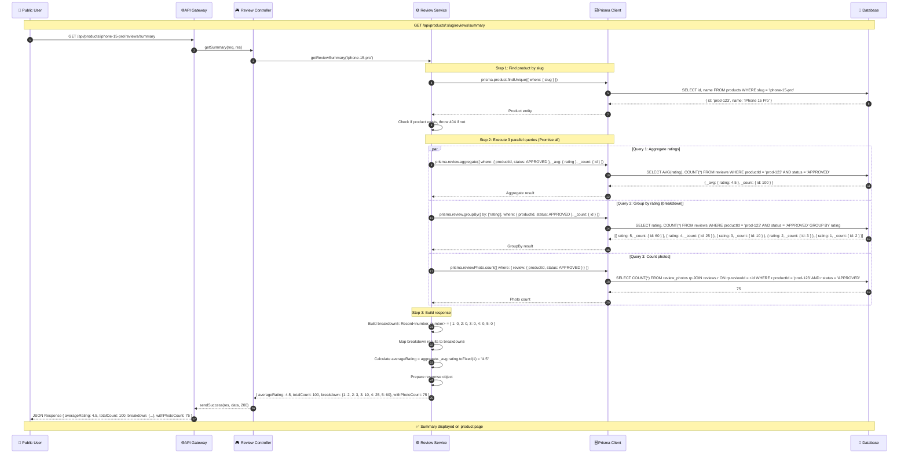

### Observable States

| Phase | Customer sees | Database state | Logs |
|-------|--------------|----------------|------|
| Request | Loading spinner / summary skeleton | — | `[INFO] GET /api/products/:slug/reviews/summary` |
| Product not found | 404 error page | — | `[ERROR] Product not found: slug=xxx` |
| Success | Star rating + breakdown counts | `products` table queried | `[INFO] Summary fetched: productId=prod-123, avgRating=4.5` |

### Error Responses

| Scenario | HTTP Code | Response body |
|----------|-----------|---------------|
| Product not found | 404 | `{ "ok": false, "error": "Sản phẩm không tồn tại" }` |
| Database connection failed | 500 | `{ "ok": false, "error": "Lỗi hệ thống" }` |

---

## 2. List Reviews

**Endpoint**: `GET /api/products/:slug/reviews`  
**Access**: Public  
**Purpose**: Lấy danh sách đánh giá có phân trang và lọc

### Sequence Diagram

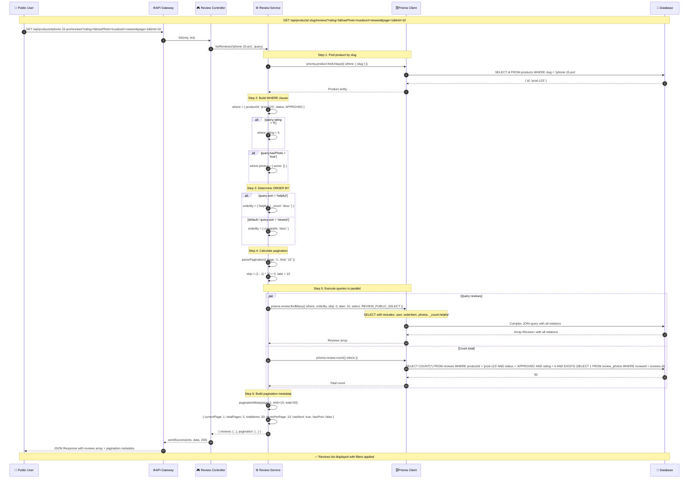

### Observable States

| Phase | Customer sees | Database state | Logs |
|-------|--------------|----------------|------|
| Request | Loading skeleton for reviews list | — | `[INFO] GET /api/products/:slug/reviews with query` |
| Product not found | 404 error page | — | `[ERROR] Product not found` |
| Success | Reviews cards with photos, helpful count, pagination controls | `reviews` table queried with JOINs | `[INFO] Reviews fetched: productId=prod-123, count=10, total=50` |

### Error Responses

| Scenario | HTTP Code | Response body |
|----------|-----------|---------------|
| Product not found | 404 | `{ "ok": false, "error": "Sản phẩm không tồn tại" }` |
| Invalid pagination | 400 | `{ "ok": false, "error": "Số trang hoặc giới hạn không hợp lệ" }` |

---

## 3. Create Review

**Endpoint**: `POST /api/order-items/:orderItemId/review`  
**Access**: Customer (authenticated)  
**Purpose**: Tạo đánh giá mới cho sản phẩm đã mua

### Sequence Diagram

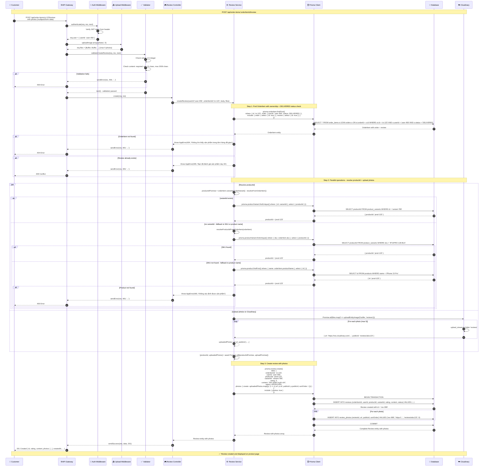

### Observable States

| Phase | Customer sees | Database state | Cloudinary state |
|-------|--------------|----------------|------------------|
| Upload progress | Progress bar for each photo | — | Photos uploading to 'reviews' folder |
| Validation | Inline errors if invalid | — | — |
| Creating | "Đang gửi đánh giá..." spinner | Transaction started | Photos stored with publicIds |
| Success | "Đánh giá thành công!" toast | `reviews` + `review_photos` records created | Photos accessible via URLs |
| Error | Error message toast | No changes (transaction rolled back) | Orphaned photos cleaned manually |

### Error Responses

| Scenario | HTTP Code | Response body |
|----------|-----------|---------------|
| Not authenticated | 401 | `{ "ok": false, "error": "Vui lòng đăng nhập" }` |
| OrderItem not found / not delivered | 404 | `{ "ok": false, "error": "Không tìm thấy sản phẩm trong đơn hàng đã giao" }` |
| Already reviewed | 409 | `{ "ok": false, "error": "Bạn đã đánh giá sản phẩm này rồi" }` |
| Validation failed | 400 | `{ "ok": false, "error": "Đánh giá phải từ 1 đến 5 sao" }` |
| Product cannot be determined | 400 | `{ "ok": false, "error": "Không xác định được sản phẩm" }` |
| Cloudinary upload failed | 500 | `{ "ok": false, "error": "Lỗi khi tải ảnh lên" }` |

---

## 4. Update Review

**Endpoint**: `PUT /api/reviews/:id`  
**Access**: Customer (authenticated, ownership verified)  
**Purpose**: Chỉnh sửa đánh giá (trong 30 ngày)

### Sequence Diagram

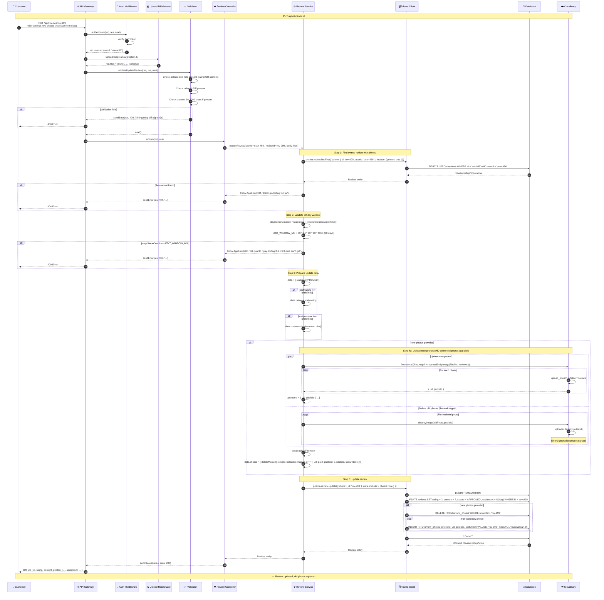

### Observable States

| Phase | Customer sees | Database state | Cloudinary state |
|-------|--------------|----------------|------------------|
| Upload | Progress bar for new photos | — | New photos uploading |
| Validation | Inline errors | — | — |
| Window check | Loading state | — | — |
| Updating | "Đang cập nhật..." spinner | Transaction started | Old photos deleted (fire-and-forget) |
| Success | "Cập nhật thành công!" toast | `reviews` record updated, `review_photos` replaced | New photos stored, old ones deleted |
| Error (30-day exceeded) | "Đã quá 30 ngày, không thể chỉnh sửa" error | No changes | No changes |

### Error Responses

| Scenario | HTTP Code | Response body |
|----------|-----------|---------------|
| Not authenticated | 401 | `{ "ok": false, "error": "Vui lòng đăng nhập" }` |
| Review not found / not owned | 404 | `{ "ok": false, "error": "Đánh giá không tồn tại" }` |
| 30-day window exceeded | 400 | `{ "ok": false, "error": "Đã quá 30 ngày, không thể chỉnh sửa đánh giá" }` |
| Validation failed | 400 | `{ "ok": false, "error": "Không có gì để cập nhật" }` |

---

## 5. Toggle Helpful

**Endpoint**: `POST /api/reviews/:id/helpful`  
**Access**: Customer (authenticated)  
**Purpose**: Đánh giá review là "hữu ích" hoặc bỏ đánh giá

### Sequence Diagram

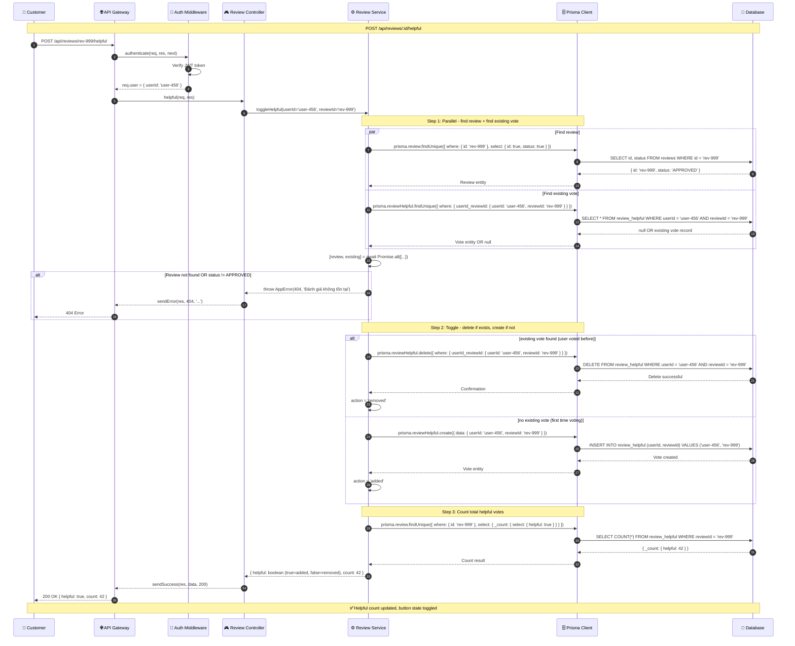

### Observable States

| Phase | Customer sees | Database state |
|-------|--------------|----------------|
| Loading | Button shows loading state | — |
| Toggling ON | "Đánh giá hữu ích" button active, count increases | `review_helpful` record created |
| Toggling OFF | Button inactive, count decreases | `review_helpful` record deleted |
| Review not approved | 404 error (review hidden) | — |

### Error Responses

| Scenario | HTTP Code | Response body |
|----------|-----------|---------------|
| Not authenticated | 401 | `{ "ok": false, "error": "Vui lòng đăng nhập" }` |
| Review not found / not approved | 404 | `{ "ok": false, "error": "Đánh giá không tồn tại" }` |

---

## 6. Admin Reply Review

**Endpoint**: `POST /api/admin/reviews/:id/reply`  
**Access**: Admin/Staff (authenticated + authorized)  
**Purpose**: Admin trả lời đánh giá của khách hàng

### Sequence Diagram

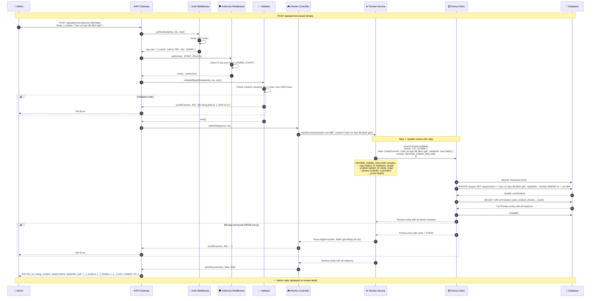

### Observable States

| Phase | Admin sees | Database state | Customer sees (on product page) |
|-------|------------|----------------|---------------------------------|
| Validation | Inline error if content invalid | — | — |
| Replying | "Đang gửi trả lời..." spinner | Transaction started | — |
| Success | "Trả lời thành công!" toast, reply visible | `reviews.replyContent` + `repliedAt` updated | Admin reply visible under review |
| Error | Error message toast | No changes | No changes |

### Error Responses

| Scenario | HTTP Code | Response body |
|----------|-----------|---------------|
| Not authenticated | 401 | `{ "ok": false, "error": "Vui lòng đăng nhập" }` |
| Not authorized (not staff/admin) | 403 | `{ "ok": false, "error": "Không có quyền truy cập" }` |
| Validation failed | 400 | `{ "ok": false, "error": "Nội dung phải từ 1-1000 ký tự" }` |
| Review not found | 404 | `{ "ok": false, "error": "Đánh giá không tồn tại" }` |

---

## Common Patterns

### 1. Authentication Pattern

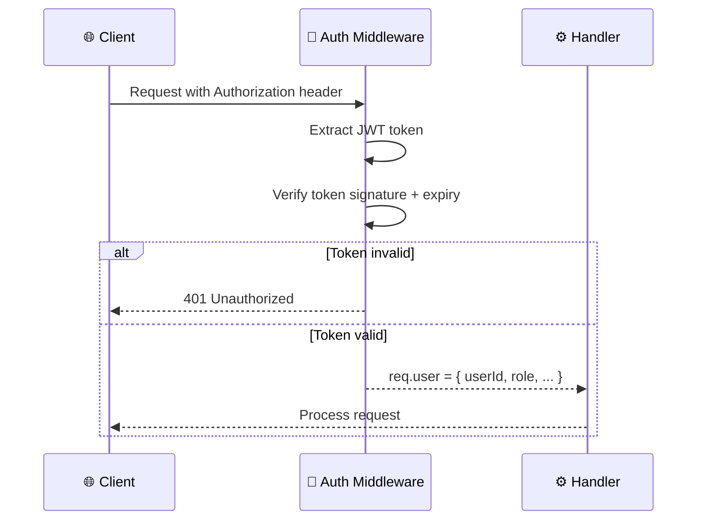

**Applied in**: Create, Update, Delete, Toggle Helpful, Admin operations

### 2. Ownership Verification Pattern

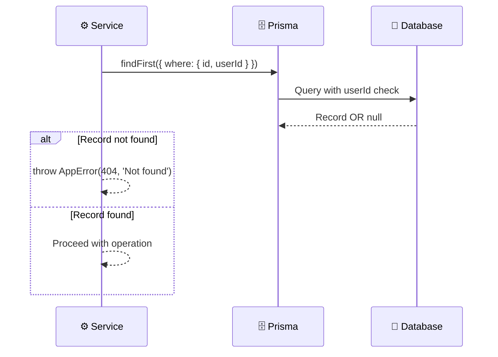

**Applied in**: Update Review, Delete Review, Find OrderItem for Create

### 3. Validation Pattern

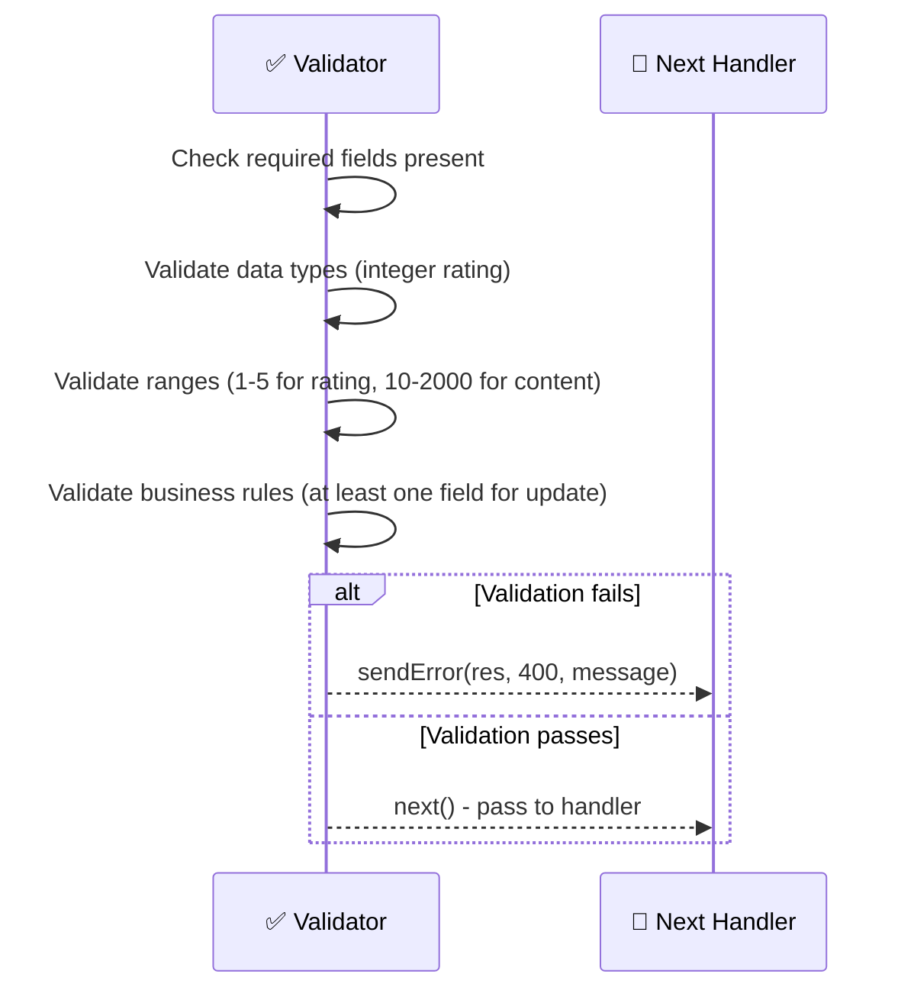

**Applied in**: All POST/PUT endpoints via validator middleware

### 4. Photo Management Workflow

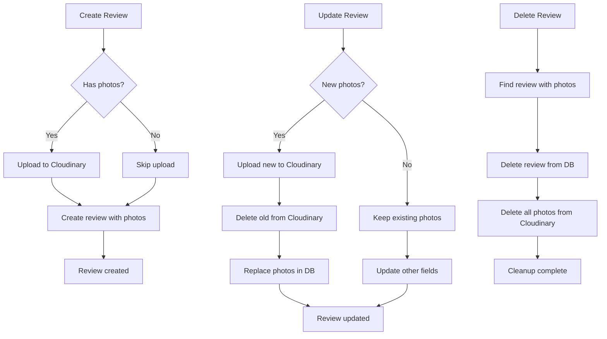

**Cloudinary operations**:
- `uploadEntityImage(buffer, 'reviews')` → `{ url, publicId }`
- `destroyImage(publicId)` → void (errors ignored)

### 5. Toggle Helpful Pattern (Idempotent Upsert)

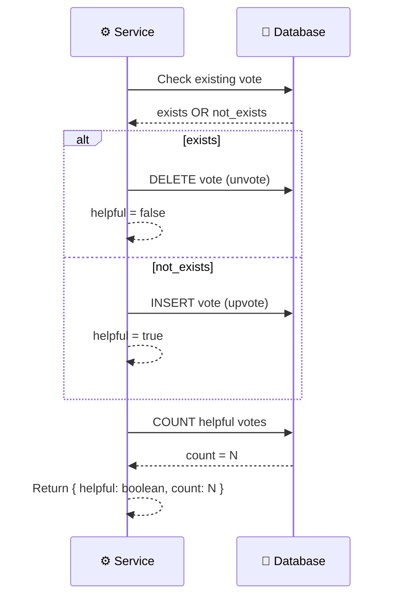

**Key characteristics**:
- Idempotent: Same request toggles state
- Always returns current count
- Parallel queries for performance
- Single record for unique user+review (composite key)

### 6. Admin Override Capability

Admin có thể:
- Xem tất cả reviews (bất kể status)
- Trả lời reviews (kể cả đã approved)
- Xóa reviews (hard delete với cleanup photos)
- Admin routes có prefix `/api/admin` và require `STAFF_ROLES`

**Authorization check**:
```typescript
authorize(...STAFF_ROLES) // [ADMIN, STAFF]
```

---

## Testing Checklist

### Unit Tests

- [ ] **getReviewSummary**
  - [ ] Product found - returns aggregate data
  - [ ] Product not found - throws 404
  - [ ] Parallel queries execute correctly
  - [ ] Breakdown builds correctly for all ratings 1-5
  - [ ] Average rating rounds to 1 decimal
  - [ ] With photo count accurate

- [ ] **listReviews**
  - [ ] Valid pagination - returns correct slice
  - [ ] Filter by rating - WHERE clause correct
  - [ ] Filter by hasPhoto - EXISTS clause correct
  - [ ] Sort by helpful - ORDER BY helpful._count DESC
  - [ ] Sort by newest - ORDER BY createdAt DESC (default)
  - [ ] Pagination metadata accurate
  - [ ] Product not found - throws 404

- [ ] **createReview**
  - [ ] Valid order item delivered - creates review
  - [ ] Order item not found - throws 404
  - [ ] Order not delivered - throws 404
  - [ ] Review already exists - throws 409
  - [ ] With variantId - resolves productId from variant
  - [ ] Without variantId - resolves from SKU fallback
  - [ ] SKU not found - resolves from productName fallback
  - [ ] Product cannot be determined - throws 400
  - [ ] With photos - uploads to Cloudinary + creates photos
  - [ ] Without photos - creates review only
  - [ ] Max 5 photos enforced
  - [ ] Status set to APPROVED by default
  - [ ] Returns review with photos included

- [ ] **updateReview**
  - [ ] Valid ownership + within window - updates review
  - [ ] Review not found - throws 404
  - [ ] Not owned - throws 404
  - [ ] 30-day window exceeded - throws 400
  - [ ] Update rating only - updates rating field
  - [ ] Update content only - updates content field
  - [ ] Update both - updates both fields
  - [ ] Update with new photos - uploads + deletes old + replaces
  - [ ] Update without photos - keeps existing photos
  - [ ] Status reset to APPROVED on update
  - [ ] Returns updated review with photos

- [ ] **toggleHelpful**
  - [ ] First vote - creates vote, returns { helpful: true, count: N+1 }
  - [ ] Remove vote - deletes vote, returns { helpful: false, count: N-1 }
  - [ ] Toggle twice - returns to original state
  - [ ] Review not found - throws 404
  - [ ] Review not approved - throws 404
  - [ ] Count accurate after multiple votes

- [ ] **replyReview (Admin)**
  - [ ] Valid review - updates replyContent + repliedAt
  - [ ] Returns full review with admin includes
  - [ ] Review not found - throws 404
  - [ ] Content trimmed correctly
  - [ ] repliedAt set to current timestamp

### Integration Tests

- [ ] **End-to-end review lifecycle**
  - [ ] Customer places order → Order delivered
  - [ ] Customer sees pending review in "my reviews"
  - [ ] Customer creates review with photos
  - [ ] Review appears on product page
  - [ ] Review summary updates
  - [ ] Customer edits review within 30 days
  - [ ] Customer cannot edit after 30 days
  - [ ] Other customers toggle helpful
  - [ ] Admin replies to review
  - [ ] Admin deletes review
  - [ ] Photos cleaned up on Cloudinary

- [ ] **Concurrent operations**
  - [ ] Multiple customers toggle helpful simultaneously - no race conditions
  - [ ] Create review for same orderItem twice - second one gets 409
  - [ ] Update review while someone else votes - no conflicts

- [ ] **Cloudinary failure handling**
  - [ ] Upload fails during create - review not created
  - [ ] Upload fails during update - old photos preserved
  - [ ] Delete photo fails - logged but ignored (fire-and-forget)

### API Tests

- [ ] **Public endpoints**
  - [ ] GET /api/products/:slug/reviews/summary - 200
  - [ ] GET /api/products/:slug/reviews - 200
  - [ ] GET /api/products/invalid-slug/reviews - 404

- [ ] **User endpoints (authenticated)**
  - [ ] POST /api/order-items/:id/review - 201 (with valid data)
  - [ ] POST /api/order-items/:id/review - 401 (without auth)
  - [ ] POST /api/order-items/:id/review - 409 (already reviewed)
  - [ ] PUT /api/reviews/:id - 200 (within window)
  - [ ] PUT /api/reviews/:id - 400 (after 30 days)
  - [ ] DELETE /api/reviews/:id - 204
  - [ ] POST /api/reviews/:id/helpful - 200

- [ ] **Admin endpoints (authorized)**
  - [ ] GET /api/admin/reviews - 200 (admin/staff)
  - [ ] GET /api/admin/reviews - 403 (customer)
  - [ ] POST /api/admin/reviews/:id/reply - 200
  - [ ] DELETE /api/admin/reviews/:id - 204

### Performance Tests

- [ ] **Query optimization**
  - [ ] Summary queries (3 parallel) complete within 200ms
  - [ ] List reviews with includes completes within 300ms
  - [ ] Pagination queries use correct indexes

- [ ] **Concurrent load**
  - [ ] 100 simultaneous helpful toggles - no deadlocks
  - [ ] 50 simultaneous review creations - no conflicts

---

## Appendix: Database Schema

### Review Table

```sql
CREATE TABLE reviews (
  id           UUID PRIMARY KEY DEFAULT gen_random_uuid(),
  order_item_id UUID UNIQUE NOT NULL,
  user_id      UUID NOT NULL,
  product_id   UUID NOT NULL,
  variant_id   UUID,
  rating       INT NOT NULL CHECK (rating >= 1 AND rating <= 5),
  content      TEXT NOT NULL,
  status       VARCHAR(20) DEFAULT 'PENDING' CHECK (status IN ('PENDING', 'APPROVED', 'REJECTED')),
  reply_content TEXT,
  replied_at   TIMESTAMP,
  created_at   TIMESTAMP DEFAULT NOW(),
  updated_at   TIMESTAMP DEFAULT NOW(),

  FOREIGN KEY (order_item_id) REFERENCES order_items(id) ON DELETE CASCADE,
  FOREIGN KEY (user_id) REFERENCES users(id) ON DELETE CASCADE,
  FOREIGN KEY (product_id) REFERENCES products(id) ON DELETE CASCADE
);

CREATE INDEX idx_reviews_product_status ON reviews(product_id, status);
CREATE INDEX idx_reviews_user_id ON reviews(user_id);
```

### ReviewPhoto Table

```sql
CREATE TABLE review_photos (
  id        UUID PRIMARY KEY DEFAULT gen_random_uuid(),
  review_id UUID NOT NULL,
  url       TEXT NOT NULL,
  public_id TEXT NOT NULL,
  sort_order INT DEFAULT 0,

  FOREIGN KEY (review_id) REFERENCES reviews(id) ON DELETE CASCADE
);

CREATE INDEX idx_review_photos_review_id ON review_photos(review_id);
```

### ReviewHelpful Table

```sql
CREATE TABLE review_helpful (
  user_id   UUID NOT NULL,
  review_id UUID NOT NULL,

  PRIMARY KEY (user_id, review_id),
  FOREIGN KEY (user_id) REFERENCES users(id) ON DELETE CASCADE,
  FOREIGN KEY (review_id) REFERENCES reviews(id) ON DELETE CASCADE
);
```

---

## Notes

- **30-day edit window**: Hardcoded as `EDIT_WINDOW_MS = 30 * 24 * 60 * 60 * 1000`
- **Max photos**: Hardcoded as `MAX_PHOTOS = 5`
- **Auto-approve**: All new reviews set to `status = APPROVED` automatically (no moderation)
- **Photo cleanup**: Fire-and-forget on delete/update - errors ignored to avoid blocking operations
- **Parallel queries**: Used extensively (Promise.all) for performance
- **Idempotent operations**: Toggle helpful is naturally idempotent (same request toggles state)
- **Authorization**: Admin operations require role in `[ADMIN, STAFF]`
- **Ownership**: Customers can only modify their own reviews
- **Delivery required**: Can only review items from delivered orders

---

**Document Status**: ✅ Complete  
**Last Updated**: 2025-06-20  
**Next Review**: After any schema or service layer changes
