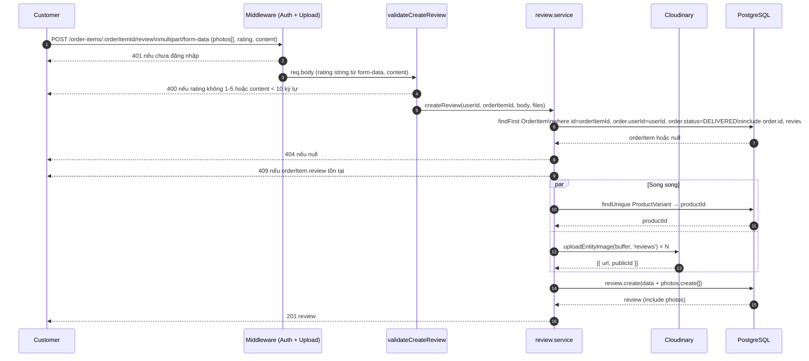
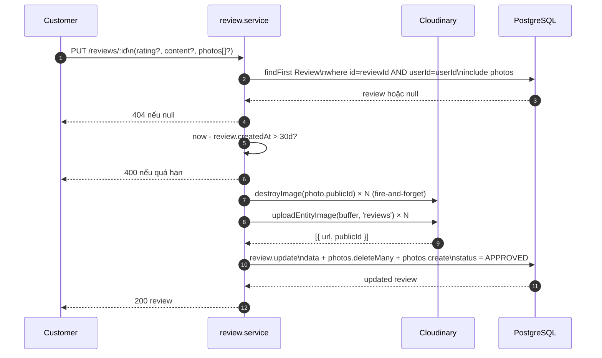
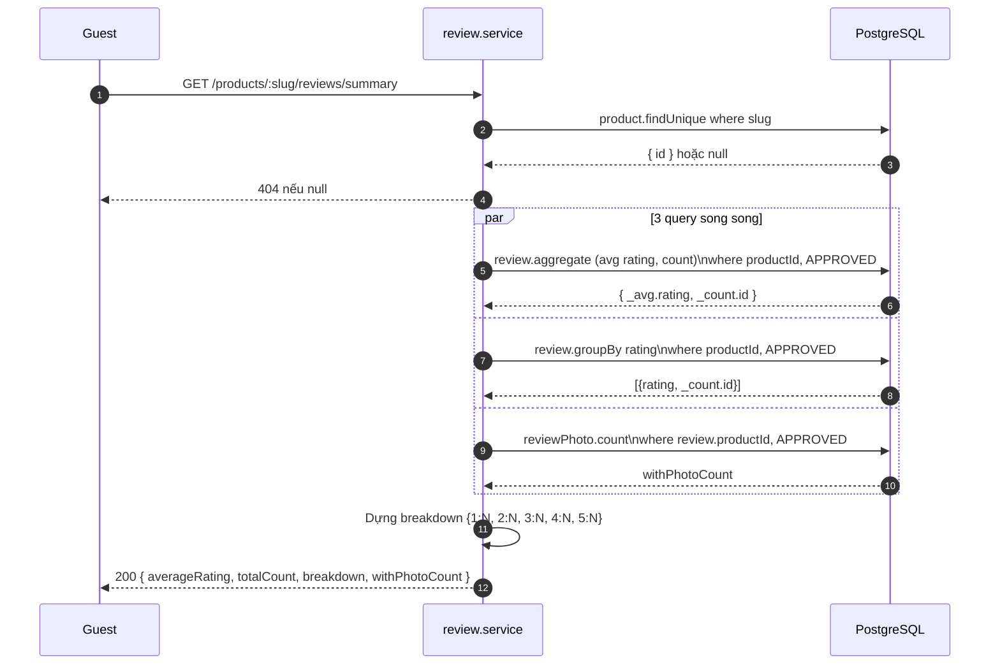
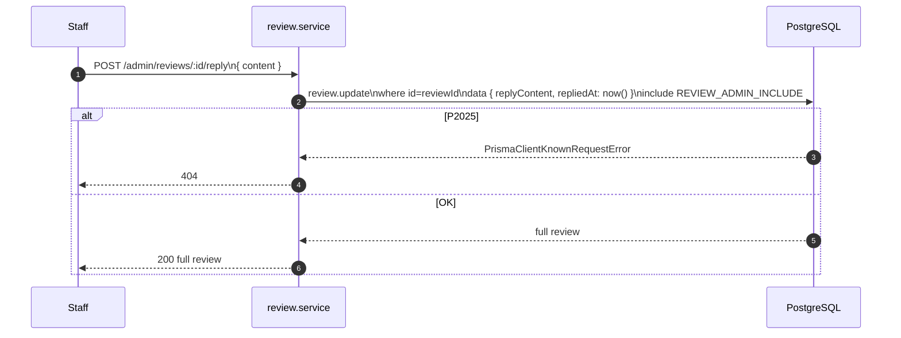

# Sequence Diagram — Luồng API
## Module: Review
### Dự án: Mobivexa E-Commerce Platform

> **Phiên bản:** 2.0 | **Ngày:** 2026-08-22

---

## SD-01: Tạo đánh giá có ảnh

---

## SD-02: Sửa đánh giá (có ảnh mới)

---

## SD-03: Xem summary sản phẩm

---

## SD-04: Admin Reply

