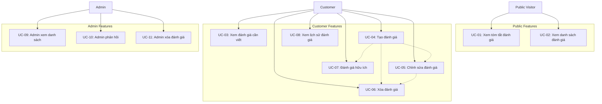

# Use Case Document
## Module: Review (Đánh giá)
### Dự án: Mobivexa E-Commerce Platform

> **Phiên bản:** 1.0  
> **Ngày:** 2026-06-20  
> **Tham chiếu:** [BRD.md](./BRD.md) | [SRS.md](./SRS.md)

---

## 1. Actors

| Actor | Mô tả | Role |
|---|---|---|
| **Public Visitor** | Khách ghé thăm chưa đăng nhập | `PUBLIC` |
| **Customer** | Khách hàng đã đăng nhập | `CUSTOMER` |
| **Admin** | Quản trị viên hệ thống | `ADMIN` hoặc `STAFF` |
| **Review System** | Module đánh giá (backend) | Hệ thống nội bộ |
| **Order Service** | Module đơn hàng (backend) | Hệ thống nội bộ |
| **Product Service** | Module sản phẩm (backend) | Hệ thống nội bộ |
| **Database** | Cơ sở dữ liệu lưu trữ đánh giá | Hệ thống lưu trữ |
| **Storage Service** | Dịch vụ lưu trữ ảnh | Hệ thống nội bộ |

---

## 2. Danh sách Use Case

| ID | Tên Use Case | Actor chính | Độ ưu tiên |
|---|---|---|---|
| UC-01 | Xem tóm tắt đánh giá | Public Visitor | Cao |
| UC-02 | Xem danh sách đánh giá | Public Visitor | Cao |
| UC-03 | Xem đánh giá cần viết | Customer | Trung bình |
| UC-04 | Tạo đánh giá | Customer | Cao |
| UC-05 | Chỉnh sửa đánh giá | Customer | Trung bình |
| UC-06 | Xóa đánh giá | Customer | Trung bình |
| UC-07 | Đánh giá hữu ích | Customer | Trung bình |
| UC-08 | Xem lịch sử đánh giá | Customer | Trung bình |
| UC-09 | Admin xem danh sách đánh giá | Admin | Cao |
| UC-10 | Admin phản hồi đánh giá | Admin | Trung bình |
| UC-11 | Admin xóa đánh giá | Admin | Trung bình |

---

## 3. Chi tiết Use Case

---

### UC-01: Xem tóm tắt đánh giá

| Thuộc tính | Nội dung |
|---|---|
| **Actor** | Public Visitor |
| **Mục tiêu** | Xem thống kê đánh giá của sản phẩm (số đánh giá, trung bình, phân phối rating, số ảnh) |
| **Tiền điều kiện** | Sản phẩm tồn tại và đang hoạt động |
| **Hậu điều kiện** | Hiển thị thông tin tóm tắt đánh giá cho khách tham khảo |
| **Trigger** | Public Visitor truy cập trang chi tiết sản phẩm |

**Luồng chính (Happy Path):**

1. Public Visitor gửi request `GET /api/products/:productId/reviews/summary`
2. Hệ thống kiểm tra sản phẩm tồn tại và `isActive = true`
3. Hệ thống thống kê đánh giá:
   - **averageRating**: Trung bình các rating (1-5 sao)
   - **totalReviews**: Tổng số đánh giá đã duyệt (`status = APPROVED`)
   - **ratingDistribution**: Phân phối theo rating (5, 4, 3, 2, 1 sao)
   - **photoCount**: Số đánh giá có ảnh
4. Hệ thống trả về `200` + thông tin tóm tắt

**Response mẫu:**
```json
{
  "averageRating": 4.5,
  "totalReviews": 128,
  "ratingDistribution": {
    "5": 89,
    "4": 25,
    "3": 10,
    "2": 3,
    "1": 1
  },
  "photoCount": 45
}
```

**Luồng thay thế:**

| Bước | Điều kiện | Xử lý |
|---|---|---|
| 2 | Sản phẩm không tồn tại | Trả `404` — `Sản phẩm không tồn tại` |
| 2 | Sản phẩm inactive | Trả `404` — `Sản phẩm không tồn tại` |
| 3 | Chưa có đánh giá nào | Trả `200` + `{ averageRating: 0, totalReviews: 0, ratingDistribution: {...}, photoCount: 0 }` |
| Bất kỳ | Lỗi database | Trả `500` — `Lỗi hệ thống, vui lòng thử lại` |

**Ghi chú:**
- Endpoint public — không cần authentication
- Chỉ tính các đánh giá `APPROVED`
- Tóm tắt được cache để tối ưu hiệu năng
- Thông tin này hiển thị trên trang sản phẩm để khách tham khảo nhanh

---

### UC-02: Xem danh sách đánh giá

| Thuộc tính | Nội dung |
|---|---|
| **Actor** | Public Visitor |
| **Mục tiêu** | Xem danh sách đánh giá của sản phẩm với bộ lọc và sắp xếp |
| **Tiền điều kiện** | Sản phẩm tồn tại và đang hoạt động |
| **Hậu điều kiện** | Hiển thị danh sách đánh giá theo bộ lọc |
| **Trigger** | Public Visitor click tab "Đánh giá" trên trang sản phẩm |

**Luồng chính (Happy Path):**

1. Public Visitor gửi request `GET /api/products/:productId/reviews` với query params:
   - `rating`: Filter theo số sao (1-5)
   - `hasPhoto`: Filter có ảnh (`true`/`false`)
   - `sort`: Sắp xếp (`recent`/`oldest`/`highest`/`lowest`/`helpful`)
   - `page`: Số trang (mặc định 1)
   - `limit`: Số item/trang (mặc định 10)
2. Hệ thống kiểm tra sản phẩm tồn tại và `isActive = true`
3. Hệ thống build query filter:
   - Chỉ lấy các đánh giá `status = APPROVED`
   - Filter theo `rating` nếu có
   - Filter theo `hasPhoto` nếu có
4. Hệ thống sắp xếp theo:
   - `recent` → `createdAt DESC`
   - `oldest` → `createdAt ASC`
   - `highest` → `rating DESC`, `createdAt DESC`
   - `lowest` → `rating ASC`, `createdAt DESC`
   - `helpful` → `helpfulCount DESC`, `createdAt DESC`
5. Hệ thống phân trang kết quả
6. Hệ thống load thông tin liên quan:
   - Customer: `id`, `name`, `avatar`
   - Admin reply: `content`, `createdAt`, `adminName`
7. Hệ thống trả về `200` + danh sách đánh giá + metadata

**Response mẫu:**
```json
{
  "data": [
    {
      "id": "review-123",
      "rating": 5,
      "content": "Sản phẩm rất tốt, giao hàng nhanh!",
      "photos": ["https://storage.example.com/photo1.jpg"],
      "helpfulCount": 15,
      "userHelpful": true,
      "createdAt": "2024-06-15T10:00:00Z",
      "customer": {
        "id": "customer-456",
        "name": "Nguyễn Văn A",
        "avatar": "https://storage.example.com/avatar.jpg"
      },
      "adminReply": {
        "content": "Cảm ơn bạn đã đánh giá!",
        "createdAt": "2024-06-15T14:00:00Z",
        "adminName": "Admin Support"
      }
    }
  ],
  "meta": {
    "total": 128,
    "page": 1,
    "limit": 10,
    "totalPages": 13
  }
}
```

**Luồng thay thế:**

| Bước | Điều kiện | Xử lý |
|---|---|---|
| 2 | Sản phẩm không tồn tại | Trả `404` — `Sản phẩm không tồn tại` |
| 2 | Sản phẩm inactive | Trả `404` — `Sản phẩm không tồn tại` |
| 4 | Query params không hợp lệ | Trả `400` — `Tham số không hợp lệ` |
| Bất kỳ | Lỗi database | Trả `500` — `Lỗi hệ thống, vui lòng thử lại` |

**Ghi chú:**
- Endpoint public — không cần authentication
- Chỉ hiển thị đánh giá `APPROVED`
- `userHelpful` = true/false nếu customer logged in và đã vote
- Phân trang để tránh load quá nhiều data

---

### UC-03: Xem đánh giá cần viết

| Thuộc tính | Nội dung |
|---|---|
| **Actor** | Customer |
| **Mục tiêu** | Xem danh sách sản phẩm đã giao cần viết đánh giá |
| **Tiền điều kiện** | Customer đã đăng nhập và có JWT token hợp lệ |
| **Hậu điều kiện** | Hiển thị danh sách sản phẩm `DELIVERED` chưa có đánh giá |
| **Trigger** | Customer truy cập trang "Đánh giá của tôi" |

**Luồng chính (Happy Path):**

1. Customer gửi request `GET /api/reviews/pending` với JWT token trong header `Authorization: Bearer <token>`
2. Hệ thống xác thực JWT token và lấy `userId` từ payload
3. Hệ thống query các đơn hàng của user với status `DELIVERED`
4. Hệ thống lọc các order items chưa có đánh giá:
   - Check từng `orderItem.productId`
   - Check nếu đã tồn tại review với `(customerId, productId)` → skip
5. Hệ thống load thông tin sản phẩm:
   - Product: `id`, `name`, `slug`, `thumbnail`
   - ProductVariant: `color`, `storage`, `ram`
6. Hệ thống trả về `200` + danh sách sản phẩm cần đánh giá

**Response mẫu:**
```json
{
  "data": [
    {
      "orderId": "order-123",
      "orderItem": {
        "id": "item-456",
        "variant": {
          "color": "Đen",
          "storage": "256GB",
          "ram": "8GB"
        }
      },
      "product": {
        "id": "product-789",
        "name": "iPhone 15 Pro Max",
        "slug": "iphone-15-pro-max",
        "thumbnail": "https://storage.example.com/thumb.jpg"
      },
      "deliveredAt": "2024-06-10T15:30:00Z"
    }
  ]
}
```

**Luồng thay thế:**

| Bước | Điều kiện | Xử lý |
|---|---|---|
| 2 | Token không hợp lệ hoặc hết hạn | Trả `401` — `Token không hợp lệ hoặc đã hết hạn` |
| 3 | Lỗi query orders | Trả `500` — `Lỗi hệ thống, vui lòng thử lại` |
| 4 | Không có sản phẩm nào cần đánh giá | Trả `200` + `{ data: [] }` |
| Bất kỳ | Lỗi database | Trả `500` — `Lỗi hệ thống, vui lòng thử lại` |

**Ghi chú:**
- Chỉ hiển thị sản phẩm từ đơn hàng `DELIVERED`
- Mỗi sản phẩm chỉ hiển thị một lần (không duplicated)
- Sắp xếp theo `deliveredAt DESC` (mới giao trước)
- Customer có thể click vào để viết đánh giá trực tiếp

---

### UC-04: Tạo đánh giá

| Thuộc tính | Nội dung |
|---|---|
| **Actor** | Customer |
| **Mục tiêu** | Viết đánh giá cho sản phẩm đã mua |
| **Tiền điều kiện** | Customer đã đăng nhập; có đơn hàng `DELIVERED` với sản phẩm này; chưa có đánh giá |
| **Hậu điều kiện** | Đánh giá được tạo với status `APPROVED` (auto-approve); ảnh được upload |
| **Trigger** | Customer submit form đánh giá |

**Luồng chính (Happy Path):**

1. Customer gửi request `POST /api/reviews` với JWT token và payload:
   - `orderId`: ID đơn hàng
   - `orderItemId`: ID order item cụ thể
   - `productId`: ID sản phẩm
   - `rating`: Số sao (1-5)
   - `content`: Nội dung đánh giá (tối đa 1000 ký tự)
   - `photos`: Array URLs ảnh (tối đa 5)
2. Hệ thống xác thực JWT token và lấy `userId`
3. Hệ thống validate input:
   - `rating` ∈ {1, 2, 3, 4, 5}
   - `content.length ≤ 1000`
   - `photos.length ≤ 5`
   - Mỗi `photo` URL hợp lệ
4. Hệ thống kiểm tra đơn hàng tồn tại và thuộc về customer (`userId === order.customerId`)
5. Hệ thống kiểm tra `order.status === DELIVERED`
6. Hệ thống kiểm tra `orderItem` thuộc `order` và `orderItem.productId === productId`
7. Hệ thống kiểm tra chưa có đánh giá nào cho `(customerId, productId)`
8. Hệ thống tạo Review record:
   - `customerId = userId`
   - `productId`
   - `orderId`, `orderItemId`
   - `rating`, `content`
   - `photos` (array URLs)
   - `status = APPROVED` (auto-approve)
   - `helpfulCount = 0`
9. Hệ thống trả về `201` + review data

**Luồng thay thế:**

| Bước | Điều kiện | Xử lý |
|---|---|---|
| 2 | Token không hợp lệ hoặc hết hạn | Trả `401` — `Token không hợp lệ hoặc đã hết hạn` |
| 3 | Rating không trong 1-5 | Trả `400` — `Số sao phải từ 1 đến 5` |
| 3 | Content quá 1000 ký tự | Trả `400` — `Nội dung không quá 1000 ký tự` |
| 3 | Photos quá 5 ảnh | Trả `400` — `Tối đa 5 ảnh` |
| 3 | Photo URL không hợp lệ | Trả `400` — `URL ảnh không hợp lệ` |
| 4 | Đơn hàng không tồn tại | Trả `404` — `Đơn hàng không tồn tại` |
| 4 | Đơn hàng không thuộc customer | Trả `403` — `Bạn không có quyền đánh giá đơn hàng này` |
| 5 | `order.status ≠ DELIVERED` | Trả `400` — `Chỉ có thể đánh giá sản phẩm đã giao` |
| 6 | `orderItem` không thuộc `order` hoặc sai `productId` | Trả `400` — `Sản phẩm không có trong đơn hàng` |
| 7 | Đã có đánh giá cho sản phẩm này | Trả `409` — `Bạn đã đánh giá sản phẩm này rồi` |
| Bất kỳ | Lỗi database khi tạo | Trả `500` — `Lỗi hệ thống, vui lòng thử lại` |

**Ghi chú:**
- Chỉ customer đã mua sản phẩm (verified buyer) mới được đánh giá
- Auto-approve giúp đánh giá hiển thị ngay (giảm moderation load)
- Unique constraint `(customerId, productId)` ngăn duplicate
- Photos được upload trước và gửi qua URLs (không upload trong API này)

---

### UC-05: Chỉnh sửa đánh giá

| Thuộc tính | Nội dung |
|---|---|
| **Actor** | Customer |
| **Mục tiêu** | Chỉnh sửa nội dung đánh giá của mình trong vòng 30 ngày |
| **Tiền điều kiện** | Customer đã đăng nhập; đánh giá tồn tại và thuộc về customer; chưa quá 30 ngày |
| **Hậu điều kiện** | Đánh giá được cập nhật; `updatedAt` được refresh; giữ nguyên `createdAt` |
| **Trigger** | Customer click "Chỉnh sửa" và submit form |

**Luồng chính (Happy Path):**

1. Customer gửi request `PUT /api/reviews/:reviewId` với JWT token và payload:
   - `rating`: Số sao mới (1-5)
   - `content`: Nội dung mới (tối đa 1000 ký tự)
   - `photos`: Array URLs ảnh mới (tối đa 5)
2. Hệ thống xác thực JWT token và lấy `userId`
3. Hệ thống tìm Review theo `reviewId`
4. Hệ thống kiểm tra `review.customerId === userId` (ownership check)
5. Hệ thống kiểm tra window 30 ngày: `createdAt > NOW() - 30 days`
6. Hệ thống validate input:
   - `rating` ∈ {1, 2, 3, 4, 5}
   - `content.length ≤ 1000`
   - `photos.length ≤ 5`
7. Hệ thống cập nhật Review:
   - `rating`, `content`, `photos`
   - `updatedAt = NOW()`
   - `createdAt` (GIỮ LẠI)
8. Hệ thống trả về `200` + review data đã update

**Luồng thay thế:**

| Bước | Điều kiện | Xử lý |
|---|---|---|
| 2 | Token không hợp lệ hoặc hết hạn | Trả `401` — `Token không hợp lệ hoặc đã hết hạn` |
| 3 | Review không tồn tại | Trả `404` — `Đánh giá không tồn tại` |
| 4 | Review không thuộc customer | Trả `403` — `Bạn không có quyền chỉnh sửa đánh giá này` |
| 5 | Quá 30 ngày kể từ `createdAt` | Trả `400` — `Đã quá 30 ngày, không thể chỉnh sửa` |
| 6 | Rating không trong 1-5 | Trả `400` — `Số sao phải từ 1 đến 5` |
| 6 | Content quá 1000 ký tự | Trả `400` — `Nội dung không quá 1000 ký tự` |
| 6 | Photos quá 5 ảnh | Trả `400` — `Tối đa 5 ảnh` |
| Bất kỳ | Lỗi database khi update | Trả `500` — `Lỗi hệ thống, vui lòng thử lại` |

**Ghi chú:**
- Window 30 ngày tính từ `createdAt`, không phải từ `updatedAt`
- Sau 30 ngày, customer có thể xóa và viết lại (không được edit)
- `createdAt` được giữ nguyên để bảo vệ window 30 ngày
- Edit không ảnh hưởng đến `helpfulCount` và `adminReply`

---

### UC-06: Xóa đánh giá

| Thuộc tính | Nội dung |
|---|---|
| **Actor** | Customer |
| **Mục tiêu** | Xóa đánh giá của chính mình |
| **Tiền điều kiện** | Customer đã đăng nhập; đánh giá tồn tại và thuộc về customer |
| **Hậu điều kiện** | Đánh giá bị xóa; `helpfulCount` bị reset; ảnh được xóa |
| **Trigger** | Customer click "Xóa" và xác nhận |

**Luồng chính (Happy Path):**

1. Customer gửi request `DELETE /api/reviews/:reviewId` với JWT token
2. Hệ thống xác thực JWT token và lấy `userId`
3. Hệ thống tìm Review theo `reviewId`
4. Hệ thống kiểm tra `review.customerId === userId` (ownership check)
5. Hệ thống xóa các file ảnh trong `review.photos` khỏi storage
6. Hệ thống xóa Review record khỏi database
7. Hệ thống xóa các `Helpful` records liên quan (`reviewId`)
8. Hệ thống trả về `200` + `{ message: 'Đã xóa đánh giá' }`

**Luồng thay thế:**

| Bước | Điều kiện | Xử lý |
|---|---|---|
| 2 | Token không hợp lệ hoặc hết hạn | Trả `401` — `Token không hợp lệ hoặc đã hết hạn` |
| 3 | Review không tồn tại | Trả `404` — `Đánh giá không tồn tại` |
| 4 | Review không thuộc customer | Trả `403` — `Bạn không có quyền xóa đánh giá này` |
| 5 | Lỗi khi xóa ảnh storage | Trả `500` — `Lỗi xóa ảnh, vui lòng thử lại` |
| 6 | Lỗi database khi xóa | Trả `500` — `Lỗi hệ thống, vui lòng thử lại` |

**Ghi chú:**
- Xóa review không thể hoàn tác (irreversible)
- Photos phải được xóa khỏi storage để giải phóng dung lượng
- Helpful records bị xóa để tránh orphan data
- Không có giới hạn thời gian (có thể xóa bất cứ lúc nào)

---

### UC-07: Đánh giá hữu ích

| Thuộc tính | Nội dung |
|---|---|
| **Actor** | Customer |
| **Mục tiêu** | Đánh dấu một đánh giá là hữu ích hoặc bỏ đánh dấu |
| **Tiền điều kiện** | Customer đã đăng nhập; đánh giá tồn tại và `status = APPROVED` |
| **Hậu điều kiện** | `helpfulCount` được tăng/giảm; record `Helpful` được tạo/xóa |
| **Trigger** | Customer click "Hữu ích" / "Bỏ hữu ích" |

**Luồng chính (Happy Path):**

1. Customer gửi request `POST /api/reviews/:reviewId/helpful` với JWT token
2. Hệ thống xác thực JWT token và lấy `userId`
3. Hệ thống tìm Review theo `reviewId`
4. Hệ thống kiểm tra `review.status === APPROVED` (chỉ vote cho review đã duyệt)
5. Hệ thống tra cứu record `Helpful` theo `(customerId, reviewId)`:
   - **Chưa có** → tạo mới `Helpful`, increment `review.helpfulCount`
   - **Đã có** → xóa `Helpful`, decrement `review.helpfulCount`
6. Hệ thống trả về `200` + `{ helpfulCount: <số lượng>, isHelpful: <true/false> }`

**Luồng thay thế:**

| Bước | Điều kiện | Xử lý |
|---|---|---|
| 2 | Token không hợp lệ hoặc hết hạn | Trả `401` — `Token không hợp lệ hoặc đã hết hạn` |
| 3 | Review không tồn tại | Trả `404` — `Đánh giá không tồn tại` |
| 4 | Review chưa approved (`PENDING`/`REJECTED`) | Trả `400` — `Chỉ có thể vote cho đánh giá đã duyệt` |
| Bất kỳ | Lỗi database | Trả `500` — `Lỗi hệ thống, vui lòng thử lại` |

**Ghi chú:**
- Toggle operation: nếu đã vote thì bỏ vote, nếu chưa thì vote
- Unique constraint `(customerId, reviewId)` đảm bảo mỗi user chỉ vote 1 lần
- `helpfulCount` không được âm (minimum 0)
- Chỉ vote được cho review `APPROVED` (tránh spam vote review pending)

---

### UC-08: Xem lịch sử đánh giá

| Thuộc tính | Nội dung |
|---|---|
| **Actor** | Customer |
| **Mục tiêu** | Xem tất cả đánh giá mình đã viết |
| **Tiền điều kiện** | Customer đã đăng nhập và có JWT token hợp lệ |
| **Hậu điều kiện** | Hiển thị danh sách tất cả đánh giá của customer |
| **Trigger** | Customer truy cập "Lịch sử đánh giá" trong tài khoản |

**Luồng chính (Happy Path):**

1. Customer gửi request `GET /api/reviews/my-reviews` với JWT token và query params:
   - `page`: Số trang (mặc định 1)
   - `limit`: Số item/trang (mặc định 10)
2. Hệ thống xác thực JWT token và lấy `userId`
3. Hệ thống query Reviews theo `customerId = userId`
4. Hệ thống sắp xếp theo `createdAt DESC`
5. Hệ thống phân trang kết quả
6. Hệ thống load thông tin sản phẩm:
   - Product: `id`, `name`, `slug`, `thumbnail`
7. Hệ thống trả về `200` + danh sách đánh giá + metadata

**Response mẫu:**
```json
{
  "data": [
    {
      "id": "review-123",
      "rating": 5,
      "content": "Sản phẩm rất tốt!",
      "photos": ["https://storage.example.com/photo1.jpg"],
      "status": "APPROVED",
      "helpfulCount": 15,
      "createdAt": "2024-06-15T10:00:00Z",
      "updatedAt": "2024-06-15T10:00:00Z",
      "canEdit": true,
      "product": {
        "id": "product-789",
        "name": "iPhone 15 Pro Max",
        "slug": "iphone-15-pro-max",
        "thumbnail": "https://storage.example.com/thumb.jpg"
      }
    }
  ],
  "meta": {
    "total": 5,
    "page": 1,
    "limit": 10,
    "totalPages": 1
  }
}
```

**Luồng thay thế:**

| Bước | Điều kiện | Xử lý |
|---|---|---|
| 2 | Token không hợp lệ hoặc hết hạn | Trả `401` — `Token không hợp lệ hoặc đã hết hạn` |
| 3 | Lỗi database query | Trả `500` — `Lỗi hệ thống, vui lòng thử lại` |
| 3 | Không có đánh giá nào | Trả `200` + `{ data: [], meta: {...} }` |

**Ghi chú:**
- Hiển thị tất cả reviews của customer (kể cả `PENDING`, `APPROVED`, `REJECTED`)
- `canEdit` = true nếu chưa quá 30 ngày
- Customer có thể edit/delete trực tiếp từ danh sách này
- Sắp xếp từ mới nhất đến cũ nhất

---

### UC-09: Admin xem danh sách đánh giá

| Thuộc tính | Nội dung |
|---|---|
| **Actor** | Admin |
| **Mục tiêu** | Quản lý tất cả đánh giá trong hệ thống với bộ lọc đa dạng |
| **Tiền điều kiện** | Admin đã đăng nhập và có quyền `STAFF+` |
| **Hậu điều kiện** | Hiển thị danh sách đánh giá theo bộ lọc; có thể approve/reject |
| **Trigger** | Admin truy cập trang quản lý đánh giá |

**Luồng chính (Happy Path):**

1. Admin gửi request `GET /api/admin/reviews` với JWT token và query params:
   - `status`: Filter theo status (`APPROVED`/`PENDING`/`REJECTED`)
   - `rating`: Filter theo số sao (1-5)
   - `hasPhoto`: Filter có ảnh (`true`/`false`)
   - `hasContent`: Filter có nội dung (`true`/`false`)
   - `customerId`: Filter theo customer
   - `productId`: Filter theo sản phẩm
   - `createdFrom`: Filter từ ngày (ISO date)
   - `createdTo`: Filter đến ngày (ISO date)
   - `sort`: Sắp xếp (`recent`/`oldest`/`highest`/`lowest`/`helpful`)
   - `page`: Số trang
   - `limit`: Số item/trang
2. Hệ thống xác thực JWT token và kiểm tra quyền `STAFF+`
3. Hệ thống build query filter theo các params
4. Hệ thống sắp xếp và phân trang
5. Hệ thống load thông tin đầy đủ:
   - Customer: `id`, `name`, `email`, `phone`
   - Product: `id`, `name`, `slug`, `thumbnail`
   - Order: `id`, `orderCode`, `status`
6. Hệ thống trả về `200` + danh sách đánh giá + metadata

**Luồng thay thế:**

| Bước | Điều kiện | Xử lý |
|---|---|---|
| 2 | Token không hợp lệ hoặc hết hạn | Trả `401` — `Token không hợp lệ hoặc đã hết hạn` |
| 2 | Không có quyền `STAFF+` | Trả `403` — `Không có quyền truy cập` |
| 3 | Query params không hợp lệ | Trả `400` — `Tham số không hợp lệ` |
| Bất kỳ | Lỗi database | Trả `500` — `Lỗi hệ thống, vui lòng thử lại` |

**Ghi chú:**
- Admin có thể filter rất chi tiết để tìm ra review cần xử lý
- Có thể search review theo customer/product để xử lý complaint
- Filter theo date range để export báo cáo
- Admin có thể approve/reject trực tiếp từ list này

---

### UC-10: Admin phản hồi đánh giá

| Thuộc tính | Nội dung |
|---|---|
| **Actor** | Admin |
| **Mục tiêu** | Trả lời đánh giá của customer (tuyệt dời hoặc xử lý khiếu nại) |
| **Tiền điều kiện** | Admin đã đăng nhập và có quyền `STAFF+`; đánh giá tồn tại |
| **Hậu điều kiện** | Phản hồi được lưu; customer có thể thấy phản hồi |
| **Trigger** | Admin click "Phản hồi" và submit form |

**Luồng chính (Happy Path):**

1. Admin gửi request `POST /api/admin/reviews/:reviewId/reply` với JWT token và payload:
   - `content`: Nội dung phản hồi (tối đa 1000 ký tự)
2. Hệ thống xác thực JWT token và kiểm tra quyền `STAFF+`
3. Hệ thống tìm Review theo `reviewId`
4. Hệ thống kiểm tra `review.status === APPROVED` (chỉ reply review đã duyệt)
5. Hệ thống validate `content.length ≤ 1000`
6. Hệ thống cập nhật hoặc tạo `adminReply`:
   - `content`: Nội dung phản hồi
   - `createdAt`: Timestamp hiện tại
   - `adminId`: ID của admin đang login
   - `adminName`: Tên của admin
7. Hệ thống trả về `200` + review data (bao gồm adminReply)

**Luồng thay thế:**

| Bước | Điều kiện | Xử lý |
|---|---|---|
| 2 | Token không hợp lệ hoặc hết hạn | Trả `401` — `Token không hợp lệ hoặc đã hết hạn` |
| 2 | Không có quyền `STAFF+` | Trả `403` — `Không có quyền truy cập` |
| 3 | Review không tồn tại | Trả `404` — `Đánh giá không tồn tại` |
| 4 | Review chưa approved (`PENDING`/`REJECTED`) | Trả `400` — `Chỉ có thể phản hồi đánh giá đã duyệt` |
| 5 | Content quá 1000 ký tự | Trả `400` — `Nội dung không quá 1000 ký tự` |
| Bất kỳ | Lỗi database | Trả `500` — `Lỗi hệ thống, vui lòng thử lại` |

**Ghi chú:**
- Chỉ reply review `APPROVED` để tránh spam reply review spam
- Reply được hiển thị công khai cho tất cả visitors
- Admin có thể edit reply bằng cách gọi lại API này
- Reply không thể delete (chỉ có thể edit hoặc để trống)

---

### UC-11: Admin xóa đánh giá

| Thuộc tính | Nội dung |
|---|---|
| **Actor** | Admin |
| **Mục tiêu** | Xóa đánh giá bất chính (spam, offensive, vi phạm) |
| **Tiền điều kiện** | Admin đã đăng nhập và có quyền `STAFF+`; đánh giá tồn tại |
| **Hậu điều kiện** | Đánh giá bị xóa; ảnh được xóa; helpful records bị xóa |
| **Trigger** | Admin click "Xóa" và xác nhận lý do |

**Luồng chính (Happy Path):**

1. Admin gửi request `DELETE /api/admin/reviews/:reviewId` với JWT token
2. Hệ thống xác thực JWT token và kiểm tra quyền `STAFF+`
3. Hệ thống tìm Review theo `reviewId`
4. Hệ thống xóa các file ảnh trong `review.photos` khỏi storage
5. Hệ thống xóa Review record khỏi database
6. Hệ thống xóa các `Helpful` records liên quan
7. Hệ thống log hành động: `Admin {adminId} xóa review {reviewId} của customer {customerId}`
8. Hệ thống trả về `200` + `{ message: 'Đã xóa đánh giá' }`

**Luồng thay thế:**

| Bước | Điều kiện | Xử lý |
|---|---|---|
| 2 | Token không hợp lệ hoặc hết hạn | Trả `401` — `Token không hợp lệ hoặc đã hết hạn` |
| 2 | Không có quyền `STAFF+` | Trả `403` — `Không có quyền truy cập` |
| 3 | Review không tồn tại | Trả `404` — `Đánh giá không tồn tại` |
| 4 | Lỗi khi xóa ảnh storage | Trả `500` — `Lỗi xóa ảnh, vui lòng thử lại` |
| Bất kỳ | Lỗi database | Trả `500` — `Lỗi hệ thống, vui lòng thử lại` |

**Ghi chú:**
- Admin có thể xóa bất kỳ review nào (không giới hạn thời gian)
- Xóa là irreversible — không thể khôi phục
- Log hành động để audit trail
- Có thể notify customer về việc review bị xóa (optional)

---

## 4. Mối quan hệ giữa Use Cases

```
UC-01 (Tóm tắt đánh giá) ─────────────► Public xem thống kê nhanh
     │                                 Hiển thị trên trang sản phẩm
     │                                 Cache để tối ưu hiệu năng
     ▼
UC-02 (Danh sách đánh giá) ──────────► Public xem danh sách đầy đủ
     │                                 Filter + sort + pagination
     │                                 Chỉ hiển thị APPROVED
     ▼
Customer truy cập trang "Đánh giá của tôi"
     │
     ▼
UC-03 (Xem đánh giá cần viết) ───────► Query đơn DELIVERED
     │                                 Filter chưa có review
     │                                 Prompt customer viết review
     ▼
UC-04 (Tạo đánh giá) ─────────────────► Validate verified buyer
     │                                 Auto-approve
     │                                 Upload tối đa 5 ảnh
     │
     ├───────────────────────────────► Unique constraint (customer, product)
     │
     ▼
UC-05 (Chỉnh sửa đánh giá) ───────────► Window 30 ngày
     │                                 Ownership check
     │                                 Giữ nguyên createdAt
     │
     ├───────────────────────────────► Quá 30 ngày → không edit
     │
     ▼
UC-06 (Xóa đánh giá) ─────────────────► Ownership check
     │                                 Xóa ảnh + helpful records
     │                                 Không giới hạn thời gian
     ▼
UC-07 (Đánh giá hữu ích) ─────────────► Toggle vote
     │                                 Chỉ vote cho APPROVED
     │                                 Unique constraint
     ▼
UC-08 (Lịch sử đánh giá) ─────────────► Customer xem tất cả review
                                        canEdit nếu chưa quá 30 ngày

───────────────────────────────────────────────────────────────

Admin truy cập trang quản lý
     │
     ▼
UC-09 (Admin danh sách đánh giá) ──────► Filter chi tiết
     │                                 Sort + pagination
     │                                 View tất cả statuses
     ▼
UC-10 (Admin phản hồi) ─────────────────► Chỉ reply APPROVED
     │                                 Log admin reply
     │                                 Public hiển thị
     ▼
UC-11 (Admin xóa) ─────────────────────► Xóa bất kỳ review nào
                                        Log hành động
                                        Notify customer (optional)
```

---

## 5. Use Case Diagram



---

## 6. Business Rules

### BR-01: Verified Buyer Only
- Chỉ customer đã mua sản phẩm mới được đánh giá
- Validate qua đơn hàng `DELIVERED` có chứa sản phẩm
- Prevent fake reviews từ người chưa mua

### BR-02: One Review Per Product
- Mỗi customer chỉ được đánh giá 1 lần cho mỗi sản phẩm
- Unique constraint `(customerId, productId)`
- Nếu muốn sửa → edit review cũ, không tạo mới

### BR-03: Auto-Approve Reviews
- Tất cả reviews được tự động approve khi tạo
- `status = APPROVED` mặc định
- Giảm moderation load, tăng UX

### BR-04: 30-Day Edit Window
- Customer chỉ có thể edit review trong 30 ngày kể từ `createdAt`
- Sau 30 ngày → lock edit, chỉ có thể xóa và viết lại
- Window tính từ `createdAt`, không reset khi edit

### BR-05: Photo Upload Limits
- Tối đa 5 ảnh/review
- Mỗi ảnh được validate qua URL hợp lệ
- Photo URLs được upload trước và gửi qua API

### BR-06: Content Length Limits
- Nội dung đánh giá tối đa 1000 ký tự
- Phản hồi admin tối đa 1000 ký tự
- Trim whitespace trước khi validate

### BR-07: Helpful Voting Rules
- Chỉ vote cho reviews `APPROVED`
- Toggle operation: vote/unvote
- Unique constraint `(customerId, reviewId)`
- `helpfulCount` không được âm

### BR-08: Admin Reply Rules
- Admin chỉ reply reviews `APPROVED`
- Reply được hiển thị công khai
- Admin có thể edit reply (không delete)
- Reply hiển thị kèm tên admin và timestamp

### BR-09: Ownership Validation
- Customer chỉ edit/delete review của chính mình
- Admin có thể xóa bất kỳ review nào
- Trả `404` thay vì `403` để avoid leakage

### BR-10: Order Status Validation
- Chỉ đơn hàng `DELIVERED` mới được đánh giá
- Các status khác (`PENDING`, `CONFIRMED`, `SHIPPING`) → không được đánh giá
- Ensure customer đã nhận hàng trước khi review

### BR-11: Public Visibility Rules
- Chỉ reviews `APPROVED` hiển thị public
- UC-01, UC-02 chỉ query `status = APPROVED`
- Customer xem history (UC-08) thấy tất cả statuses

### BR-12: Review Status Values
- `APPROVED`: Đã duyệt, hiển thị public (auto-set)
- `PENDING`: Chờ duyệt (không dùng trong auto-approve)
- `REJECTED`: Bị từ chối (không dùng trong auto-approve)

### BR-13: Storage Cleanup
- Khi xóa review → xóa ảnh trong storage
- Khi xóa review → xóa helpful records
- Avoid orphan data và waste storage

### BR-14: Admin Audit Trail
- Admin xóa review được log lại
- Log bao gồm: adminId, reviewId, customerId, timestamp
- Dùng cho compliance và dispute resolution

---

## 7. Preconditions & Postconditions

### UC-01: Xem tóm tắt đánh giá

**Preconditions:**
- Sản phẩm tồn tại và `isActive = true`
- Database có ít nhất một review cho sản phẩm

**Postconditions:**
- Thông tin tóm tắt được hiển thị
- Cache được update (nếu dùng cache)
- UI hiển thị thống kê đánh giá

### UC-02: Xem danh sách đánh giá

**Preconditions:**
- Sản phẩm tồn tại và `isActive = true`
- Database có reviews `APPROVED` cho sản phẩm

**Postconditions:**
- Danh sách đánh giá được hiển thị theo filter
- Pagination metadata được trả về
- UI hiển thị danh sách với admin replies

### UC-03: Xem đánh giá cần viết

**Preconditions:**
- Customer đã đăng nhập
- Có ít nhất một đơn hàng `DELIVERED`
- Một số sản phẩm chưa có đánh giá

**Postconditions:**
- Danh sách sản phẩm cần đánh giá được hiển thị
- Customer có thể click để viết review
- Prompt hiển thị trên UI

### UC-04: Tạo đánh giá

**Preconditions:**
- Customer đã đăng nhập
- Có đơn hàng `DELIVERED` với sản phẩm này
- Chưa có đánh giá cho `(customerId, productId)`
- Ảnh đã upload và có URLs hợp lệ

**Postconditions:**
- Review được tạo với `status = APPROVED`
- Ảnh được lưu trong review
- Review hiển thị public ngay lập tức
- Customer không thể tạo review trùng lặp

### UC-05: Chỉnh sửa đánh giá

**Preconditions:**
- Customer đã đăng nhập
- Review tồn tại và thuộc về customer
- Chưa quá 30 ngày kể từ `createdAt`

**Postconditions:**
- Review được cập nhật
- `updatedAt` được refresh
- `createdAt` được giữ nguyên
- 30-day window không reset

### UC-06: Xóa đánh giá

**Preconditions:**
- Customer đã đăng nhập
- Review tồn tại và thuộc về customer

**Postconditions:**
- Review bị xóa khỏi database
- Ảnh bị xóa khỏi storage
- Helpful records bị xóa
- Không thể khôi phục (irreversible)

### UC-07: Đánh giá hữu ích

**Preconditions:**
- Customer đã đăng nhập
- Review tồn tại và `status = APPROVED`

**Postconditions:**
- `helpfulCount` được toggle (+1/-1)
- Record `Helpful` được tạo/xóa
- UI hiển thị updated helpful count

### UC-08: Xem lịch sử đánh giá

**Preconditions:**
- Customer đã đăng nhập
- Database có ít nhất một review của customer

**Postconditions:**
- Danh sách tất cả reviews được hiển thị
- `canEdit` flag hiển thị đúng trạng thái
- Customer có thể edit/delete từ list

### UC-09: Admin xem danh sách đánh giá

**Preconditions:**
- Admin đã đăng nhập và có quyền `STAFF+`
- Database có ít nhất một review

**Postconditions:**
- Danh sách reviews được hiển thị theo filter
- Admin có thể approve/reject/reply/delete
- Pagination metadata được trả về

### UC-10: Admin phản hồi đánh giá

**Preconditions:**
- Admin đã đăng nhập và có quyền `STAFF+`
- Review tồn tại và `status = APPROVED`

**Postconditions:**
- Admin reply được lưu/cập nhật
- Reply hiển thị public
- Customer có thể thấy reply

### UC-11: Admin xóa đánh giá

**Preconditions:**
- Admin đã đăng nhập và có quyền `STAFF+`
- Review tồn tại

**Postconditions:**
- Review bị xóa khỏi database
- Ảnh bị xóa khỏi storage
- Helpful records bị xóa
- Hành động được log lại

---

## 8. Error Handling Summary

| HTTP Code | Khi nào dùng | Message mẫu |
|---|---|---|
| `200` | Thành công (GET, PUT, DELETE) | — |
| `201` | Tạo thành công (POST) | — |
| `400` | Rating không trong 1-5 | `Số sao phải từ 1 đến 5` |
| `400` | Content quá 1000 ký tự | `Nội dung không quá 1000 ký tự` |
| `400` | Photos quá 5 ảnh | `Tối đa 5 ảnh` |
| `400` | Đơn hàng chưa DELIVERED | `Chỉ có thể đánh giá sản phẩm đã giao` |
| `400` | Quá 30 ngày edit window | `Đã quá 30 ngày, không thể chỉnh sửa` |
| `400` | Vote cho review chưa approved | `Chỉ có thể vote cho đánh giá đã duyệt` |
| `400` | Reply review chưa approved | `Chỉ có thể phản hồi đánh giá đã duyệt` |
| `400` | Query params không hợp lệ | `Tham số không hợp lệ` |
| `401` | Token không hợp lệ hoặc hết hạn | `Token không hợp lệ hoặc đã hết hạn` |
| `403` | Không có quyền (ownership/staff) | `Bạn không có quyền thực hiện hành động này` |
| `404` | Resource không tồn tại | `Không tìm thấy đánh giá` |
| `409` | Review đã tồn tại | `Bạn đã đánh giá sản phẩm này rồi` |
| `500` | Lỗi hệ thống | `Lỗi hệ thống, vui lòng thử lại` |

---

## 9. Special Requirements

### NFR-01: Hiệu năng
- Xem tóm tắt đánh giá: < 100ms (p95) — với cache
- Xem danh sách đánh giá: < 200ms (p95)
- Tạo đánh giá: < 300ms (p95)
- Toggle helpful: < 100ms (p95)
- Admin list reviews: < 500ms (p95)

### NFR-02: Bảo mật
- Public endpoints (UC-01, UC-02) không cần authentication
- Customer endpoints validate ownership
- Admin endpoints validate `STAFF+` role
- Không leak thông qua error messages (404 thay vì 403)

### NFR-03: Khả năng mở rộng
- Hỗ trợ 10K+ reviews/sản phẩm
- Hỗ trợ 100K+ reviews total
- Cache summary để giảm DB load
- Pagination để tránh large result sets

### NFR-04: Storage & Photos
- Photo URL validation trước khi lưu
- Cleanup storage khi xóa review
- Support max 5 photos/review
- Photo size limit (qua upload service)

### NFR-05: Audit & Compliance
- Log tất cả admin actions (xóa review)
- Timestamps cho tất cả operations
- Immutable `createdAt` để bảo vệ 30-day window
- Cannot undo delete (irreversible)

---

## 10. Appendix

### 10.1 Terminology

| Term | Định nghĩa |
|---|---|
| **Review** | Đánh giá sản phẩm — bao gồm rating, content, photos |
| **Verified Buyer** | Customer đã mua sản phẩm (có đơn hàng DELIVERED) |
| **Auto-approve** | Review tự động được duyệt khi tạo (không cần moderation) |
| **30-Day Window** | Thời gian 30 ngày kể từ createdAt để edit review |
| **Helpful Count** | Số lượng customer vote review là hữu ích |
| **Admin Reply** | Phản hồi của admin cho review (public visible) |
| **Pending Reviews** | Sản phẩm đã giao chưa có đánh giá |
| **Approved Review** | Review đã duyệt và hiển thị public |
| **Photo Cleanup** | Xóa ảnh khỏi storage khi xóa review |
| **Audit Trail** | Log hành động của admin cho compliance |

### 10.2 Related Documents

| Document | Link |
|---|---|
| BRD - Business Requirements | [BRD.md](./BRD.md) |
| SRS - Software Requirements | [SRS.md](./SRS.md) |
| API Specification | [APISpec.md](./APISpec.md) |
| Activity Diagram | [ActivityDiagram.md](./ActivityDiagram.md) |
| Sequence Diagram | [SequenceDiagram.md](./SequenceDiagram.md) |
| ERD | [ERD.md](./ERD.md) |
| Test Cases | [TestCase.md](./TestCase.md) |

### 10.3 Data Model Summary

**Review Entity:**
```
- id: UUID
- customerId: UUID (FK → Customer)
- productId: UUID (FK → Product)
- orderId: UUID (FK → Order)
- orderItemId: UUID (FK → OrderItem)
- rating: INTEGER (1-5)
- content: TEXT (max 1000 chars)
- photos: TEXT[] (max 5 URLs)
- status: ENUM (APPROVED, PENDING, REJECTED)
- helpfulCount: INTEGER (default 0)
- adminReply: JSONB { content, createdAt, adminId, adminName }
- createdAt: TIMESTAMP
- updatedAt: TIMESTAMP

Unique constraint: (customerId, productId)
Indexes: (productId, status), (customerId, createdAt), (status, createdAt)
```

**Helpful Entity:**
```
- id: UUID
- reviewId: UUID (FK → Review)
- customerId: UUID (FK → Customer)
- createdAt: TIMESTAMP

Unique constraint: (customerId, reviewId)
```

### 10.4 API Endpoints Summary

| Method | Endpoint | Auth | Description |
|---|---|---|---|
| `GET` | `/api/products/:productId/reviews/summary` | Public | UC-01: Xem tóm tắt |
| `GET` | `/api/products/:productId/reviews` | Public | UC-02: Xem danh sách |
| `GET` | `/api/reviews/pending` | Customer | UC-03: Xem cần viết |
| `POST` | `/api/reviews` | Customer | UC-04: Tạo đánh giá |
| `PUT` | `/api/reviews/:reviewId` | Customer | UC-05: Chỉnh sửa |
| `DELETE` | `/api/reviews/:reviewId` | Customer | UC-06: Xóa đánh giá |
| `POST` | `/api/reviews/:reviewId/helpful` | Customer | UC-07: Toggle helpful |
| `GET` | `/api/reviews/my-reviews` | Customer | UC-08: Lịch sử |
| `GET` | `/api/admin/reviews` | Admin (STAFF+) | UC-09: Admin list |
| `POST` | `/api/admin/reviews/:reviewId/reply` | Admin (STAFF+) | UC-10: Admin reply |
| `DELETE` | `/api/admin/reviews/:reviewId` | Admin (STAFF+) | UC-11: Admin delete |

---

> **Document Status:** Draft  
> **Last Updated:** 2026-06-20  
> **Next Review:** After implementation complete  
> **Author:** Workflow Architect (generated from business requirements and use case analysis)
