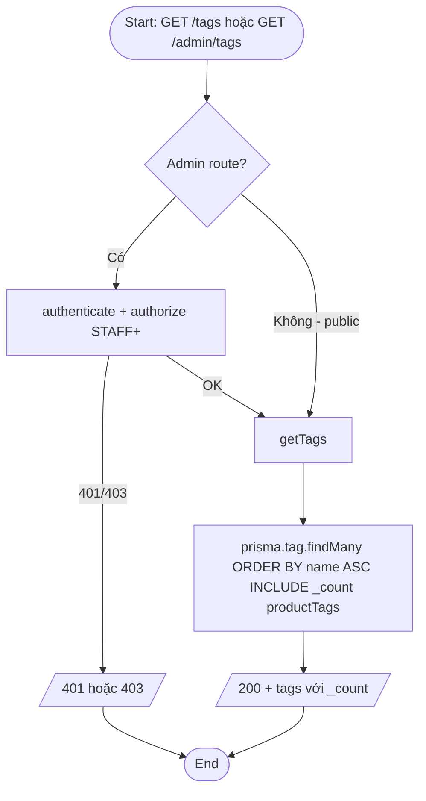
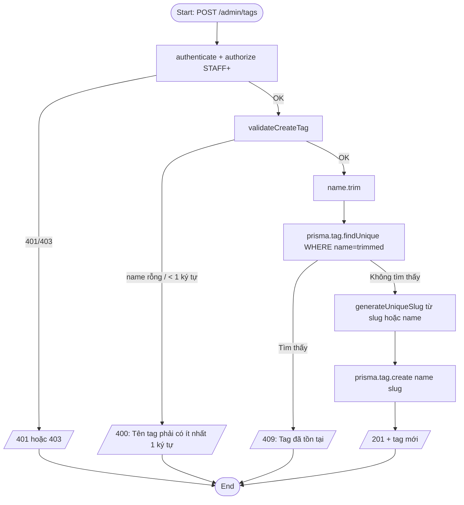
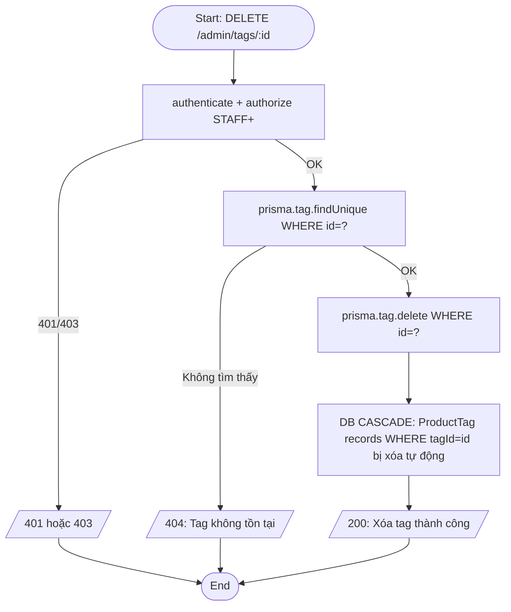
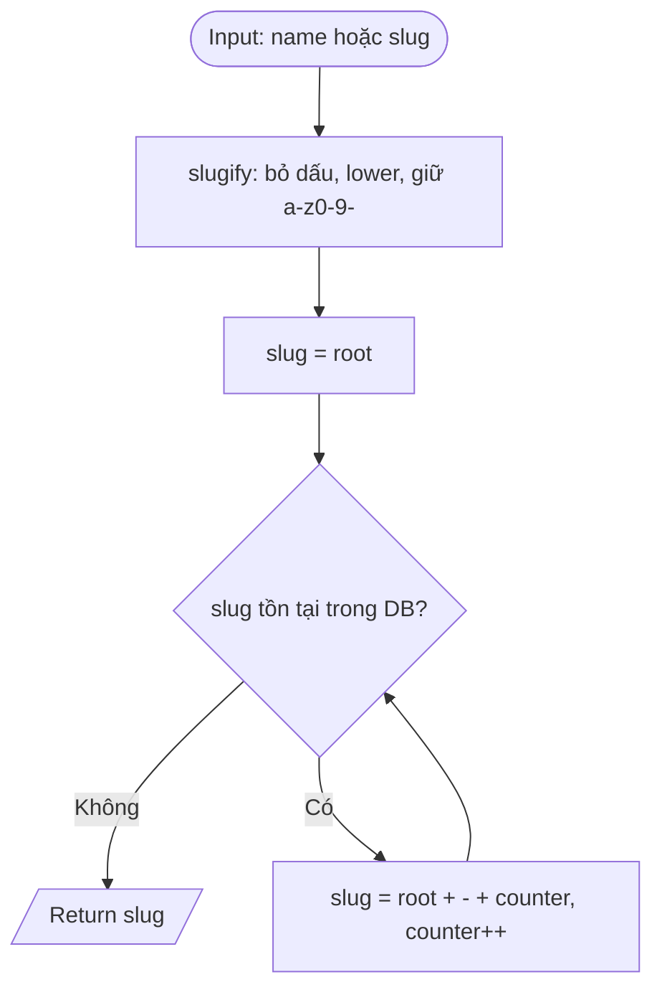

# Activity Diagram — Luồng xử lý
## Module: Tag
### Dự án: Mobivexa E-Commerce Platform

> **Phiên bản:** 1.0 | **Ngày:** 2026-06-19

---

## AD-01: Xem danh sách tag

---

## AD-02: Tạo tag

---

## AD-03: Xóa tag

---

## AD-04: Sinh Slug (dùng chung với Brand/Category)

