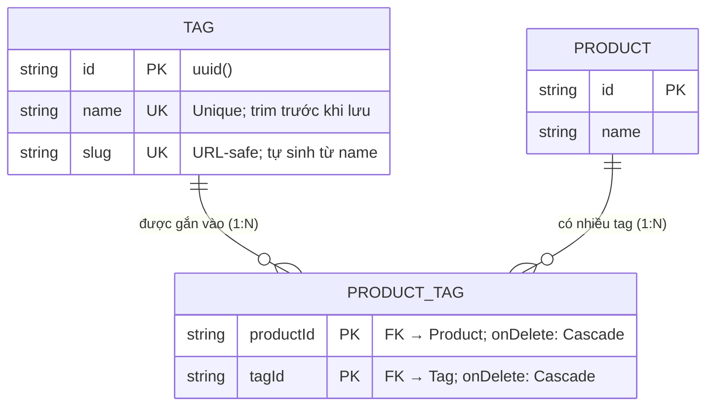

# ERD — Entity Relationship Diagram
## Module: Tag
### Dự án: Mobivexa E-Commerce Platform

> **Phiên bản:** 1.0 | **Ngày:** 2026-06-19

---

## 1. Sơ đồ ERD



---

## 2. Quan hệ N:M Tag ↔ Product

Tag và Product có quan hệ **N:M** qua bảng trung gian `ProductTag`:

```
TAG ────────────── PRODUCT_TAG ────────────── PRODUCT
id: "tag-5g"       tagId: "tag-5g"            id: "prod-iphone15"
name: "5G"         productId: "prod-iphone15"  name: "iPhone 15"

                   tagId: "tag-5g"            id: "prod-s24"
                   productId: "prod-s24"       name: "Galaxy S24"
```

- **Một Tag** có thể gắn vào **nhiều Product**
- **Một Product** có thể có **nhiều Tag**
- Composite PK `(productId, tagId)` ngăn gắn trùng tag cho cùng sản phẩm

---

## 3. Mô tả chi tiết Entity Tag

| Trường | Kiểu DB | Nullable | Unique | Ghi chú |
|---|---|---|---|---|
| `id` | VARCHAR (uuid) | No | PK | Auto-generated |
| `name` | VARCHAR | No | Yes | Trim trước khi lưu + check |
| `slug` | VARCHAR | No | Yes | `slugify(name)` + hậu tố nếu trùng |

> **Không có:** `description`, `isActive`, `imageUrl`, `sortOrder`, `parentId`, `createdAt`, `updatedAt`

---

## 4. Ràng buộc Cascade

| Quan hệ | `onDelete` | Hành vi |
|---|---|---|
| `Product` → `ProductTag` | Cascade | Xóa Product → xóa hết `ProductTag` của product đó |
| `Tag` → `ProductTag` | **Cascade** | **Xóa Tag → xóa hết `ProductTag` của tag đó** |

Không cần application-level guard khi xóa Tag vì DB lo toàn bộ.

---

## 5. Index

| Index | Trường | Loại |
|---|---|---|
| PK | `id` | Primary |
| UK | `name` | Unique |
| UK | `slug` | Unique |

---

## 6. So sánh Tag vs Brand vs Category

| Tiêu chí | Tag | Brand | Category |
|---|---|---|---|
| Field | `id`, `name`, `slug` | + `logo`, `desc`, `isActive`, `createdAt`... | + `image`, `parent`, `sortOrder`... |
| Có `isActive` | ❌ | ✅ | ✅ |
| Có `createdAt` | ❌ | ✅ | ✅ |
| Tên unique | ✅ | ✅ | ❌ |
| Xóa cascade | ✅ (DB level) | ❌ (app guard) | ❌ (app guard) |
| Quan hệ với Product | N:M (qua junction) | 1:N (brandId FK) | 1:N (categoryId FK) |
