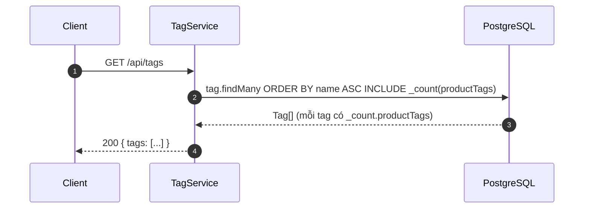
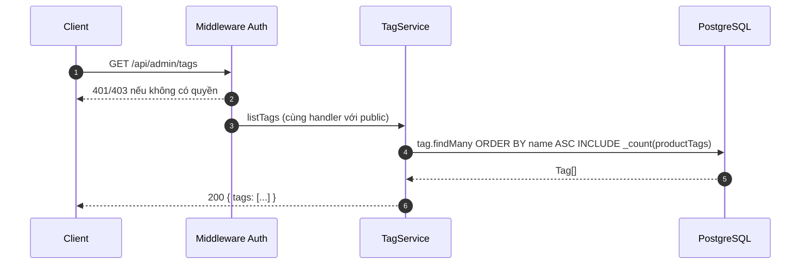
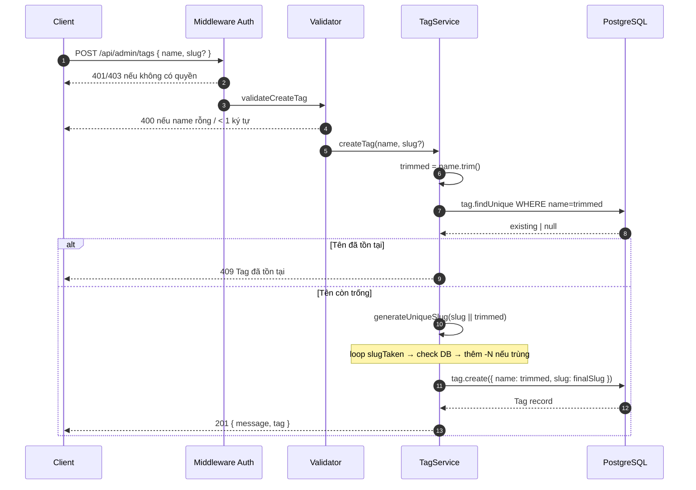
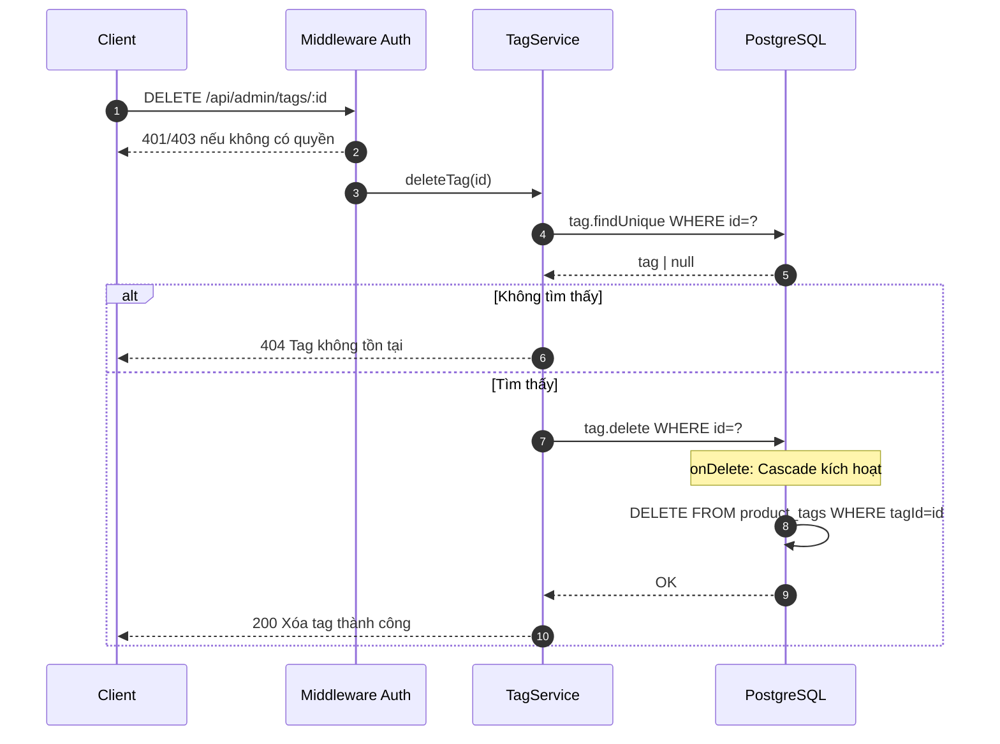

# Sequence Diagram — Luồng API
## Module: Tag
### Dự án: Mobivexa E-Commerce Platform

> **Phiên bản:** 1.0 | **Ngày:** 2026-06-19

---

## SD-01: Xem danh sách tag (Public)

---

## SD-02: Xem danh sách tag (Admin — cùng response)

> Public và Admin nhận response giống hệt nhau — chỉ khác middleware auth.

---

## SD-03: Tạo tag

---

## SD-04: Xóa tag (có Cascade)

> `onDelete: Cascade` xử lý ở DB level — không cần thêm query app-level.
