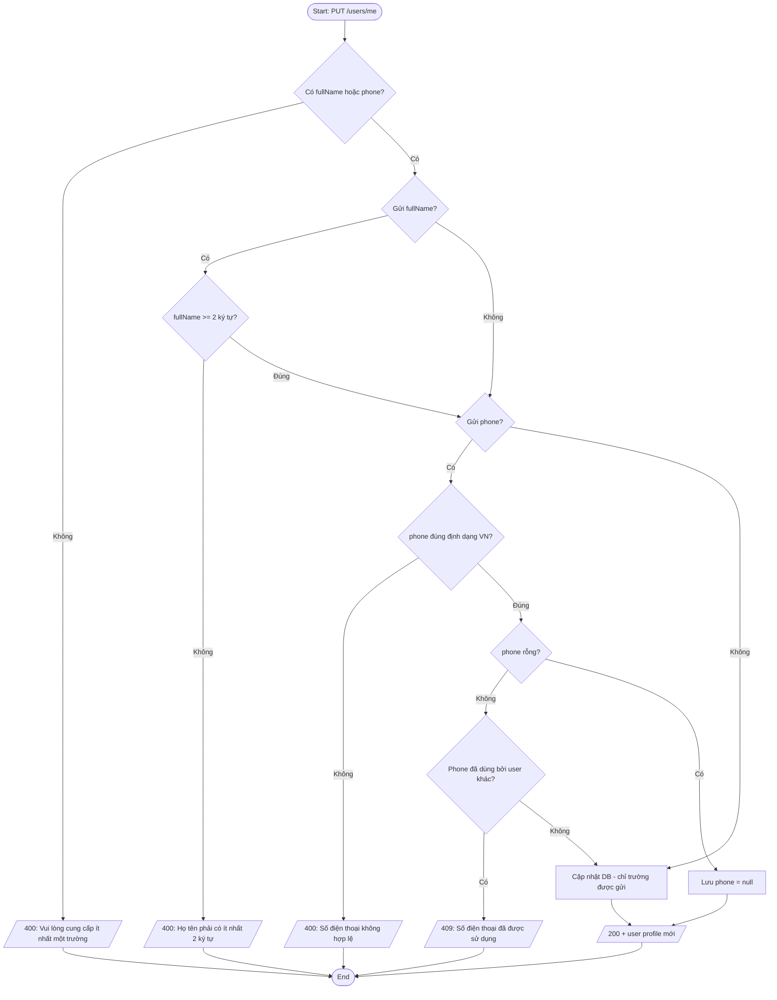
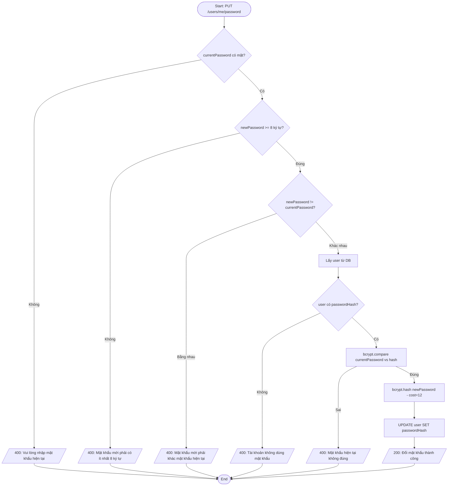
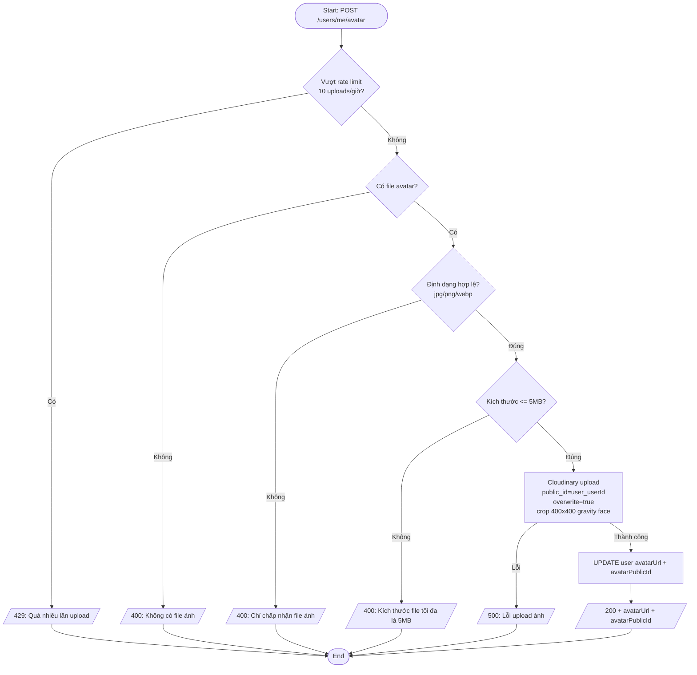
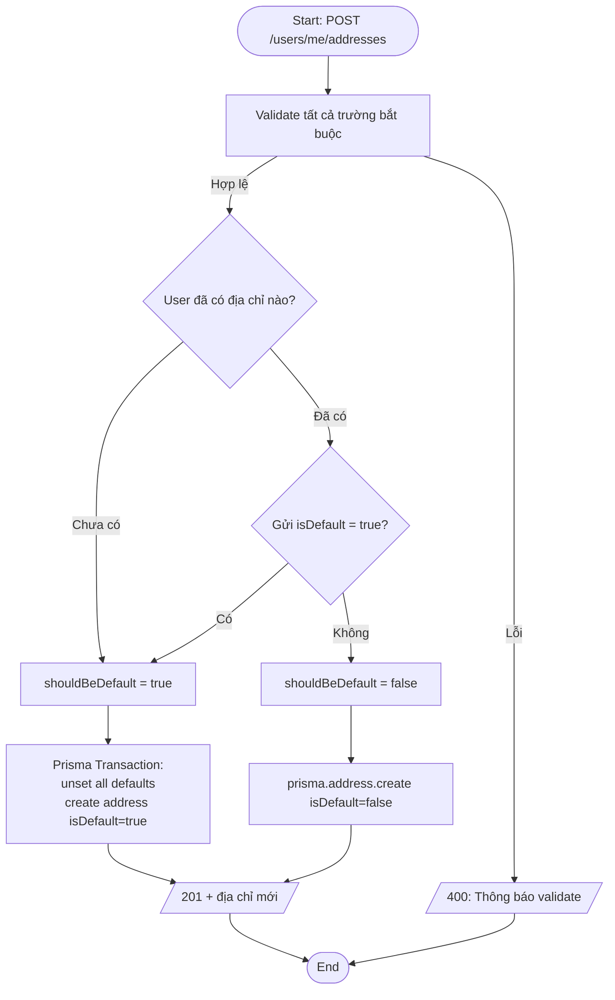
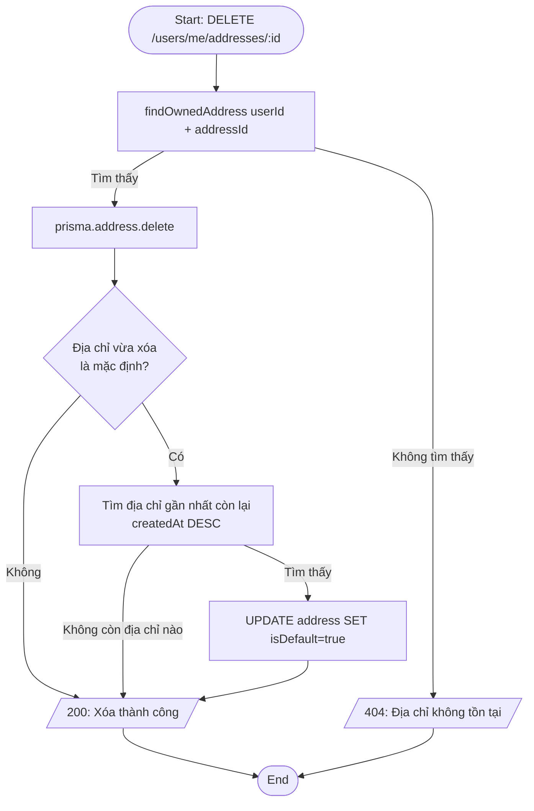
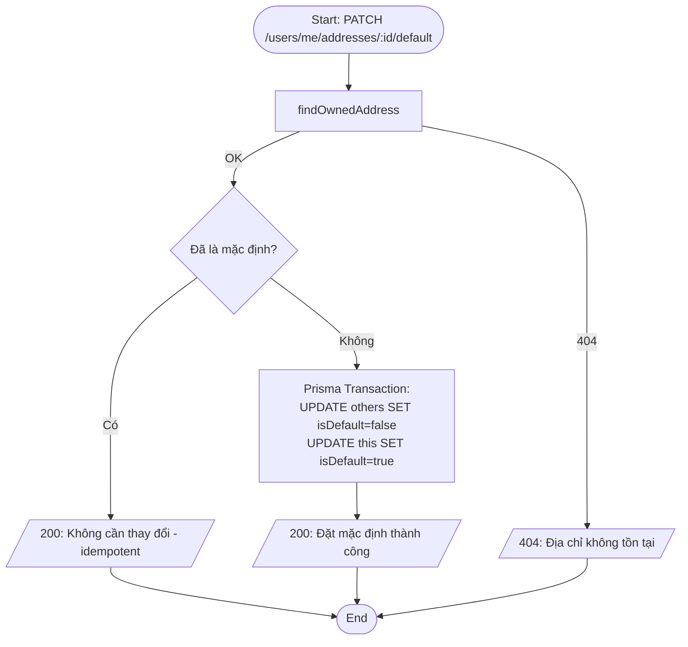

# Activity Diagram — Luồng xử lý
## Module: User
### Dự án: Mobivexa E-Commerce Platform

> **Phiên bản:** 1.0 | **Ngày:** 2026-06-19  
> Render bằng Mermaid (GitHub, Obsidian, VSCode Mermaid Preview)

---

## AD-01: Cập nhật hồ sơ

---

## AD-02: Đổi mật khẩu

---

## AD-03: Upload ảnh đại diện

---

## AD-04: Thêm địa chỉ mới

---

## AD-05: Xóa địa chỉ

---

## AD-06: Đặt địa chỉ mặc định

