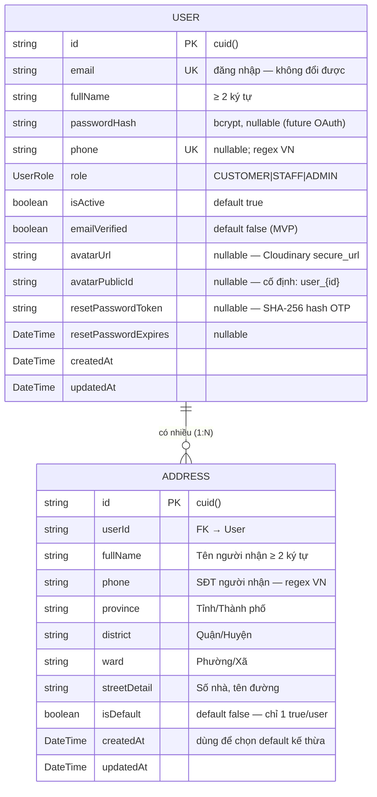

# ERD — Entity Relationship Diagram
## Module: User
### Dự án: Mobivexa E-Commerce Platform

> **Phiên bản:** 1.0 | **Ngày:** 2026-06-19

---

## 1. Sơ đồ ERD



---

## 2. Mô tả chi tiết

### Entity: User

| Trường | Kiểu DB | Nullable | Unique | Ghi chú |
|---|---|---|---|---|
| `id` | VARCHAR (cuid) | No | PK | Tự sinh |
| `email` | VARCHAR | No | Yes | Không đổi sau đăng ký |
| `fullName` | VARCHAR | No | No | ≥ 2 ký tự |
| `passwordHash` | TEXT | Yes | No | bcrypt — null nếu OAuth (tương lai) |
| `phone` | VARCHAR | Yes | Yes | `0xxxxxxxxx` hoặc `+84xxxxxxxxx` |
| `role` | ENUM | No | No | CUSTOMER / STAFF / ADMIN |
| `isActive` | BOOLEAN | No | No | false = bị khóa |
| `emailVerified` | BOOLEAN | No | No | Luôn false ở MVP |
| `avatarUrl` | TEXT | Yes | No | URL Cloudinary |
| `avatarPublicId` | TEXT | Yes | No | Luôn = `user_{id}` nếu có ảnh |
| `resetPasswordToken` | TEXT | Yes | No | Hash SHA-256 |
| `resetPasswordExpires` | TIMESTAMPTZ | Yes | No | Null sau reset |
| `createdAt` | TIMESTAMPTZ | No | No | Auto |
| `updatedAt` | TIMESTAMPTZ | No | No | Auto |

**Indexes:**
- `PK (id)`
- `UNIQUE (email)`
- `UNIQUE (phone)` — partial (phone IS NOT NULL)

---

### Entity: Address

| Trường | Kiểu DB | Nullable | Ghi chú |
|---|---|---|---|
| `id` | VARCHAR (cuid) | No | PK |
| `userId` | VARCHAR | No | FK → User.id; cascade delete |
| `fullName` | VARCHAR | No | Tên người nhận (riêng với User.fullName) |
| `phone` | VARCHAR | No | SĐT người nhận (riêng với User.phone) |
| `province` | VARCHAR | No | |
| `district` | VARCHAR | No | |
| `ward` | VARCHAR | No | |
| `streetDetail` | TEXT | No | |
| `isDefault` | BOOLEAN | No | Default false |
| `createdAt` | TIMESTAMPTZ | No | Dùng làm tiebreaker khi auto-set default |
| `updatedAt` | TIMESTAMPTZ | No | Auto |

**Indexes:**
- `PK (id)`
- `INDEX (userId)` — liệt kê địa chỉ của user

---

## 3. Quan hệ

| Từ | Đến | Cardinality | Cascade |
|---|---|---|---|
| User | Address | 1 : N | Delete User → Delete all Addresses |

---

## 4. Ràng buộc bảo toàn tính nhất quán

### Chỉ 1 địa chỉ mặc định per user

Không có `UNIQUE` constraint ở DB level cho `(userId, isDefault=true)` — nhất quán được đảm bảo **ở application level** thông qua Prisma transaction:

```ts
// Trước mỗi set-default:
await tx.address.updateMany({ where: { userId, isDefault: true }, data: { isDefault: false } })
// Sau đó mới set:
await tx.address.update({ where: { id }, data: { isDefault: true } })
```

> **Hàm ý:** Nếu có bug bypass application layer (direct DB write), có thể vi phạm ràng buộc này. Nên xem xét thêm DB-level partial unique index trong tương lai.

---

## 5. Dữ liệu nhạy cảm

| Trường | Cách bảo vệ |
|---|---|
| `passwordHash` | Không include trong `USER_PUBLIC_SELECT` |
| `resetPasswordToken` | Không include trong `USER_PUBLIC_SELECT` |
| `resetPasswordExpires` | Không include trong `USER_PUBLIC_SELECT` |
| `avatarPublicId` | Không expose trong profile response (chỉ dùng nội bộ cho Cloudinary) |
