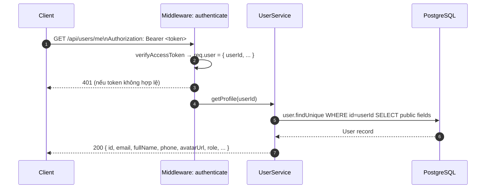
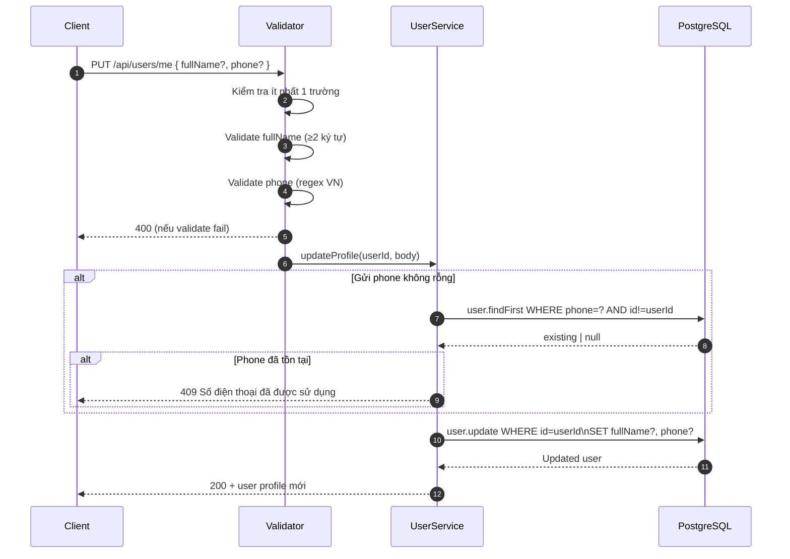
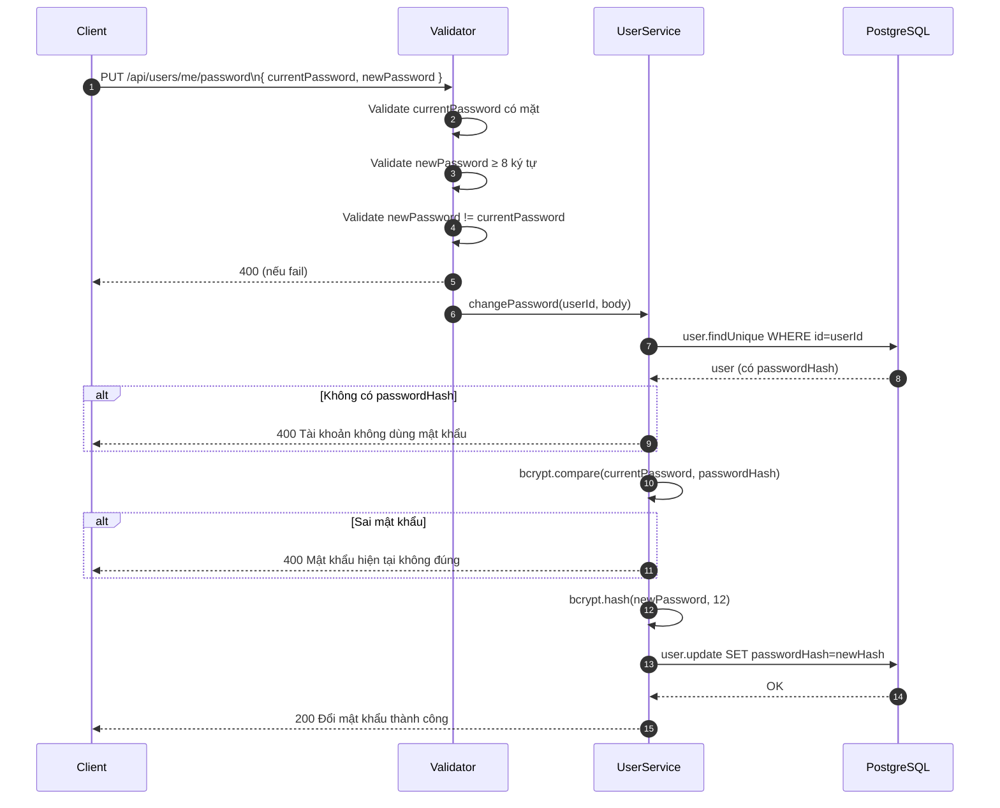
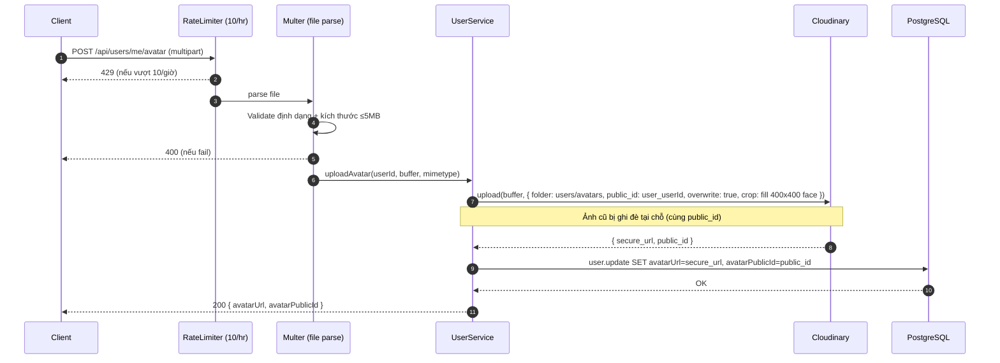
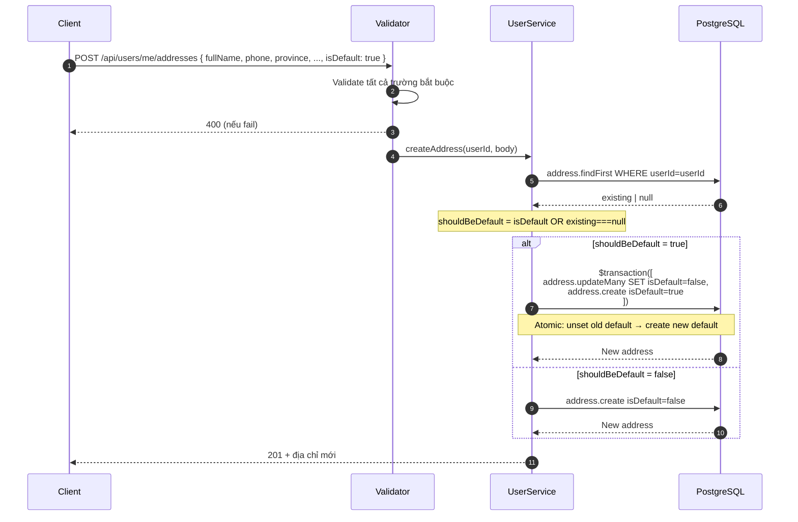
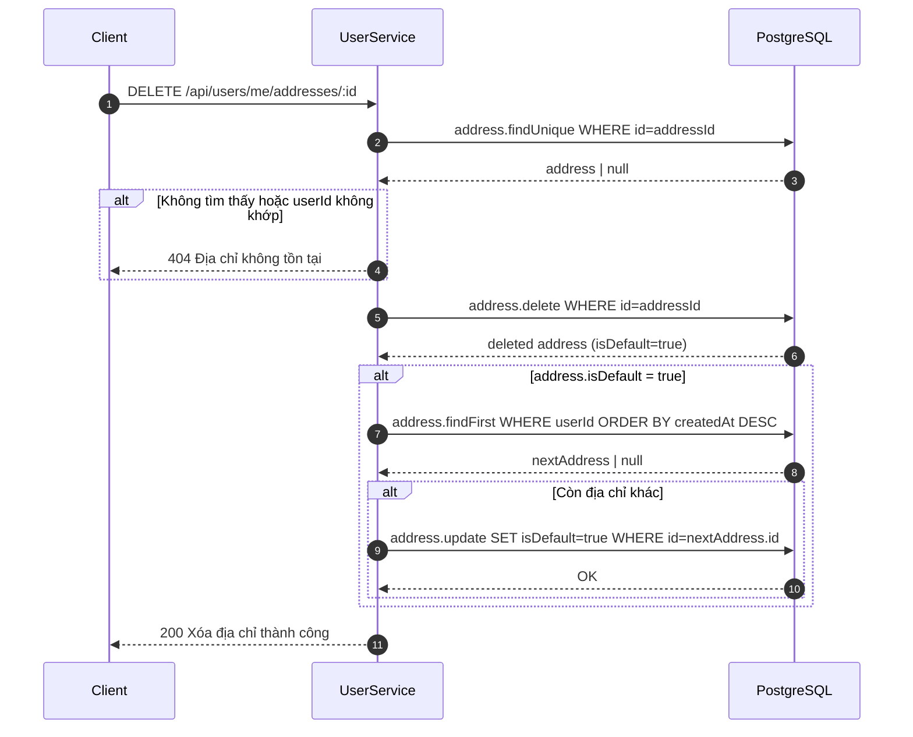
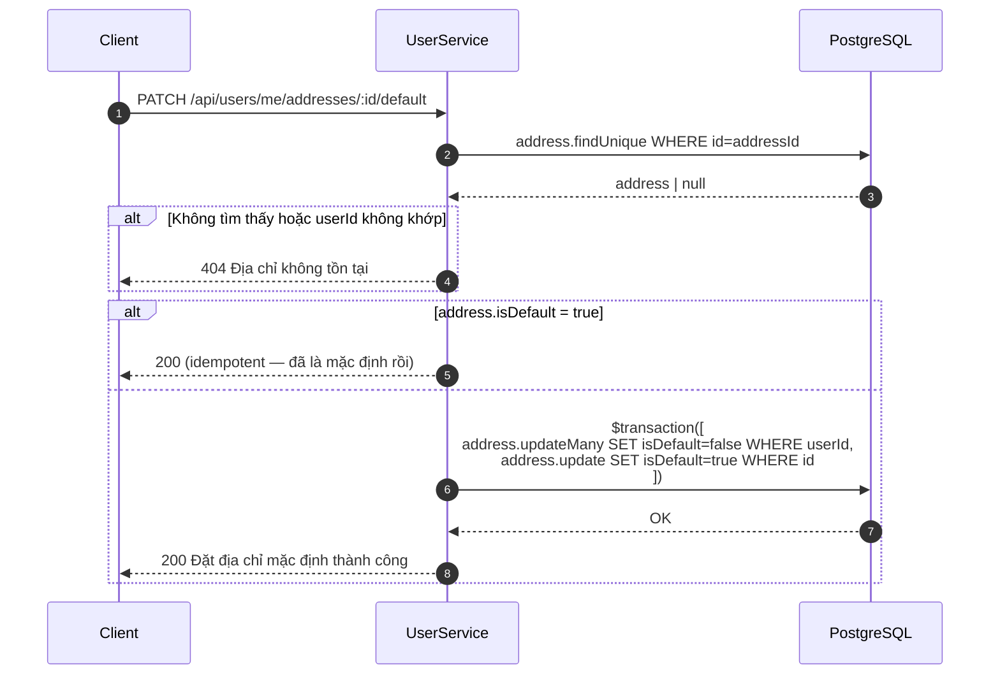

# Sequence Diagram — Luồng API
## Module: User
### Dự án: Mobivexa E-Commerce Platform

> **Phiên bản:** 1.0 | **Ngày:** 2026-06-19

---

## SD-01: Xem hồ sơ cá nhân

---

## SD-02: Cập nhật hồ sơ

---

## SD-03: Đổi mật khẩu

---

## SD-04: Upload ảnh đại diện

---

## SD-05: Thêm địa chỉ mới (có isDefault=true)

---

## SD-06: Xóa địa chỉ mặc định

---

## SD-07: Đặt địa chỉ mặc định

